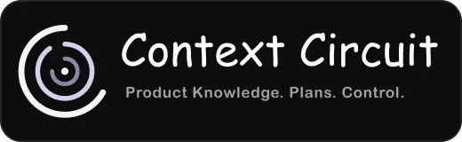
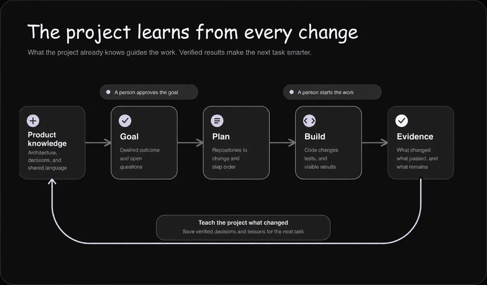
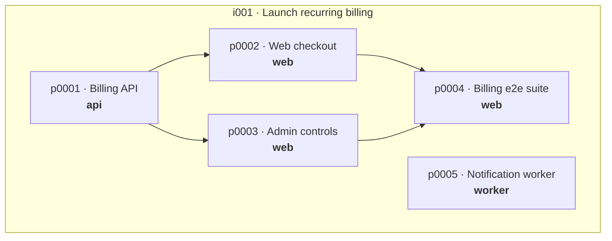
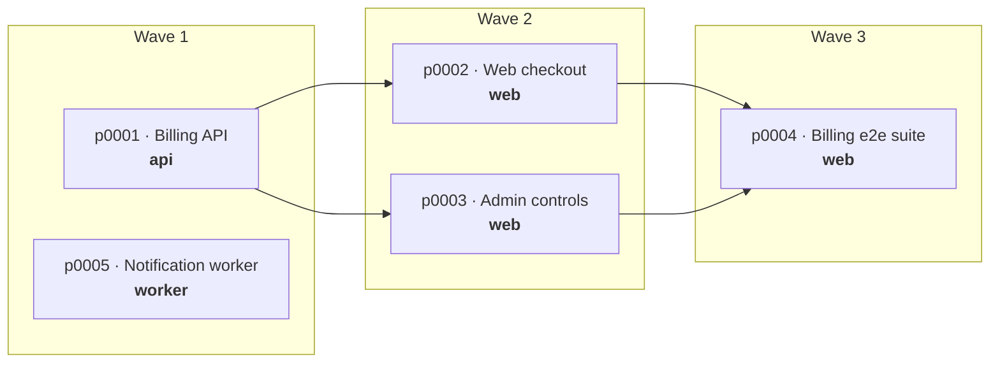
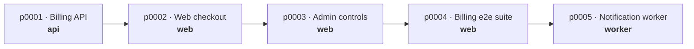
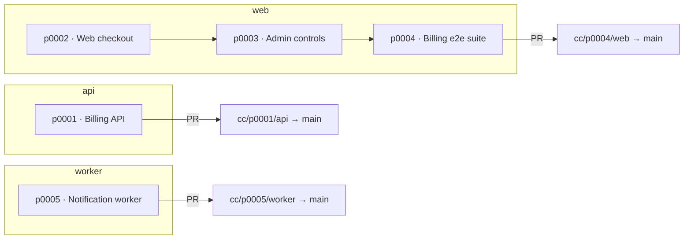
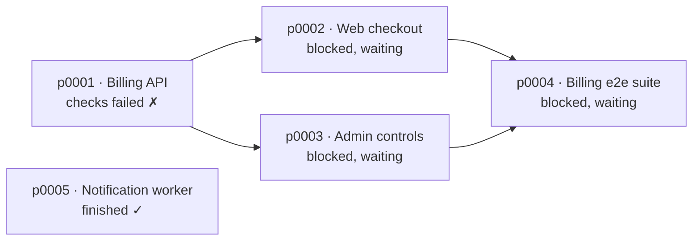

<p align="center">
  
</p>

<h1 align="center">Context Circuit</h1>

<p align="center">
  <strong>Give your coding agent project context and a grounded plan—while you stay in control across every repository in your project.</strong>
</p>

<!-- Each product's release badge reads the repository that publishes it: the
     template here, the CLI where its source is built. Date ordering avoids a
     semver sort that cannot parse a prefixed tag. -->
<p align="center">
  <a href="https://github.com/kaotypr/context-circuit/releases"></a>
  <a href="https://github.com/kaotypr/context-circuit-source/releases"></a>
  <a href="https://context-circuit.kaotypr.com"></a>
  <a href="https://github.com/kaotypr/context-circuit/blob/main/LICENSE"></a>
  
</p>

<p align="center">
  <a href="#quick-start">Quick start</a> ·
  <a href="#how-to-use">How to use</a> ·
  <a href="#stacked-plans-parallel-when-safe-ordered-when-necessary">Stacked plans</a> ·
  <a href="#what-context-circuit-adds">Capabilities</a> ·
  <a href="#documentation">Documentation</a>
</p>

Coding agents are good at changing code. The harder problem is carrying the
right project context across sessions, repositories, people, and machines.

Context Circuit gives an agent a shared place to learn the project, help prepare the
goal before coding, coordinate work across repositories, update product knowledge
when the code changes, and preserve what the team learned afterward. You stay in
control of the decisions that matter.

## Why Context Circuit

A prompt can be very specific about what to change while leaving out why the
current behavior exists, which product rules it must preserve, or what else the
change will affect. Without that wider understanding, an agent can follow the
request faithfully and still produce a locally correct change that conflicts
with the product or breaks a business flow.

Context Circuit does not promise to prevent every mistake. It helps the agent
read the project's accepted product knowledge and repository relationships
before the goal is approved. The agent writes down the outcome it understood,
points out conflicts or missing decisions, and turns questions it should not
answer alone into explicit open questions for a person.

Without this shared project context, every new session starts by rediscovering
the same architecture and conventions. A change that crosses repositories
becomes a collection of disconnected tasks. Plans drift away from the outcome,
and useful decisions disappear into chat history.

Context Circuit keeps those pieces connected:

- **A grounded goal** — the requested change is read against what the project
  already knows, so assumptions, contradictions, and open questions are visible
  before implementation begins.
- **One outcome across repositories** — a solo developer or team can coordinate
  several repository-specific plans as one intended product change, with their
  dependencies and execution order kept explicit.
- **Living product knowledge** — completed changes are reconciled with the
  project's architecture, rules, decisions, conventions, and vocabulary, giving
  the next goal more accurate context.
- **Shared project context** — product knowledge, repository relationships,
  intents (goals), plans, dependencies, and current work remain available
  across sessions, people, and machines.
- **Human control** — approval, execution, delivery, cleanup, and other consequential
  actions remain explicit human choices; unresolved product decisions are not
  quietly made by the agent.

The workspace is ordinary Markdown and YAML committed with your project. The
companion CLI handles dependable bookkeeping and Git mechanics; the coding agent
still does the reasoning, implementation, and project-specific checks.

## Workspace repository structure

A Context Circuit workspace is itself a small Git repository. It holds the
shared understanding and coordination files for the project; the application
repositories it coordinates can live beside it, inside its ignored
`repositories/` directory, or elsewhere on the machine.

```text
context-circuit/
├── README.md                    This workspace's front page, written at initialization
├── AGENTS.md                    Standing workflow and safety rules
├── CLAUDE.md                    Claude Code entry instruction
├── CURSOR.md                    Cursor entry instruction
├── workspace.yaml              Project identity and repository relationships
├── members.yaml                People who share this workspace
├── context/                    Product knowledge shared through Git
│   ├── INDEX.md                Searchable knowledge catalog
│   └── glossary.md             Shared project vocabulary
├── intent/                     Goals, boundaries, and open questions
├── plans/                      Repository-specific plans and dependencies
├── sources/                    Optional evidence supplied for a task
├── repositories/               Optional local application checkouts (ignored)
├── member.local.yaml           Active person on this machine (ignored)
├── repositories.local.yaml     Local paths and starting branches (ignored)
├── .context-circuit/
│   ├── docs/                   Detailed workspace and CLI documentation
│   ├── role-tiering.yaml       Shared defaults for AI-agent roles
│   ├── role-tiering.local.yaml Optional machine overrides (ignored)
│   ├── local/                  Host-local settings and locks (ignored)
│   ├── VERSION                 Workspace-template version
│   └── CLI_VERSION             CLI version this workspace expects
├── .agents/skills/             Canonical Context Circuit agent skills
├── .claude/                    Claude Code skills and agent roles
├── .codex/                     Codex agent roles
└── .cursor/                    Cursor rules, skills, and agent roles
```

Files marked as ignored are recreated or connected on each machine. Everything
else can be reviewed and shared like normal project documentation.

## Quick start

### 1. Create and open the workspace

Use [Tembiter](https://www.npmjs.com/package/tembiter) to create a clean project
from a tagged Context Circuit release:

```sh
npx tembiter init \
  --template https://github.com/kaotypr/context-circuit.git \
  --tag v2.0.0 \
  --target acme-workspace

cd acme-workspace
```
> Replace "acme-workspace" with your preferred workspace folder name.

Tembiter copies that release without carrying over the template repository's Git
history, initializes a new repository, and records which template version it came
from. It requires Node.js 20 or later.

What it copies is the workspace, not this repository: the page you are reading,
the license, the changelog and the contributing and security pages stay here.
The new directory has no README until the next step writes one for your project.

Open the new directory in Codex, Claude Code, or Cursor. The workspace includes
instructions and skills for each host.

### 2. Ask the agent to install and initialize

```text
Install the Context Circuit CLI, then initialize this workspace as Acme Billing
for our billing platform. Add me as Maya.
```

The bundled installation skill selects the correct macOS, Linux, or Windows
package, verifies its checksum, and installs it without administrator access.

If you do not want the conversation, intent and plan docs written in English,
say so now and say how you write. Records are then composed in that language
rather than translated into it, which is what keeps them from reading like a
machine translation of something else:

```text
I write records in Bahasa Indonesia, semi-formal, with technical terms left in
English.
```

Headings and field names stay English either way, so the records stay diffable
and every agent reads them the same. Only the prose follows you.

### 3. Connect the repositories

Tell the agent which repositories belong to the project, where each one can be
found, and how they relate. You do not need to decide where Context Circuit
stores a repository obtained from a Git URL:

Think of the **`default branch`** as the repository's home branch on its origin—
usually `main` or `master`. It is shared because it normally means the same thing
for everyone and is the usual starting point for new work.

The **`base branch`** is this machine's current working anchor. It may be the
default branch, or a branch belonging to a person or feature already in progress.
Context Circuit starts new worktrees and plan execution from that anchor. You can
change it when you move to another feature or work on several efforts in
parallel. Base branch settings stay local and Git-ignored, so changing
your anchor never changes a teammate's.

```text
Add these repositories to the project:

- The billing API is at https://github.com/acme/billing-api.git. Its default
  branch on the origin is main. For the recurring-billing feature I am working
  on, use feature/recurring-billing as this machine's base branch. Create it
  from main if it does not exist yet.
- The billing web app is already on this machine at
  /Users/maya/Work/acme/billing-web. Its origin also defaults to main, and this
  machine base branch should be feature/recurring-billing.

The web app consumes the API.
```

When you provide a Git URL, the agent obtains and organizes the working copy for
you. When you provide a full local path, it uses that existing checkout in
place. It can also initialize an empty repository when you are starting
something new.

### 4. Gather the project context

Before starting the first change, ask the agent to learn the durable knowledge
already present across every connected repository:

```text
Gather project context from all connected repositories and write it down as
product knowledge.
```

This gives later goals a useful starting point instead of making each new agent
session rediscover the product from code alone. The knowledge stays readable and
versioned in the workspace, where it can be corrected and kept current as the
project changes.

If your organization already keeps a knowledge center that several teams share,
mount it, before gathering context:

```text
Mount https://github.com/acme/core-service-knowledge as a knowledge repository
called core-service-knowledge. Its index is index.md.
```

It is read beside your own notes and retrieval says which side each answer came
from. It is never written here: the checkout is read-only, syncing fast-forwards
only when it is clean, and nothing is ever merged, reset, or discarded to make a
sync succeed. Corrections go upstream, where that knowledge is actually kept —
which is the point, since a copy would read as current while quietly drifting.

### 5. Optional: tune the subagent roles

Context Circuit can delegate bounded work to four roles. The defaults inherit
whatever your coding host chooses, so configuration is optional. To make the
tradeoffs explicit, ask the agent to recommend supported settings before it
writes them:

```text
Set up shared subagent role tiering for Codex. Check which models and reasoning
effort levels this host actually supports, then recommend exact settings using
these priorities:

- Explorer: a fast, economical model with low effort for narrow codebase research.
- Planner: a strong reasoning model with high or extra-high effort because
  every downstream plan depends on its analysis.
- Worker: a capable, balanced model with medium or high effort for implementation
  and normal repository checks.
- Reviewer: a strong model with high or extra-high effort

Show me the recommendation before applying it. If I approve, write the shared
configuration and set up the native role definitions for this host.
```

Shared preferences live in `.context-circuit/role-tiering.yaml` and travel with
the workspace. A member whose host, account, or budget differs can override only
the affected roles on their machine:

```text
Keep the team's shared role tiering, but configure a local worker override for
this machine. Show me the supported choices first, write the approved override
locally, and refresh the native role definitions.
```

Local overrides live in the Git-ignored
`.context-circuit/role-tiering.local.yaml`; roles absent from that file continue
tracking the shared configuration. Replace `Codex` in the prompt with Claude Code
or Cursor when that is the host you use.

Applying the settings also creates or updates the coding host's native role files:

- Codex: `.codex/agents/cc-*.toml`
- Claude Code: `.claude/agents/cc-*.md`
- Cursor: `.cursor/agents/cc-*.md`

These files are ignored by default because they are generated from the role
tiering and may include model or effort choices specific to one person's host,
account, or budget. Ignoring them prevents one member's local setup from becoming
everyone's setup; another member generates the right files for their own host.

A solo developer who wants the generated definitions to travel with the
workspace can remove the matching `<host>/agents/cc-*` rule from `.gitignore`
and commit those files. They then become project-owned files: review changes to
them like any other configuration, and remember that a fresh clone may preserve
them as existing customizations rather than replacing them automatically.

### 6. Start working on your project

The workspace is ready. Describe the goal you want to achieve to your coding
agent in ordinary language; you do not need to translate it into Context Circuit
commands or split it into repository tasks yourself.

Continue to [How to use](#how-to-use) to see how the agent grounds that goal,
surfaces decisions it should not make alone, prepares dependent plans, and waits
for your authorization before implementation or delivery.

## How to use

Work from the Context Circuit workspace and talk to your coding agent in ordinary
language. You normally do not need to run Context Circuit commands yourself. The
agent uses the workspace's pinned CLI for records and Git mechanics, then explains
the decisions that remain yours.

### 1. Ground the request

Describe the outcome:

```text
Add recurring billing to the API and web app. Monthly plans only; keep the
existing payment provider.
```

The agent retrieves the relevant product knowledge and repository relationships,
writes the goal, calls out assumptions or missing decisions, list the open questions,
create the INTENT.md file for you to read and stops. You might need to answers its
numbered questions and correct anything it misunderstood:

```text
1. Existing customers stay on their current plan.
2. Failed renewals get a seven-day grace period.
The rest of the goal looks right. I approve it.
```

Approval lets the agent, or a spawned sub-agent with the `planner` role, inspect
the actual repositories and prepare grounded plans. It does not start implementation.

### 2. Read the plan—or ask for the summary

The agent shows which repositories will change, which plan depends on another,
what checks it expects to run, and what remains uncertain. You can inspect the
plan files or stay in the conversation:

```text
Summarize the plans, their dependencies, and the main risks.
```

If the outcome has changed, say so before execution. The agent updates the goal
and returns to approval instead of quietly expanding the work.

### 3. Start the work explicitly

When the plans look ready, ask the agent to run them:

```text
Run all the billing plans using the recommended execution order.
```

If you start the execution in a new coding agent session, mention the intent ID,
number, or slug:

```text
Run all intent <intent-id> plans using the recommended execution order.
```

You also can specificly ask AI agent to execute a single plan:

```text
Run plan <plan-id>
```

Any of that request will starts implementation. The agent prepares isolated working copies,
runs independent plans together where safe, waits for unfinished dependencies,
follows each repository's instructions, and runs the relevant tests, lint, and
builds. It reports actual results and labels anything it could not verify.

### 4. Continue or recover without losing work

You can leave and return to the workspace later:

```text
Show me the status of the billing plans and resume the unfinished work.
```

The agent checks the real branches, working copies, commits, and diffs before it
continues. Failed or partial work stays available; Context Circuit does not reset,
stash, or discard it to make the records look clean.

### 5. Request review and delivery

Implementation does not silently become publication. Review and delivery are
separate requests, and neither happens unless you ask.

Review is optional and read-only: it reports findings and changes nothing. Ask
for one before delivery, while the work is still yours alone:

```text
Review the completed changes independently before we open anything.
```

Or after, as a second read on work already in flight:

```text
The API pull request is open. Review it independently.
```

A review never blocks delivery and is never required before it. Asking for one
is your judgment about a particular change, not a gate the workspace imposes.

Delivery is the consequential half. Pushes, pull requests, and merges act on the
real work branches and their target branches, so each one needs your
authorization:

```text
Open pull requests for the API and web plans.
```

### 6. Mark the work complete once it has landed

Delivering is not completing. Completion is normally yours to request after the
merge, and that order is deliberate: it confirms the change actually shipped
before the project records anything as true because of it.

```text
The billing pull requests are merged. Mark the plans complete.
```

Completion is two acts, not one. The agent appends a completion note to each
record, then brings back the product knowledge those plans could have made stale
and judges which of it actually changed meaning. Most completions change no
knowledge at all; recording that is the normal outcome, not a skipped step.

Completion does not delete branches or working copies. Cleanup stays a separate
request.

For a small, already-specific edit, you can ask the agent to work directly in a
connected repository without creating a goal or plan. Describing it plainly is
usually enough, and invoking the `cc-direct` skill takes that path with no
negotiation:

```text
/cc-direct make this small copy change in the web checkout...
```

Codex invokes skills with `$` instead, as `$cc-direct`.

Asking is what authorizes the bypass. The agent offers this path where a request
is already its own specification, but never takes it unasked, and it stops and
returns you to the normal flow as soon as the change needs an outcome nobody has
approved. The work happens in the connected checkout on its current branch.

Nothing else relaxes. Preserving your existing work, authorizing every commit,
push, and pull request, and reconciling the product knowledge the change alters
all apply exactly as they do to a plan.

### Asking what has gone out of date

Knowledge rots quietly, so you can ask at any time:

```text
Check the workspace.
```

This reports records that stopped lining up, repositories this machine has not
obtained, dependency cycles — and any note whose code has moved since the note
was last confirmed, with how many commits have landed under it. A note nobody has
disturbed is never reported, however old its date, so the list stays worth
reading.

Every finding names what settles it: a command to run, an edit to make, or a
decision that is yours. It is a report, not a gate — nothing waits on it and it
blocks nothing.

<p align="center">
  
</p>

For the behavior behind these conversations, including the division between the
coding agent and CLI, read [How Context Circuit works](.context-circuit/docs/how-it-works.md).

## Stacked plans: parallel when safe, ordered when necessary

Large changes rarely fit into one repository or one uninterrupted agent run.
Context Circuit turns one approved goal into several linked plans, makes their
dependencies explicit, and runs the AI agents responsible for those plans in the
right order.

This is more than spawning several agents at once. Before an agent starts,
Context Circuit gives it the complete plan it owns, the repositories it may
change, its dependency information, and the correct working copy and starting
point. A plan whose dependency is unfinished stays blocked instead of running
against the wrong code.

For example, one approved goal to launch recurring billing becomes five plans
across three repositories:



Each plan names the repository it changes, and an arrow is a dependency. The
checkout and the admin controls both need the API. The end-to-end suite needs
both of them, because it exercises the two together. The notification worker
needs nothing and is free to run immediately.

Three plans change `web`, and one of them waits on two predecessors at once.
That shape is what decides everything below.

### Waves

Independent plans run together, and a dependent plan starts when the work it
needs is finished:



This is the shorter route in wall-clock time. Its cost shows up where branches
converge: `p0002` and `p0003` develop `web` in parallel, so before `p0004` can
start, Context Circuit has to merge both of their branches into the working copy
it prepares. That integration is implementation work, not delivery.

### A linear chain

Every plan stacks on the one before it, so no plan ever runs against code
another plan is still writing:



Slower, and no integration merges at all: `p0003` starts from the finished
`p0002`, and `p0004` from the finished `p0003`, so the three `web` plans never
diverge in the first place. When several plans crowd one repository, that is
often the cheaper trade despite the wait.

### Choosing the shape

You do not pick the shape off a diagram. Context Circuit derives the
recommendation from every plan's recorded dependencies and repository overlap,
and explains what that shape costs before anything runs. You confirm it once.
After each wave, it recalculates what is genuinely ready from the work that
finished, then gives the next agents their dependency and starting-point
information.

### Delivery follows the chains, not the plans

Five plans do not become five pull requests. Delivery is per repository, and it
opens one request from the branch where that repository's chain **ends** —
because that branch already contains the plans it was prepared from. Opening
requests for those too would deliver the same commits twice.



So this goal delivers as three pull requests. `cc/p0004/web` carries the
checkout and the admin controls along with the suite, and `p0002` and `p0003`
get no request of their own.

Note that `p0005` runs in the very first wave and still ends its chain. Chain
ends are not the last wave, and a plan nothing depends on would be dropped
silently by anyone reasoning from waves instead.

Each request targets that repository's base branch on this machine. A branch
holding no commits beyond its base is skipped rather than opened empty, since a
plan can name a repository it turned out not to change. Merging remains separate
and still needs a person.

### When a plan fails

Completed plans are not unwound because a sibling failed:



The notification worker's branch and commits stay exactly where they are. The
failed plan is named, everything waiting behind it stays paused, and nothing is
reset, stashed, or discarded to tidy up the records. That is what makes parallel
agent work faster without making it disposable.

## What Context Circuit adds

| Capability | What it means for you |
| --- | --- |
| Product knowledge | Architecture, conventions, decisions, and domain rules are retrieved when relevant instead of rediscovered every session. |
| Borrowed knowledge | An organization's shared knowledge center is mounted read-only beside your own notes and retrieved with them, rather than copied in to drift. |
| Knowledge that reports its own age | A note is flagged when the code it points at has moved since it was last confirmed — evidence, not a calendar reminder. |
| Records in your language | A team that does not work in English records in its own language and register, while headings and field names stay English so records stay diffable. |
| Stacked multi-repository plans | Every AI agent receives its plan dependencies, waits for prerequisites, and runs in the correct parallel wave or linear order. |
| Isolated implementation | Each plan gets a separate working copy by default, protecting unrelated and unfinished work. |
| Human control points | The agent waits for approval of the goal and a later request to begin implementation. Delivery and cleanup remain separate choices. |
| Preserved failures | Partial work and failed checks are kept and reported instead of reset, stashed, or hidden. |
| Optional sub-agents | Exploration, implementation, and independent review can be delegated when useful; they are not mandatory ceremony. |
| Actionable diagnostics | Every finding names what discharges it: a command to run, an edit to make, or a decision only a person can take. |
| Reviewable files | Shared state is Markdown and YAML that your team can diff, discuss, and version in Git. |

## What is shared and what stays personal

| Shared through Git | Stays on personal machine |
| --- | --- |
| `workspace.yaml` — purpose, repository IDs, their URLs and default branches, and how they relate | `repositories.local.yaml` — where each repository is checked out here, and the branch you work from |
| `members.yaml` — who shares the workspace, with each member's record language and tone | `member.local.yaml` — which of those members you are |
| `.context-circuit/role-tiering.yaml` — model and effort defaults for each agent role | `.context-circuit/role-tiering.local.yaml` — your overrides, and the generated `cc-*` role files |
| `intent/` and `plans/` — approved goals, their plans, and the dependencies between them | `.worktrees/` and `repositories/` — the Git working copies themselves |
| `context/` — product knowledge and its catalog | `.context-circuit/local/` — plan-to-worktree links and the edit lock |

The pattern holds down the table: the workspace records a decision, and your
machine records how that decision is carried out here. `workspace.yaml` says the
billing API is a repository of this project; `repositories.local.yaml` says where
your copy of it lives and which branch you are working from.

That split lets a team share the truth about the project without pretending that
every developer, container, or remote agent has the same local setup.
[Workspace files](.context-circuit/docs/workspace.md) lists every record.

## Safety model

Context Circuit is designed to preserve user work and make consequential actions
visible:

- No implementation begins before you explicitly request it.
- No force checkout, hard reset, automatic stash, or silent overwrite is used to
  clear a path.
- Failed and partial implementation remains available for inspection and resume.
- Pushes, pull requests, merges, deployment, publication, and cleanup require
  explicit authorization.
- Independent review happens only when requested and does not silently modify
  code.
- Checks report what actually ran; anything not exercised is reported as
  unverified.

## Documentation

- [How Context Circuit works](.context-circuit/docs/how-it-works.md) — agent
  behavior, human decisions, and the CLI mechanisms supporting each stage
- [Workspace files](.context-circuit/docs/workspace.md) — what the workspace
  stores and which information stays local
- [Commands](.context-circuit/docs/commands.md) — the complete CLI surface
- [Working records](.context-circuit/docs/working.md) — the detailed goal and
  plan file formats
- [Worktrees](.context-circuit/docs/worktrees.md) — isolated work, environment
  reuse, recovery, and cleanup
- [Sub-agents](.context-circuit/docs/agents.md) — available roles, configuration,
  and dispatch

`AGENTS.md` carries the standing safety rules your agent reads whenever it works
in this workspace. Skills under `.agents/skills/` provide the procedure for the
stage currently in progress.

## License

The workspace template — these instructions, skills, and documents — is released
under the [BSD Zero Clause License](LICENSE), which permits use,
modification, and redistribution with **no attribution requirement**. These files
become yours the moment they are copied into your repository, so keeping a notice
of ours in your project is not a condition of using them.

Your own code, your project knowledge, and everything your agent writes here are
yours and are covered by whatever license your repository already carries. The
`context-circuit-cli` itself is separate, and is released under the Apache
License 2.0.

## Requirements and limits

- Git is required. Users do not need Go, Python, or a package manager.
- CLI packages are available for macOS, Linux, and Windows on amd64 and arm64.
- Each operating system, container, or remote host installs the CLI and records
  its local repository paths independently.
