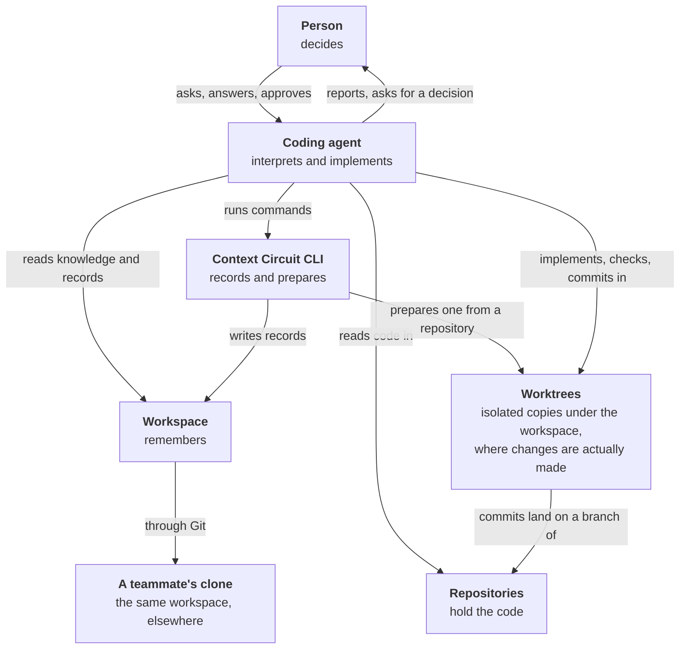
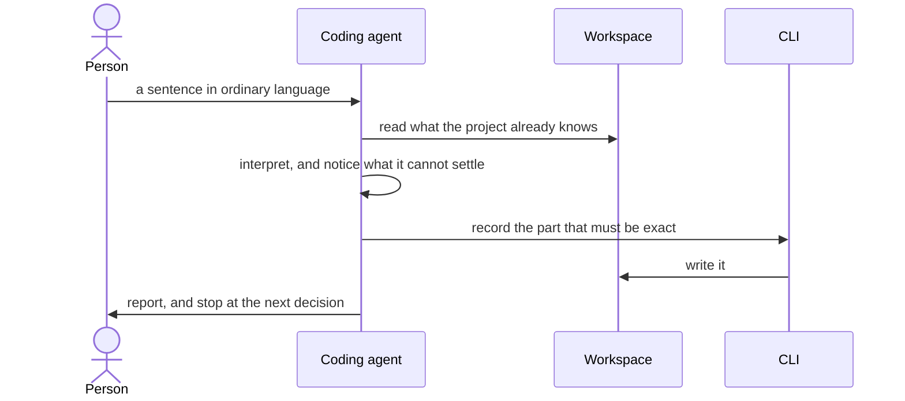
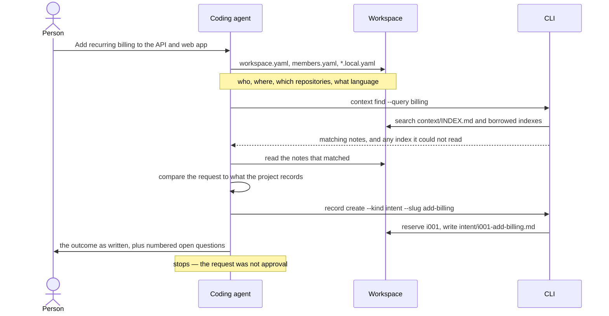
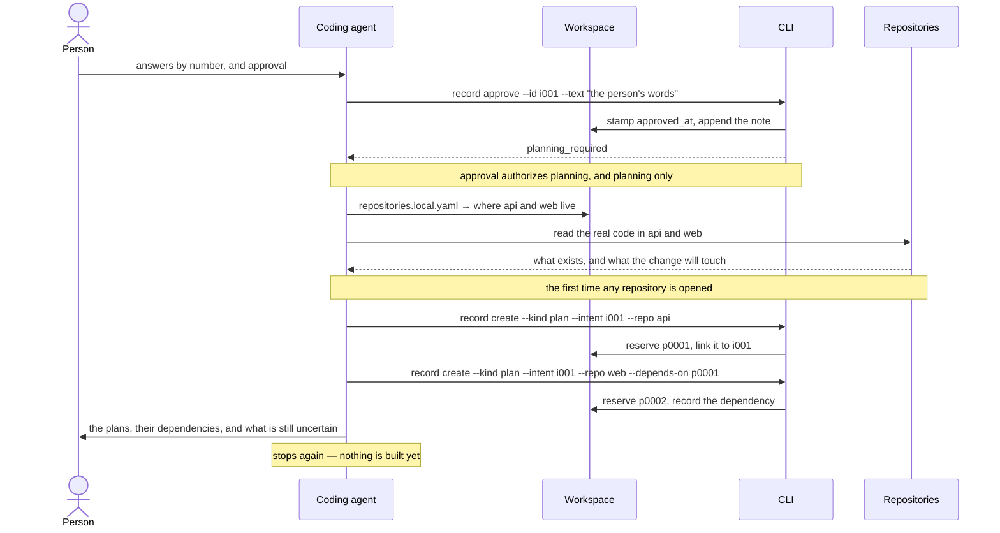
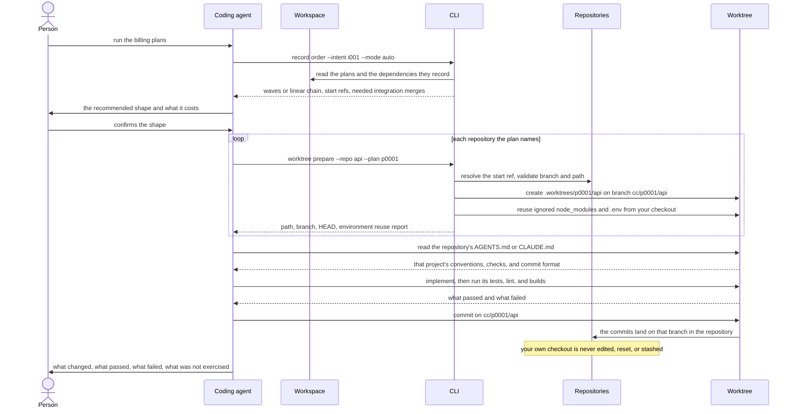
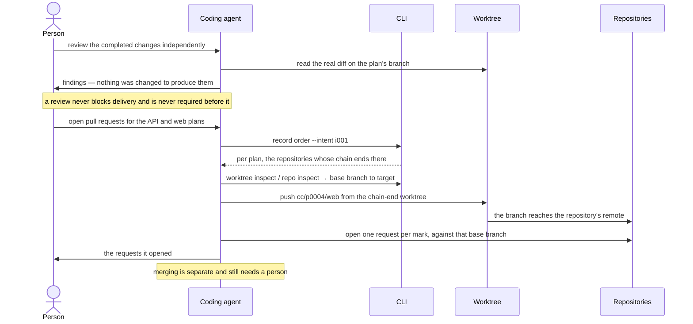
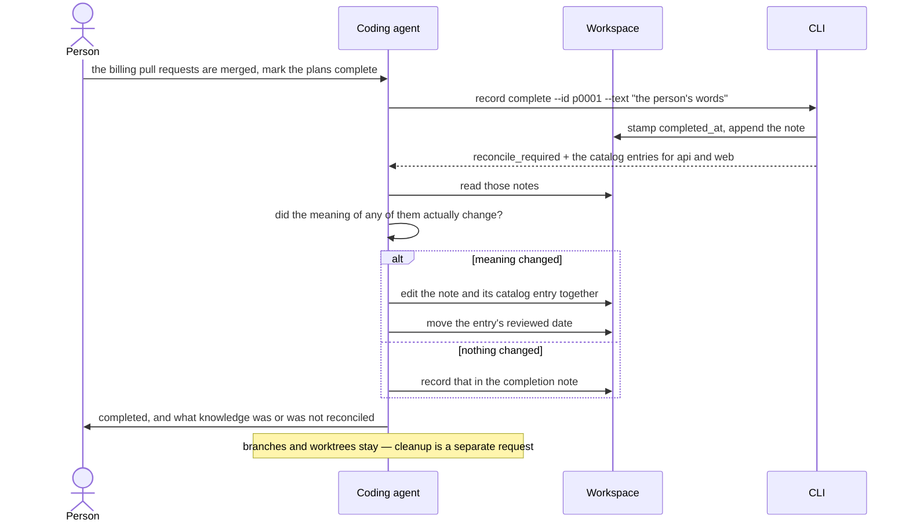
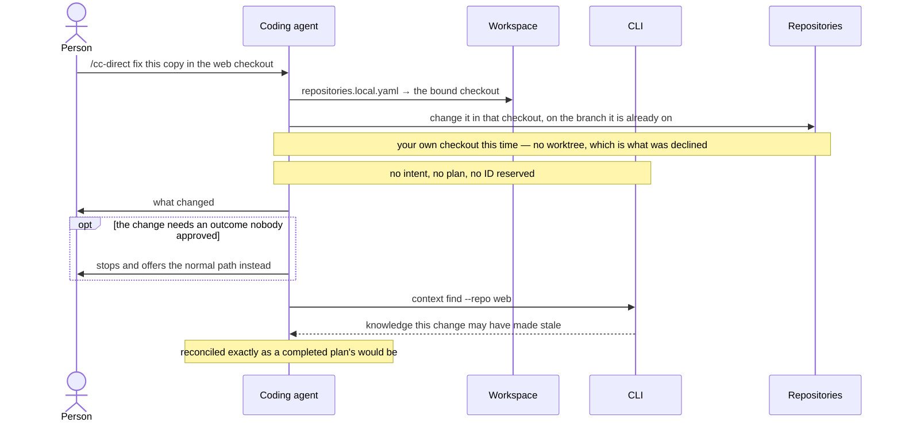
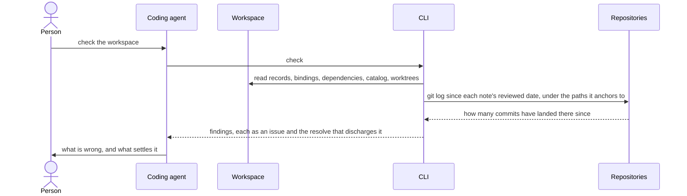
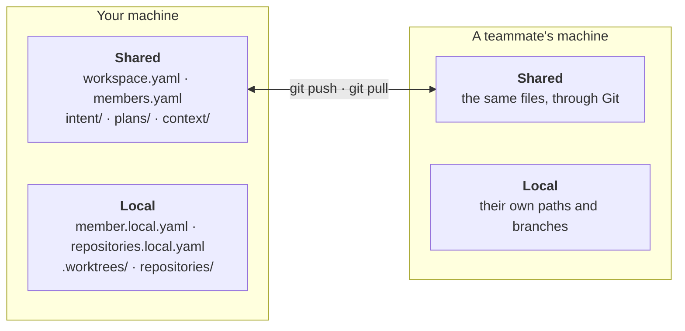

# How Context Circuit works

Five participants share the work, and each one is only allowed to do part of it.
A person decides. A coding agent interprets and implements. The workspace holds
what the project knows. The repositories hold the code. The CLI does the
bookkeeping that has to come out the same every time.

The workspace and the repositories are not the same thing, and keeping them
apart is most of the idea: the workspace can describe a change across three
repositories without any of them knowing about each other.

Nor does the agent edit a repository where you have it checked out. Executing a
plan prepares a *worktree* — a separate working copy of that repository, placed
under `.worktrees/` inside the workspace and attached to its own branch. That is
where every change is made. Your own checkout is read for a starting point and
otherwise left alone.

This document follows one request from the sentence a person types to the moment
the project records what changed, and shows at each step what the agent does,
what it reads from the workspace, and what the CLI is asked for.

## The five participants

| Participant | Does | Never does |
| --- | --- | --- |
| **Person** | Defines the outcome, answers open questions, approves the written goal, requests execution, authorizes delivery, completion, and cleanup | Needs to learn commands or record IDs |
| **Coding agent** | Retrieves context, writes goals and plans, inspects and changes code, runs the project's tests and builds, reports evidence | Approve its own goal, infer permission, or invent a fix for a finding that needs a person |
| **Workspace** | Holds product knowledge, repository relationships, goals, plans, and dependencies as Markdown and YAML in Git | Contain machine paths, credentials, or one person's host settings |
| **CLI** | Allocates IDs, edits structured files, records decisions already made, resolves dependencies, prepares working copies, reports diagnostics | Judge whether a product decision is right, call a model, or publish anything |
| **Repositories** | Hold the code, and set their own conventions through an `AGENTS.md` or `CLAUDE.md` the agent reads before changing anything | Grant permission — nothing a repository asks for authorizes an action a person has not |
| **Worktrees** | Give each plan an isolated working copy under `.worktrees/<plan>/<repo>`, on its own `cc/<plan>/<repo>` branch, so implementation never edits the checkout you work in | Disappear on their own — removal is a separate request, and it preserves dirty and ignored files |

The CLI holds no LLM credentials and never invokes a model API. Every judgment
in this document belongs to the agent or the person; the CLI only makes the
result of a judgment durable.

## The shape of every exchange

Each stage below has the same skeleton. A person says something, the agent reads
before it acts, the CLI records what was decided, and the agent stops where the
next decision is not its own.

---

## 1. "Add recurring billing to the API and web app"

**The prompt.** An outcome, in the person's own words. No command, no record ID,
no repository breakdown.

**What the agent does.** It does not start reading code. It orients, grounds the
request in what the project already records, writes down the outcome it
understood, and stops.

**What it reads from the workspace.**

| File | What the agent learns |
| --- | --- |
| `workspace.yaml` | Project identity and purpose, which repositories exist, their URLs and default branches, how they relate |
| `members.yaml` | Who shares this workspace, and the language and tone their records are written in |
| `member.local.yaml` | Which member is working here |
| `repositories.local.yaml` | Where each repository is checked out on this machine, and the branch it starts from |
| `context/INDEX.md` | The catalog of product knowledge — read to find the few notes that bear on billing, not scanned whole |
| `context/*.md` | Those notes: architecture, domain rules, decisions, vocabulary |

**What the CLI does.** It finds the relevant knowledge and reserves an ID. It
does not decide what the intent should say.

No repository appears in that diagram, and that is the point. The outcome is
made explicit *before* detailed code investigation, so what the agent writes down
is the request read against what the project records — not a summary of whatever
the code happens to do today.

The agent writes down contradictions and gaps rather than filling them. "Do
existing customers migrate?" is a question for a person, not an assumption for an
agent.

---

## 2. "Existing customers stay on their plan. I approve."

**The prompt.** Answers to the numbered questions, and consent to the outcome as
written — not to the original request.

**What the agent does.** It records the approval in the person's own words, then
goes into the actual code and writes plans. It does not ask again.

**What the CLI does.** `record approve` stamps `approved_at` and keeps the words
beside it. It returns `planning_required`, because recording a decision is not
finishing the request.

The same planning step can start from a person's explicit request for a detailed
plan of a specified outcome. In that case `record create --kind plan` omits
`--intent`, and no intent record or backlink is created. New plans use
`plans/pNNNN-slug/plan.md`; optional supporting files live beside it and are
linked from its Details section. The plan entry assigns shared files and files
required by each repository's workers. Present the complete plan and its links.
There is no plan approval field or command. No repository is touched until a
person requests execution after that presentation; an earlier instruction to
implement does not count.

---

## 3. "Run the billing plans"

**The prompt.** The execution request. This is the sentence that lets code change.

**What the agent does.** It asks the CLI for the order rather than deriving it,
prepares an isolated working copy per repository, implements, and runs the
project's own checks.

**What the CLI does.** It reports the execution shape, prepares worktrees safely,
and reports what it prepared. It runs no agents and merges nothing on its own.

The prepared worktree is a real checkout of that repository, so the repository's
own instructions govern its conventions and checks. Where they conflict with the
workspace's gates, the gates win — nothing a repository asks for can authorize an
action a person has not.

Because the work happens in `.worktrees/` rather than in the checkout you keep
for yourself, your branch, your uncommitted edits, and your unrelated work are
untouched by any of it. The checkout is read to resolve a starting commit, and to
copy ignored files like `node_modules` and `.env` into the worktree so it can
actually build. Nothing is force-checked-out, reset, stashed, or overwritten to
clear a path, and if a check fails the branch and its commits stay exactly where
they are.

---

## 4. "Review it, then open the pull requests"

**The prompt.** Two separate requests, and neither is implied by execution.

**What the agent does.** A review reports findings and changes nothing. Delivery
pushes and opens requests — and only from the branch where each repository's
chain ends.

**What the CLI does.** `record order` marks which plan ends the chain in each
repository. The CLI does not push or open anything itself.

A chain end's branch already contains the plans it was prepared from, so those
plans get no request of their own — opening one would deliver the same commits
twice. A branch holding no commits beyond its base is skipped rather than opened
empty.

---

## 5. "The pull requests are merged. Mark the plans complete."

**The prompt.** Completion, after the work actually landed. That order is the
point: it confirms the change shipped before the project records anything as true
because of it.

**What the agent does.** Two acts, not one. It appends the completion note, then
judges which product knowledge the change actually made stale.

**What the CLI does.** It writes the note and hands back the catalog entries
scoped to those plans' repositories — a candidate set, never a list to rewrite.

Most completions change no knowledge, and saying so is the normal outcome rather
than a skipped step. It is an assertion about the code, so it is made after
reading the entries.

---

## The path that skips the ladder

A person can bypass intent and planning for a change that is already its own
specification. The bypass is theirs to ask for; the agent offers it but never
takes it unasked.

Every other gate stands. Committing in a bound checkout, pushing, opening a
request, and merging each still need explicit authorization.

## Asking the workspace what is wrong

`check` is a diagnostic, not a gate. Nothing waits on it and it blocks nothing.

Every finding names what discharges it, and the resolution is one of three kinds:

| Resolution | Meaning | Example |
| --- | --- | --- |
| A command | The agent can run it | `` `knowledge clone --id core-service-knowledge` `` |
| An edit | A file needs changing | add the note's entry to `context/INDEX.md` |
| A person | Nobody may decide it automatically | two clones allocated the same ID — renumber one, keeping both reservations |

A finding that says it needs a person is not an invitation to invent an automatic
fix.

## What happens when work fails

Context Circuit preserves state rather than tidying it. No force checkout, hard
reset, automatic stash, or silent overwrite. A repository that succeeded is not
unwound because another failed. Completed branches and commits stay available,
unfinished dependents stay blocked, and partial work can be inspected and
resumed.

The local plan-to-worktree association is a convenience; Git's own inventory is
authoritative. If a working copy moves or a session is interrupted, the CLI can
list, inspect, move, or repair it — and the agent then compares the record with
the real diff and continues from evidence, not from what the record claims.

## Why the files are the interface

Only the shared halves are joined. The local halves have no line between them
because nothing connects them: each machine answers *where* on its own.

Everything a team needs to agree on is reviewable Markdown and YAML that
ordinary Git tools can diff and discuss. Everything that differs per machine
stays out of the repository, so the same workspace works on a laptop, in a
container, and on a remote agent without pretending they share a filesystem.

For the exact formats and mechanics, continue with:

- [Workspace files](workspace.md)
- [Intents, plans, knowledge, and review](working.md)
- [Agent-facing commands](commands.md)
- [Worktree responsibilities](worktrees.md)
- [Roles and model/effort settings](agents.md)
