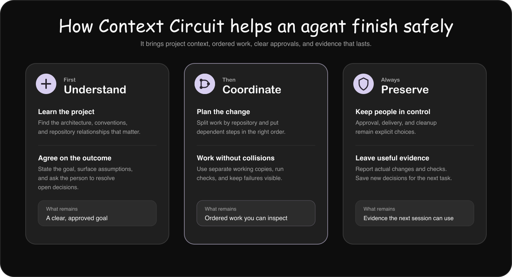

# How Context Circuit works

Context Circuit separates project judgment from dependable workspace mechanics.
The coding agent understands the request, reads the project, plans, implements,
and explains results. The CLI gives that agent stable records, dependency facts,
local repository bindings, isolated working copies, and diagnostics. A person
keeps authority over the decisions that should not be inferred.

  

## Three participants, three responsibilities

| Participant | Responsible for |
| --- | --- |
| Person | Defines the outcome, answers open questions, approves the written goal, requests execution, and authorizes delivery, completion, or cleanup. |
| Coding agent | Retrieves project context, interprets the request, inspects code, writes goals and plans, implements changes, runs project checks, and reports evidence. |
| Context Circuit CLI | Allocates IDs, edits structured workspace files, records decisions already made by a person, resolves dependencies, prepares working copies, and reports deterministic state. |

The CLI does not understand whether a product decision is correct. It does not
approve a goal, write a meaningful implementation plan, modify application code,
launch an AI model, or publish changes. The coding agent uses its results as facts
while retaining responsibility for the actual work.

## What the agent does with a request

### 1. Orient to the workspace

The agent reads the project identity, repository map, relationships, active
person, and local checkout bindings. It resolves the CLI version pinned by the
workspace and ensures native AI-agent role definitions exist for the current
coding host.

Shared files describe the project for everyone. Ignored local files identify the
person and repository paths on this machine. That lets the same workspace work
across laptops, containers, and remote agents without committing machine paths or
host-specific settings.

### 2. Retrieve relevant project context

The agent searches `context/INDEX.md` and any mounted read-only knowledge
repositories for architecture, conventions, domain rules, vocabulary, and
repository relationships related to the request. It reads relevant notes rather
than scanning every note and repository.

This grounding happens before the goal is written. If existing knowledge
contradicts the request or cannot answer a product question, the agent surfaces
that uncertainty instead of filling it with an assumption.

### 3. Write the goal and wait

For a normal implementation change, the agent creates an intent: the desired
outcome, non-goals, constraints, success criteria, likely repository scope, and
numbered open questions. It presents that written interpretation and stops.

The original request is not approval. Approval is a later response to the goal
the agent actually wrote. The CLI records that response and its timestamp, but
the person's words—not a field or command—are the authorization.

### 4. Inspect code and build grounded plans

Goal approval authorizes planning, not implementation. The agent inspects the
real repositories and creates one or more linked plans with affected
repositories, dependencies, task order, risks, and expected checks. It then
presents the plans and stops again.

There is no separate plan-approval record. The person may read the plans or ask
for a summary, but repository changes begin only after a new request to execute
them.

### 5. Prepare the correct place to work

An execution request normally prepares an isolated Git working copy for every
repository named by a plan. The CLI validates the repository, branch, starting
commit, path, collisions, and existing Git worktree inventory. It may reuse
ignored dependencies and environment files through copy-on-write or independent
copying, but it never prints their contents or stores them in shared records.

The agent receives the resulting path, branch, HEAD, and starting commit, then
follows that repository's own instructions and environment setup. The CLI does
not install arbitrary dependencies, start services, or run application-specific
setup hooks.

If the person explicitly requests direct work, the agent instead uses the bound
checkout on its current branch. That bypasses the goal, plan, and isolated
working-copy flow; it does not relax preservation or delivery rules.

### 6. Order and dispatch the work

For several plans, the CLI derives an execution shape from recorded dependencies
and repository overlap:

- **Waves** allow independent plans to run together and identify integration
  merges needed before dependent work begins.
- **A linear chain** stacks each plan on the previous one, avoiding integration
  merges when overlap makes parallel work expensive.

The ordering report is advice and state, not an executor. It creates no branches,
launches no agents, and performs no merges. The coordinator uses that report to
prepare the right working copies, launch AI agents through the coding host, wait
for their results, and integrate completed work. After each wave, it recalculates
what is ready from what actually finished.

When delegation is useful, the CLI resolves the configured model and effort for
an explorer, planner, worker, or reviewer and produces a complete dispatch brief.
The brief includes the working directory, ownership boundary, full goal or plan,
dependencies, and expected return. The coding host—not the CLI—launches the AI
agent.

### 7. Implement and report evidence

The coding agent changes code, runs the repository's relevant tests, lint, and
builds, and interprets failures. Work on an isolated plan branch is committed so
dependent plans and later sessions can see it. Work in a person's bound checkout
is committed only with their authorization.

The result report distinguishes what changed, what passed, what failed, and what
was not exercised. A plan record remains the original plan; it is not rewritten
to look like the result. Resume therefore reads the real branch, diff, and
working copy instead of treating the record as proof of implementation.

### 8. Keep later decisions separate

Implementation does not imply review, delivery, completion, or cleanup:

- Independent review happens only when requested and remains read-only.
- Pushes, pull requests, merges, deployments, and publication require explicit
  authorization.
- Completion happens only when requested after the work has actually landed. It
  records the result and brings possibly affected product knowledge back for
  reconciliation.
- Working-copy removal and branch deletion are separate cleanup decisions.

Keeping these actions separate prevents an instruction to build something from
quietly becoming permission to publish or delete it.

## How the CLI helps the agent

| Mechanism | What the CLI supplies | What the agent still decides |
| --- | --- | --- |
| Workspace and members | Shared identity, roster edits, active-person binding, repository metadata, and local paths | What the project means and which repositories belong to a request |
| Product knowledge | Catalog search, repository-scoped reconciliation candidates, and consistency findings | Which notes are relevant and how their meaning changed |
| Goals and plans | Stable IDs, links, timestamps, approvals already given, dependencies, and completion notes | Goal content, open questions, plan content, and whether work satisfies the outcome |
| Stacked execution | Ready waves, linear ordering, start references, overlap, and required integration merges | Which reported shape to use and how to perform the implementation |
| Working copies | Safe Git preparation, inspection, movement, repair, environment reuse, and explicit removal | Setup, implementation, tests, recovery choices, and whether cleanup is appropriate |
| AI-agent roles | Shared/local model settings, native role definitions, and complete dispatch briefs | Whether delegation helps, launching agents, waiting, and integrating their results |
| Diagnostics | Deterministic issues with the command, edit, or human decision that resolves each one | Whether and when to run the diagnostic and how to settle judgment calls |

`context-circuit-cli check` is a diagnostic, not a gate. It reports inconsistent
records, bindings, dependency cycles, stale working-copy associations, and product
knowledge that may need review. A finding that says it needs a person is not an
invitation for the agent to invent an automatic fix.

## What happens when work fails

Context Circuit preserves useful state. It does not force checkout, hard-reset,
stash, overwrite unrelated files, or unwind successful repositories because
another repository failed. Completed plan branches and commits remain available;
unfinished dependents stay blocked; partial work can be inspected and resumed.

The local plan-to-working-copy association is a convenience, while Git's actual
inventory is authoritative. If a working copy moves or a session is interrupted,
the CLI can list, inspect, move, or repair it. The agent then compares the record
with the real diff and continues from evidence.

## Files remain the shared interface

Context Circuit stores shared state as reviewable Markdown and YAML. People can
diff goals, plans, product knowledge, repository relationships, and configuration
with normal Git tools. Machine paths, role definitions, locks, and unfinished
runtime state remain local and ignored.

For the exact formats and mechanics, continue with:

- [Workspace files](workspace.md)
- [Intents, plans, knowledge, and review](working.md)
- [Agent-facing commands](commands.md)
- [Worktree responsibilities](worktrees.md)
- [Roles and model/effort settings](agents.md)
