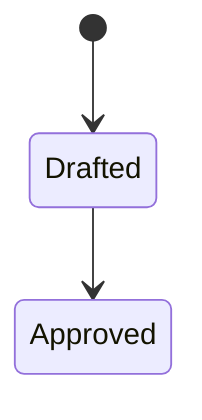

# Write live knowledge

On a request to gather knowledge, synthesize durable concepts into live context
notes and maintain the catalog entries beside them. There is no separate
knowledge acceptance lifecycle. Keep raw evidence separate from accepted
knowledge, and keep task progress and temporary results in plans. The executable
can locate catalog entries; semantic interpretation and the writing itself are
yours.

Run the diagnostic after editing notes — it reports any line that crosses the
boundaries below:

```sh
context-circuit-cli --workspace <root> check
```

## A note describes the project, not the machinery

Never name a plan record, an intent record, or a file under `sources/` inside a
note. Records are archived while knowledge outlasts them, and a recorded evidence
path becomes a standing instruction to read material that must stay passive.
Which record or evidence produced a note belongs in that plan.

## Anchors belong in one place

Repository paths are the durable anchor, exact or patterned, written with the
logical repository ID — `api@internal/billing/dunning/`,
`web@src/features/<feature>/` — never a local checkout path.

They appear in one place: an `Owner:` block at the end of the note. The body
calls things by their project names — *the goodwill limit*, *the retry
schedule* — and the block says where each one lives.

```
Owner:

- `api@internal/billing/dunning/` — the retry schedule and its wind-down.
- `api@internal/billing/invoice.go` `Void` — the one path that voids rather
  than credits.
```

A path dropped into a sentence is most of what makes a note tiring to read: the
reader stops on a string they cannot act on, and the sentence grows longer to
explain why it is there. Collecting anchors at the end costs one stop and puts
every path where a reader can find it twice. Use that heading and no other; past
a handful of paths a two-column table reads better than bullets, and both are
the same block. Never a comma-separated run of paths, which names no question
any of them answers and sends the reader to open all of them.

A table that pairs paths with what each one owns is the other place an anchor
belongs, wherever the mapping is the note's subject rather than its appendix — a
column heading does the same work as the `Owner:` block. `check` reports an
anchor written in a sentence.

`context/glossary.md` is the exception, because mapping a project word to the
identifier the code uses is the reason that file exists.

## Shape a note by what it is saying

Open with the title and one line saying what the note is for. Then `##`
headings, each phrased as the question that section answers, so the headings
read as the questions the note settles.

Match the form to the content:

| When the content is | Write it as |
| --- | --- |
| Several things sharing attributes — states, fields, limits, options, comparisons | a table |
| A flow, a state machine, a layering, a sequence between parts | a `mermaid` diagram |
| Rules or constraints that each stand alone | bullets |
| An ordered procedure, or a chain where each step causes the next | a numbered list |
| Why it is this way, what was rejected, what breaks without it | prose, which nothing else does as well |

A diagram earns its place when the relation between things is the fact worth
recording. One that redraws the list beside it is noise. Keep to `flowchart`,
`sequenceDiagram`, and `stateDiagram`, with short labels and no styling or theme
directives, because some readers see the source rather than a picture.

The fence names the language and the first line inside it names the diagram
type. Opening the fence with the diagram type instead renders the diagram as
plain text everywhere, which looks deliberate in the source and blank in the
reader, so write it this way:



`check` reports a fence opened with a diagram type, and a type inside a
`mermaid` fence that would not render.

More than eight lines of unbroken prose usually has a list or a table hiding
inside it.

Notes, the catalog, and the glossary are written in English, whatever language
the project is discussed in and whatever a member records for their own records.
A note outlives the member who wrote it and anchors to code, and the catalog is
searched by substring, which a mixed-language index quietly breaks.

Domain vocabulary is never translated. A word the project uses for its own
subject matter keeps that word in an English note, because the glossary exists
to map the project's words to the identifiers behind them and a translated term
maps nothing.

## An actor note

`actors/` holds one note per actor that deals with the project — a person in a
role, a team, or an external system — and what each one needs from it. These are
the notes an intent is grounded against, so they record what an actor needs
today rather than what the next change will give them.

Group the stories under the business flow they belong to, and head each group
with a link to the `domains/` note describing that flow:

```markdown
# Support agent

Answers customer contact after an order is placed, and is the only actor who can
return money to a customer without finance review.

## [Order lookup](../domains/order-lookup.md)

1. **As a support agent, I want to find an order from a phone number alone,** so
   that I can help a caller who never received a confirmation email.
2. **As a support agent, I want to see where the courier is,** so that "where is
   my order" is answered without contacting the courier.

## [Refunds](../domains/refunds.md)

1. **As a support agent, I want to refund up to the goodwill limit myself,** so
   that a small complaint closes in one call.
2. **As a support agent, I want a larger refund to reach finance with the case
   attached,** so that the customer does not restate it to a second person.

Owner:

- `api@internal/support/` — case handling and the goodwill limit.
- `console@src/routes/orders/` — the surface this actor works in.
```

Four rules hold that shape up:

- **The flow itself is described once, in `domains/`.** An actor note carries
  only that actor's stake in it. A flow retold in every participating actor's
  note becomes several copies that disagree within a quarter.
- **Stories are numbered within their group**, restarting at 1 under each flow,
  and a story is cited by flow and number. Inserting one then renumbers that
  group alone; numbering straight through the note would move every story below
  an insertion and break every citation at once. A story that stops being true
  goes, and the numbers around it stay put.
- **A story says what the project does for that actor now.** A capability
  someone wants is an intent; a wish list kept here rots into a backlog nobody
  trusts, and takes the reviewed date's meaning with it.
- **Everything else is a note like any other**: anchors in `Owner:` only, and
  nothing about the workspace machinery.

An actor earns a note once the project has to ask who a request is for, or once
two actors want incompatible things from the same flow.

## Write it so a person can read it

A note is read by someone deciding something and by an agent about to change
code. Both want the answer first, in a shape they can scan.

- Lead with the answer, then the reason. A paragraph that reaches its point in
  the last sentence is read twice or not at all.
- One idea per paragraph, and sentences short enough to read once.
- Active voice, and the project's own vocabulary rather than invented synonyms.
- State what is true. Hedging reads as uncertainty about the project rather than
  about the sentence.
- Cut any sentence that restates its heading, and any word doing no work.
- Explain a term the first time it appears, or record it in the glossary and
  move on.

The test is whether a reader can answer the heading's question from that section
alone.

## One note, one catalog entry

A note is one unwrapped catalog entry carrying its own link, the repositories it
applies to, the question it answers, its search terms, and the date it was last
confirmed against the code, as `context/INDEX.md` describes. `check` reports an
entry that claims repositories without that date.

A note lives in a directory named for its concern and is catalogued under a
heading for the same one, so a reader can guess where it is. Each heading
carries one line under it saying what belongs there, written before its first
entry, so the next note has somewhere obvious to go; `check` reports a heading
missing that line, and a directory catalogued under two headings. Only the
catalog and the glossary sit at the top level. Link freely between notes.

Record a domain term in `context/glossary.md` the first time its meaning has to
be asked for, naming the code identifier when it differs from the project's own
word.

## Refining a note written earlier

A note gathered by an earlier version of this product, or in a hurry, is often a
wall of prose with paths scattered through it. Rewriting one into the shape above
is ordinary work, with one hard limit: restructuring is not a licence to add
facts.

- Nothing enters the note that was not already in it or confirmed in the code
  just now. A gap the old note left stays a gap.
- Confirm each anchor still exists before it survives the rewrite. Drop one that
  does not, and say so.
- Move the `reviewed` date only when the note was actually re-confirmed against
  the code. A rewrite that changed only the shape leaves the date where it is.
  `check` reads this date against the commits under the note's own anchors, so a
  date moved without a reading makes a stale note look current and silences the
  one thing that would have caught it.
- Report what could not be verified instead of smoothing it into a confident
  sentence. Removing a claim nobody can confirm is a real outcome, not a loss.

The note and its catalog entry move together, as always.

## Knowledge this workspace does not own

A workspace may mount an organization's knowledge center as a knowledge
repository. `context find` reads its index beside this catalog and marks each
match `borrowed`. That mark decides what you may do with it.

- **Never copy a borrowed note into `context/`.** Link to it by path. A copy
  goes stale silently while still reading as current, and nothing here can tell
  that it has; avoiding that is the whole reason the repository is mounted
  rather than vendored.
- **Never edit one here.** The checkout's push URL is disabled, so an attempt
  fails rather than half-succeeding. An improvement is a merge request in that
  repository, from a separate checkout of it.
- **Never reconcile one.** Completion returns this workspace's own entries, and
  a borrowed entry is an obligation nobody here can discharge. Borrowed
  knowledge goes stale on its owner's schedule; when you find it wrong, say so
  and raise it upstream rather than recording the correction here.
- **Read it before re-deriving anything.** It exists so that what someone
  already established about a shared service is not worked out again from source
  or trial and error. Judge relevance from what its own index and frontmatter
  say, the way `INDEX.md` is used here.

A borrowed repository writes its index its own way, and nothing here holds it to
this product's catalog shape. `check` reports what stands between this machine
and reading it — an unobtained checkout, an unreadable index, local edits in a
read-only checkout — and never a fault inside content nobody here may fix.

## Reconciling when the code moved underneath

`check` reports a note whose anchors have commits under them since it was last
confirmed, naming how many. That is the second way a note comes back: completion
covers work done through this workspace, and this covers everything else — a
merge by somebody else, a commit from before the workspace existed, a hotfix
pushed straight to the branch.

Read the note against that code, then either edit the note and its entry together
and move the reviewed date, or move the date alone because nothing it says
changed. Both are real outcomes. What is not an outcome is moving the date
without reading, which converts a stale note into a confident one.

## Reconciling after a plan completes

`record complete` returns the catalog entries scoped to that plan's repositories
and names the judging as `reconcile_required`. Judge each against what the plan
actually changed: edit the note and its catalog entry together and move its
reviewed date, or record in the completion note that it changed nothing. Most
completions change no durable knowledge, and recording that is the normal
outcome rather than a skipped step.
