# Context Circuit — Core Concept (v0.6)

> A maintainer-facing conceptual map of what Context Circuit **is**, how it
> **works**, and how the same repository serves two purposes at once: as the
> product **source** and as the shippable **template**.
>
> This document is descriptive, not authoritative. The binding rules live in
> `wrapper/contracts/invariants.yaml` (one rule, one owner) and the conversational
> contract lives in `wrapper/adapters/WORKFLOW.md`. Where this document and a
> contract disagree, the contract wins.
>
> **Scope of this edition:** the v0.5 core plus the four v0.6 scopes released on
> top of it — **run-stack** (execute a set of approved plans together),
> **repository-grounding** (ground the writer in the target repo's own guidance),
> **external-surface** (opt-in publications to external systems), and
> **system-design-authoring** (a source-authoring skill). v0.6 adds no owner and
> forks no rule; it extends the same spine. The four scopes are summarized in §16.

---

## 1. What Context Circuit is

Context Circuit is a **universal project workspace for AI-assisted work**. You
talk to an agent in ordinary language; the agent holds durable **Product
Knowledge**, turns requests into **grounded plans**, and executes those plans
**safely across one or more Git repositories** — with a hard separation between
*thinking about a change*, *approving it*, *making it*, *proving it*, and
*shipping it*.

The whole design exists to answer one question safely:

> "An AI made changes across my repositories. How do I know exactly what it did,
> that a human approved it, that something independent checked it, and that
> nothing shipped without me asking?"

Its answer is a set of **non-negotiable separations**:

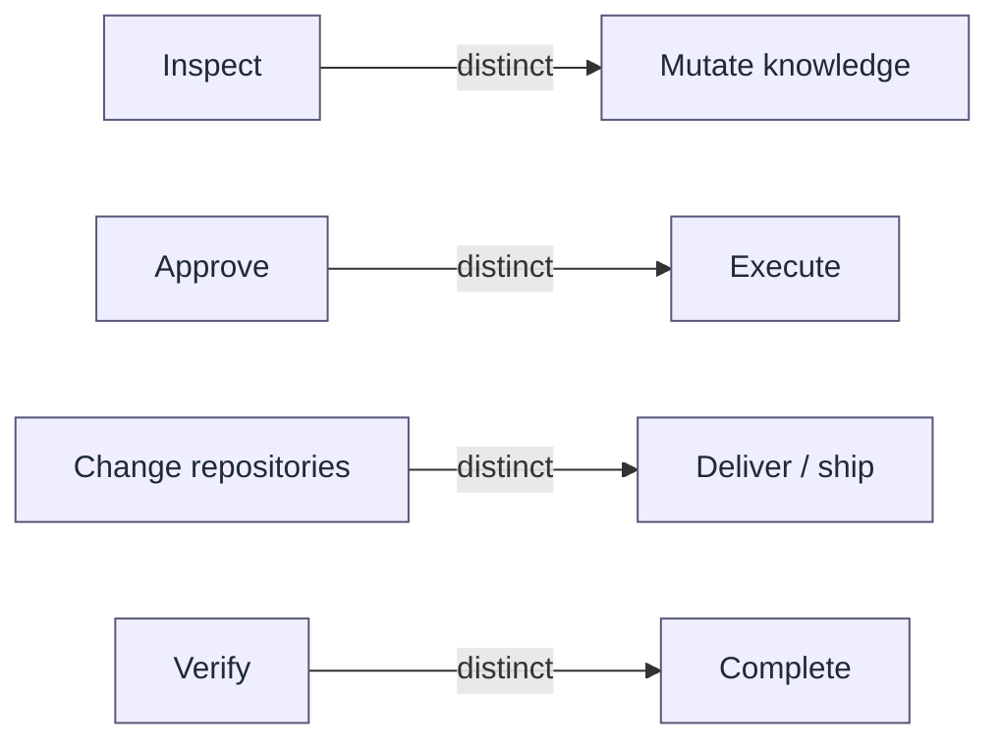

Each arrow is a boundary a human crosses on purpose. Nothing on the right side
happens because something on the left side "looked good."

---

## 2. The dual nature: source **and** template

This one repository (`context-circuit-source`) is both the factory and a working
example of what the factory produces.

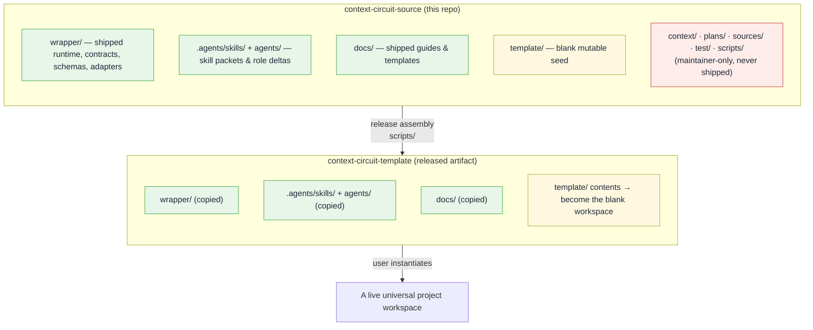

Two hats, one checkout:

| Hat | Meaning | Where it lives |
| --- | --- | --- |
| **Source** | The maintainer material that *produces* the product: design, tests, release scripts, the maintainer's own Product Knowledge and plans. | `sources/`, `test/`, `scripts/`, `context/`, `plans/` |
| **Template** | The clean, uninitialized workspace a user actually receives and fills in. | `template/` (seed) + the shipped `wrapper/`, `.agents/`, `agents/`, `docs/` |

The **release boundary** (`wrapper/manifest.yaml`) makes this precise:

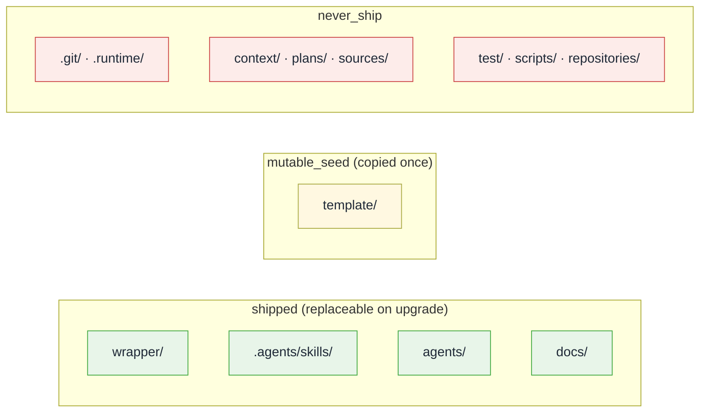

And the **upgrade boundary** protects the user: an upgrade may replace only the
shipped machinery; it must always preserve what the user created.

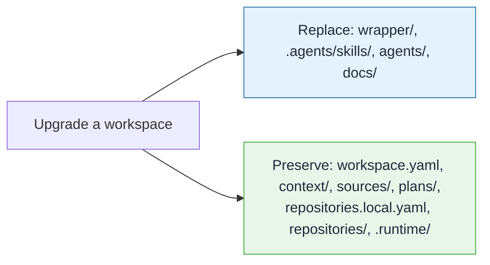

> **Why it matters:** the machinery evolves; the user's knowledge, plans, and
> repository bindings never get clobbered by an upgrade.

---

## 3. The mental model: one workspace, many repositories

A workspace is not a repository. It is an **agent-oriented coordination layer**
that sits *above* one or more Git repositories and holds the knowledge and plans
that span them.

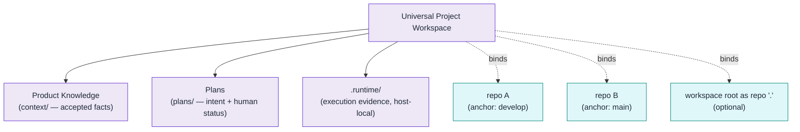

Key identity rules (owned by `INV-REPO-*`):

- **Portable identity** (`workspace.yaml`) holds only a logical key, an optional
  credential-free URL, and an optional `default_branch`. **No machine paths, no
  credentials.**
- **Local binding** (`repositories.local.yaml`, gitignored) holds the
  host-specific path and the **`anchor_branch`** — the required execution base
  and default pull-request target.
- `default_branch` is only clone/setup guidance; it is **never** silently used as
  the execution base or PR target.

---

## 4. Layered architecture

Context Circuit is built as strict layers, each with a narrow job. Higher layers
carry *intelligence*; lower layers carry *determinism*.

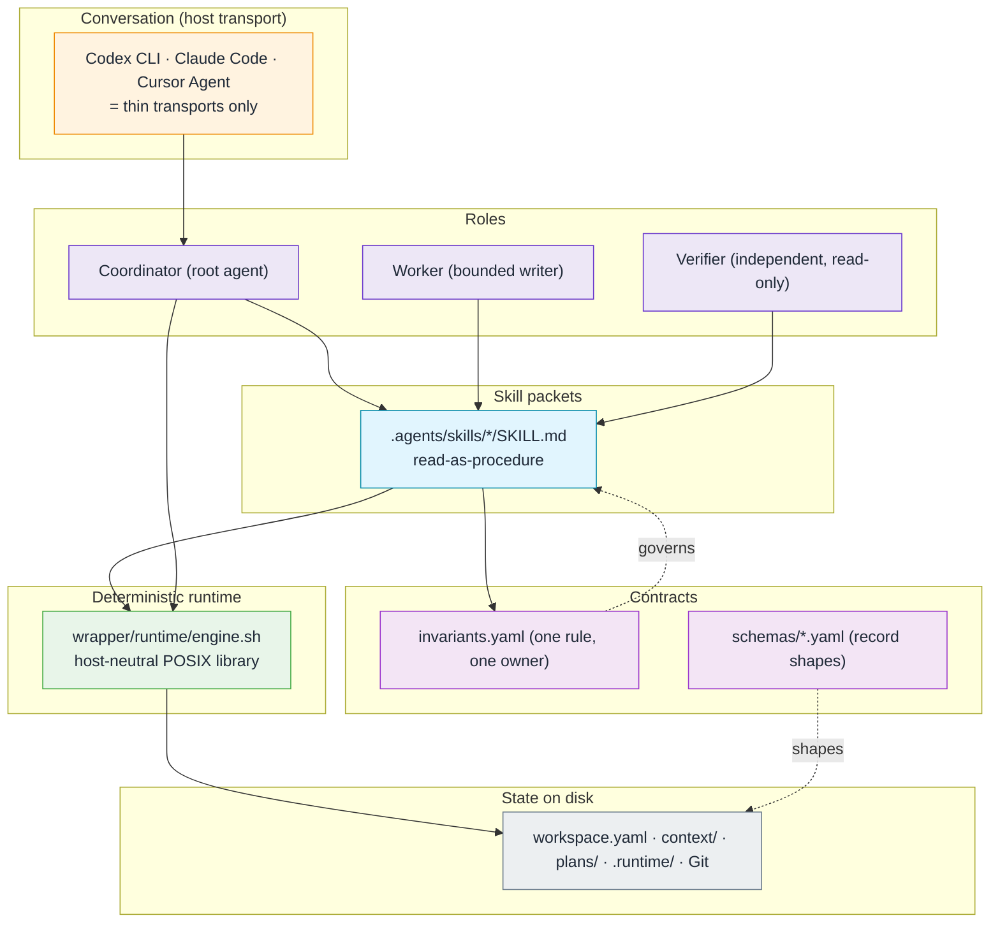

The single most important architectural line:

> **Intelligence lives in roles and skills. Determinism lives in the runtime.**
> The runtime never interprets knowledge, writes plans, routes conversation, or
> ships anything. Roles never bypass the runtime's safe state operations.

---

## 5. Authority order

When instructions could conflict, this fixed order decides who wins
(owned by `wrapper/adapters/WORKFLOW.md`):

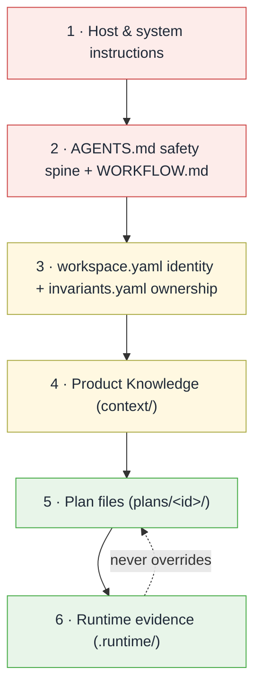

The last edge is deliberate and load-bearing: **runtime execution evidence never
overrides human plan status.** A plan is `done` only because a human said so
(§10), never because a machine record implies it.

---

## 6. Invariants: one rule, one owner

### In plain terms

An **invariant** is a promise the system always keeps — a rule about how Context
Circuit must behave, no matter which host, which repository, or which agent is
acting. "Only an approved plan may execute." "A pull request targets the anchor
branch, never the default branch." "Never silently clean up failed work." Each
such promise gets a **stable name** (`INV-<AREA>-NN`, e.g. `INV-EXEC-01`) and is
written down in exactly **one place**.

Think of `wrapper/contracts/invariants.yaml` as the project's **constitution plus
a table of contents**: it states every rule once and records which single file is
responsible for it. It is *not* program code that runs — it is the authoritative
index that people and agents consult to answer "what is the rule here, and who
owns it?"

### What problem it solves

Context Circuit's behavior is spread across many files: role descriptions, skill
packets, schemas, the runtime, and host adapters. Without a single owner per rule,
two files would eventually describe the *same* rule slightly differently and drift
apart — "parallel policy." The invariant model forbids that:

> **One rule has one owner. Every other file may *reference* the rule by its ID,
> but must never re-state or re-define it.**

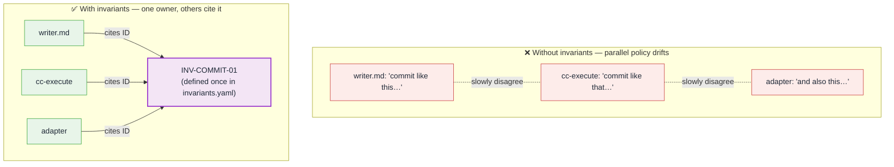

### What a rule connects to: the owner map

The file has two parts. `invariants:` lists the rules; `owners:` maps each
*concern* to the one file that actually implements/enforces it. The invariant
**names** the promise; the **owner file** is where the behavior truly lives.

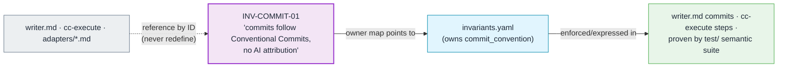

Different concerns have different owners — a schema file owns record shapes, the
runtime owns locking, a role file owns worker behavior. The `owners:` block is the
lookup table from concern → owning file.

### Who reads the invariants, and when

The invariants file is consulted, not executed. Three kinds of reader use it:

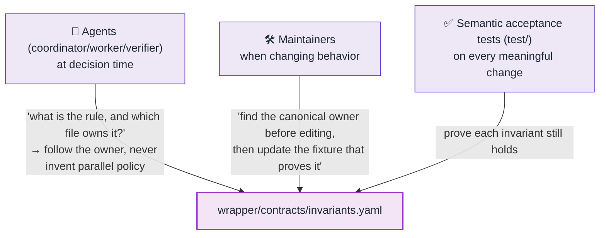

- **Agents** consult it to find the *one* authoritative source for a rule so they
  act consistently and don't quietly write a competing policy into a skill or role
  file (`AGENTS.md`: "do not add parallel policy").
- **Maintainers** consult it to locate a rule's owner *before* changing it, then
  update the test that proves it (`WORKFLOW.md`: "identify its canonical owner").
- **Tests** consult it as the checklist of promises the semantic acceptance suite
  must keep proving true.

### Worked example: `INV-COMMIT-01`

> *Rule:* every commit an agent authors follows Conventional Commits and carries
> **no** AI attribution. *Owner:* `invariants.yaml` (`commit_convention`).

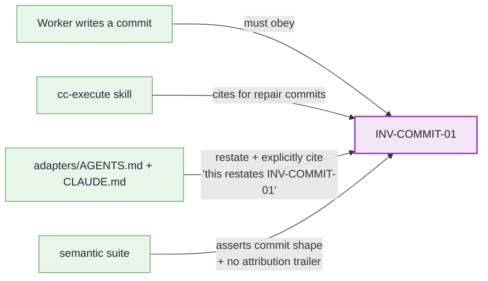

The adapter files even say so out loud — they note their commit text "restates
INV-COMMIT-01, which owns the rule." That sentence is the invariant model working
as designed: mention the effect, point at the one owner, never fork it.

### The full catalog

These are all the invariant families and the concern each one guards — the "table
of contents" of promises:

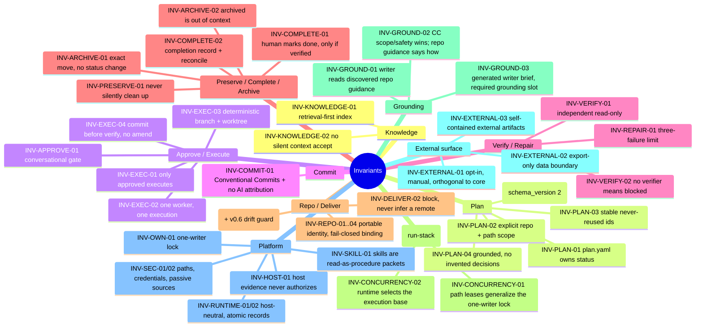

---

## 7. The three roles

Exactly three roles exist. They map cleanly onto whatever a host offers (root
session, task/subagent), but the boundaries never move.

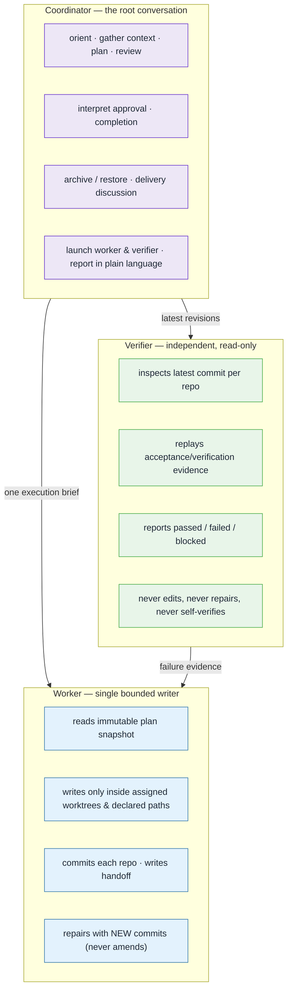

Hard separations between them:

- The **coordinator** never writes code and never self-verifies.
- The **worker** never approves, never completes, never marks its own work
  verified, never merges/pushes/publishes.
- The **verifier** is a *separate actor*, strictly read-only w.r.t. product
  files. **If the host cannot create an independent verifier, the execution is
  `host-blocked` — nobody self-verifies as a substitute** (`INV-VERIFY-02`).

---

## 8. The full lifecycle

A request flows through explicit, separately-authorized stages. Each stage is a
human decision or an independent check — never an inference.

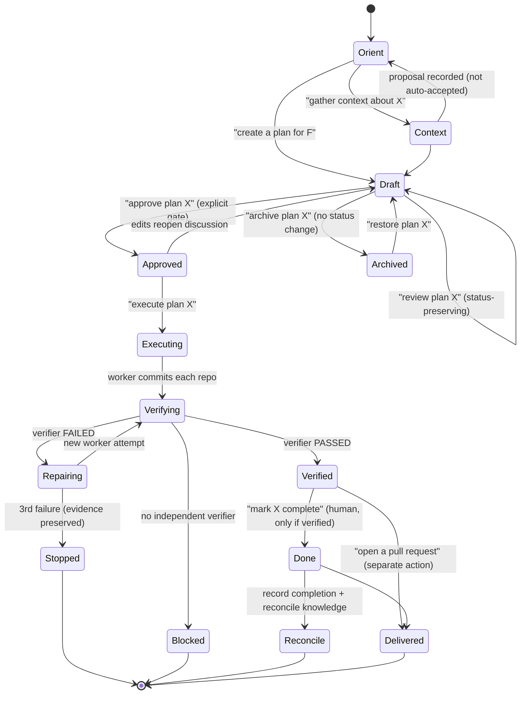

Notice what is **not** an edge: verification does not flow to `Done`; execution
does not flow to `Delivered`; a passing verifier does not complete a plan. Those
gaps are the product.

In v0.6 this same per-plan lifecycle applies **unchanged** to every plan in a
run-stack — the stack only decides *ordering* (§10), never the gates. Publications
(external-surface) sit entirely outside this diagram: a publication is a peer
command, never a lifecycle edge, and no phase triggers or waits on one.

---

## 9. Conversation → action

The coordinator maps ordinary language onto exactly one contract action. It never
infers a consequential action from "okay" or "looks good."

| You say | Action | Side effect? |
| --- | --- | --- |
| What is this workspace? | Read-only orientation | none |
| Gather context about X. | Propose a context update (with provenance) | proposal only |
| Connect / clone / init repo R. | Register & bind; clone/init only if asked | repo binding |
| Create a plan for F. | Draft a grounded plan | plan draft |
| Review plan X. | Non-executing discussion | may edit draft |
| Approve plan X. | Explicit gate: draft → approved | status change |
| Execute plan X. | Execute **only if approved** | branches, commits |
| Approve plan X and execute it. | Two sequential explicit actions | both |
| Execute approved plans X…Z (run the ready stack). | Run-stack: schedule ready plans by dependencies + free leases; each still separately verified/completed/delivered | branches, commits |
| What happened with X? | Summarize execution evidence | none |
| Repair the failed X. | Another worker attempt (if allowed) | new commits |
| Mark X complete. | Human completion, **only if verified** | done + reconcile |
| Archive / restore plan X. | Move out of / into active area | no status change |
| Open a pull request for X. | Delivery: source = execution branch, target = anchor branch (rebase + re-verify if the base drifted) | PR |
| Publish plan X to my tracker. | `cc-publish` (plan kind) — manual, orthogonal, export-only | external items only |
| Post X's open questions as a discussion. | `cc-publish` (thread kind) — manual, orthogonal, export-only | external thread only |
| Author a system design for F. | `cc-system-design` authoring skill (source material) | source files only |

---

## 10. Execution internals (hidden, but knowable)

Execution is deterministic and isolated. The user sees plain language; the
mechanism underneath is fixed by `INV-EXEC-*` and `INV-OWN-01`.

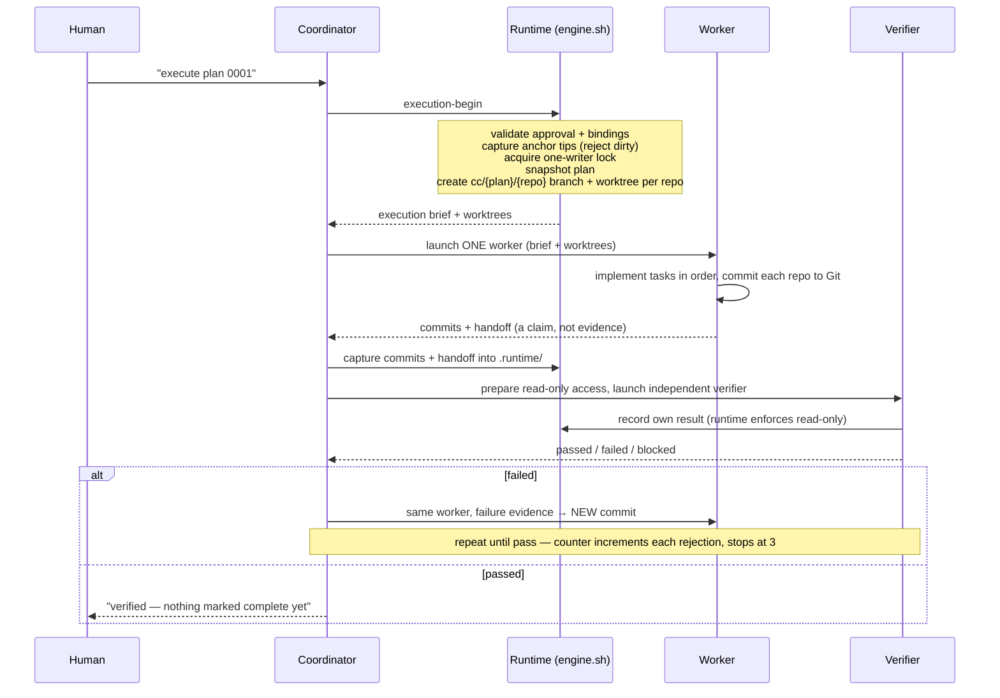

Guarantees baked into this flow:

- **The anchor checkout is never written during execution** — all work happens in
  isolated worktrees off captured anchor tips (`INV-EXEC-03`).
- **Commit before verify; repairs are new commits, never amendments**
  (`INV-EXEC-04`) — history never hides a repair attempt.
- **At most one active writer**, enforced by an atomic exclusive-create lock; a
  competing writer gets read-only or blocked, never a silent steal (`INV-OWN-01`).

### The repair loop and the three-failure limit

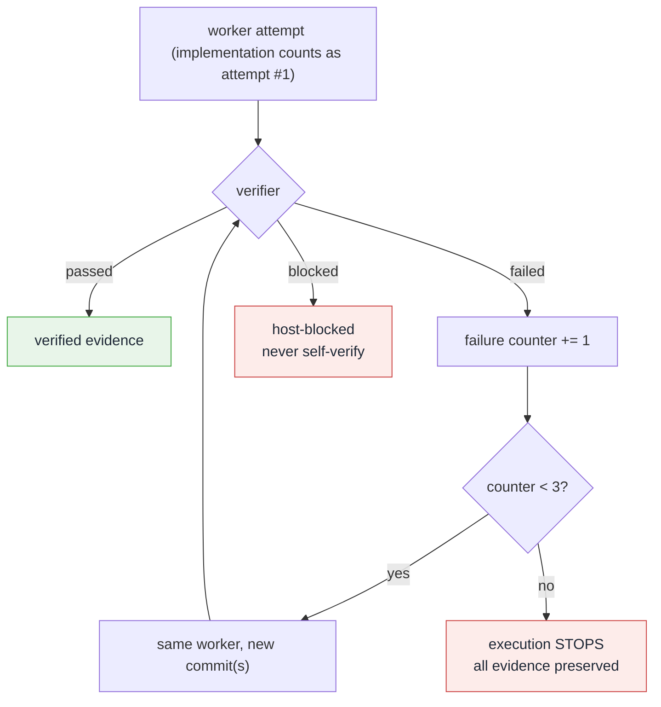

### Run-stack: executing a set of approved plans (v0.6)

A single execution runs one approved plan. **Run-stack** runs a *set* of
already-approved plans in one conversational run — a *plan stack* — so any
conflict between them becomes a scheduling decision made **before** a worker
runs, never a merge collision found after. It adds **no new authority**: every
plan is still separately approved, verified, completed, and delivered.

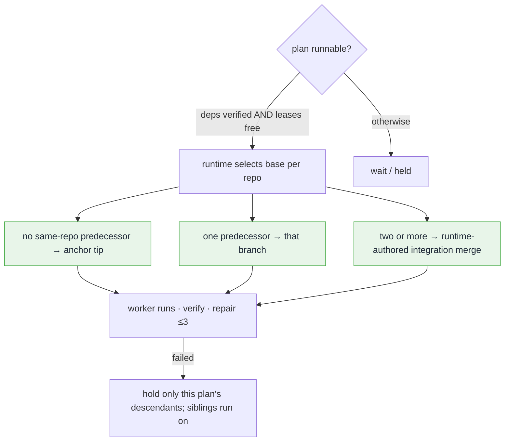

Four coordinated mechanisms layer on the v0.5 core:

- **Inter-plan dependencies** (`INV-PLAN-05`): a plan may declare optional
  `plan_dependencies` (`{id, reason}`), distinct from a task's intra-plan
  `depends_on`; using the field requires `schema_version 2`, and the graph is
  acyclic. A v0.5 engine refuses such a plan rather than scheduling it
  dependency-blind.
- **Path leases** (`INV-CONCURRENCY-01`): a lease generalizes the one-writer
  lock (`INV-OWN-01`) from plan scope to `(repository, path-region)` scope under
  `.runtime/locks/paths/`. While held, no non-descendant plan may take an
  overlapping region; a lease lives from execution start until **delivery**, not
  merely verification.
- **Execution bases** (`INV-CONCURRENCY-02`): the runtime selects each plan's
  base per repository — anchor tip, the single predecessor branch, or a
  runtime-authored integration merge — recorded as `base_commit`, with base refs
  at `refs/cc-base/<plan>/<repo>`. An integration merge is never counted as a
  worker attempt; a stale base (predecessor repaired) is rebuilt.
- **Delivery drift guard** (`INV-DELIVER-01`, v0.6): when a plan is delivered and
  its recorded base has diverged (a sibling already merged), the plan is rebased
  onto the current anchor tip and re-verified before its pull request opens.

### Grounding the writer in the target repository (v0.6)

Before implementing, the worker reads and honors the target repository's **own**
agent guidance — `AGENTS.md`, `CLAUDE.md`, `.cursor/rules`,
`.github/copilot-instructions.md`, and `.agents/skills/*/SKILL.md` — discovered
live from the execution worktree by a deterministic runtime scan
(`INV-GROUND-01`). The scan emits **data** (a grounding manifest recorded as
execution evidence), never prompt text.

- **Precedence** (`INV-GROUND-02`): the writer brief's scope and safety rules are
  authoritative on *what* and *where* to change; the repository's guidance is
  authoritative on *how* to write code correctly there. On a scope/safety
  conflict the writer stops and reports; repo guidance never overrides a Context
  Circuit safety or scope rule.
- **Generated brief** (`INV-GROUND-03`): the brief's fact sections are a fixed
  template (`wrapper/adapters/writer-brief.md`) filled by deterministic slot
  substitution from the manifest and the plan; the coordinator delivers the brief
  and authors only a one-line task focus. A preflight refuses a brief missing the
  required grounding slot. Worktree hardening eliminates environment workarounds
  rather than documenting them by hand.

---

## 11. The runtime engine: a deterministic boundary

`wrapper/runtime/engine.sh` is a small, host-neutral, POSIX-`sh` deterministic
library. It is the *only* thing allowed to mutate workspace/Git/execution state,
and it is deliberately unintelligent.

```mermaid
flowchart LR
    subgraph owns["engine.sh OWNS (deterministic)"]
        o1["safe path/id checks · atomic writes · digests"]
        o2["workspace + binding validation"]
        o3["anchor validation · branch/worktree prep"]
        o4["plan structure + approval-state validation"]
        o5["archive/restore exact moves"]
        o6["execution/attempt records · commit capture"]
        o7["verifier-result + read-only enforcement"]
        o8["three-failure counter · one-writer lock"]
        o9["completion eligibility + record · recovery inspect"]
        o10["path leases · execution-base selection (run-stack)"]
        o11["repository-grounding discovery + manifest"]
        o12["writer-brief slot-fill + preflight"]
    end
    subgraph not["engine.sh does NOT own"]
        n1["provider child launch · model prompts/SDKs"]
        n2["Product Knowledge interpretation"]
        n3["plan-writing intelligence"]
        n4["conversational routing policy"]
        n5["confirmation cards / tokens"]
        n6["product test semantics"]
        n7["auto PR/merge/push/publish/deploy/cleanup/completion"]
    end

    classDef ok fill:#e8f5e9,stroke:#4a4,color:#1f2937;
    classDef no fill:#fdecea,stroke:#c44,color:#1f2937;
    class o1,o2,o3,o4,o5,o6,o7,o8,o9,o10,o11,o12 ok;
    class n1,n2,n3,n4,n5,n6,n7 no;
```

> A coordinator **invokes** the engine as a tool; it never *reads the engine's
> implementation* as context. The execution brief is enough to act.

---

## 12. Skills as read-as-procedure packets

Product behavior is packaged as skills at `.agents/skills/<name>/SKILL.md`. A
skill is a **procedure the coordinator reads and follows** — resolved by path, not
a separate authority or route (`INV-SKILL-01`).

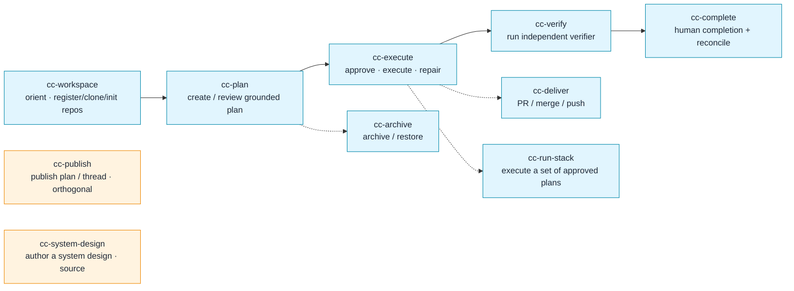

A host may *additionally* surface a skill as a slash command (e.g. Claude Code
symlinks under `.claude/skills/`), but that bridge is a host-local convenience
that grants no route or authority the read-as-procedure path doesn't already
carry. The shipped workspace never contains a host-specific skill directory.

---

## 13. Host adapters: transports, not deciders

Codex CLI, Claude Code, and Cursor Agent CLI all sit on the **same** instruction
surface (`AGENTS.md` / `WORKFLOW.md`). They are transports. What a host reports
about itself is bounded, provider-neutral **`host_evidence`** and it authorizes
**nothing** (`INV-HOST-01`).

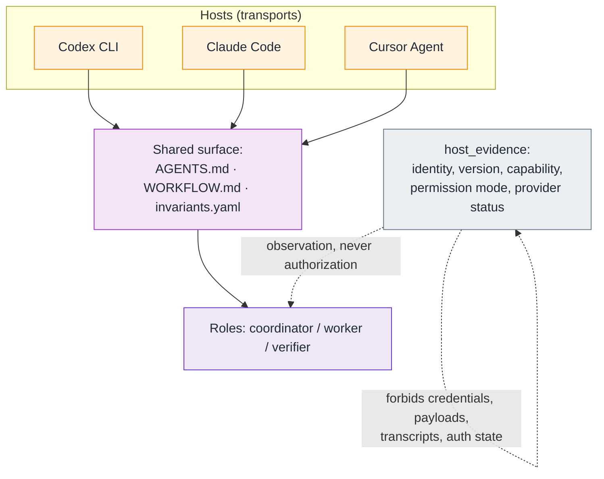

- The **root session** is always the **coordinator**.
- A native **task/subagent** maps only to the single **worker** or the
  independent **verifier**.
- A host permission flag is an observation, not a grant. If child creation is
  unavailable → `host-blocked`, read-only, **never self-verify**.

---

## 14. Safety spine (the short version)

Everything above collapses into a handful of always-on rules:

```mermaid
flowchart TB
    R1["Read first: WORKFLOW.md · workspace.yaml · context/INDEX.md<br/>then only what an action needs"]
    R2["One rule, one owner — no parallel policy in skills/roles"]
    R3["Only an approved plan executes<br/>(explicit gate, no cards/tokens)"]
    R4["One writer, one independent read-only verifier<br/>no verifier ⇒ host-blocked, never self-verify"]
    R5["sources/ is passive: read only exact named files<br/>plans/.archived/ only via explicit restore"]
    R6["Completion, PR, merge, push, publish, deploy, archive, cleanup<br/>= separate explicit human actions"]
    R7["Failed/interrupted work is preserved, never silently cleaned"]
    R8["Credentials stay in host Git config / host agent<br/>never in workspace files or runtime records"]

    R1 --> R2 --> R3 --> R4 --> R5 --> R6 --> R7 --> R8

    classDef spine fill:#fff8e1,stroke:#aa4,color:#1f2937;
    class R1,R2,R3,R4,R5,R6,R7,R8 spine;
```

---

## 15. The v0.6 delta — four scopes at a glance

v0.6 is a **delta on v0.5**: it adds no owner and forks no rule, and it changes
only what it names. Four independent capabilities ship together.

```mermaid
flowchart TB
    V5["v0.5 core<br/>(unchanged spine)"]
    RS["run-stack<br/>execute a set of approved plans"]
    RG["repository-grounding<br/>ground the writer live"]
    ES["external-surface<br/>opt-in publications"]
    SD["system-design-authoring<br/>a source-authoring skill"]
    V5 --> RS
    V5 --> RG
    V5 --> ES
    V5 --> SD
    RS -. "shared contract bump<br/>plan schema [1,2] · runtime 0.6.0" .- RG

    classDef c fill:#ede7f6,stroke:#63c,color:#1f2937;
    classDef n fill:#e8f5e9,stroke:#4a4,color:#1f2937;
    class V5 c;
    class RS,RG,ES,SD n;
```

| Scope | What it adds | Skill(s) | Invariants | Contract change |
| --- | --- | --- | --- | --- |
| **run-stack** | Execute a set of approved plans in one run — inter-plan dependencies, path leases, runtime-selected execution bases, a readiness/scheduling loop, and a delivery drift guard. No new authority. | `cc-run-stack` | INV-PLAN-05, INV-CONCURRENCY-01/02, INV-DELIVER-01 (drift) | Owns the bump: plan schema `[1,2]`, `runtime_version 0.6.0`, `lease.yaml` |
| **repository-grounding** | Ground the writer in the target repo's own guidance (discovered live) and hand it a prepared worktree via a generated brief; worktree hardening removes environment workarounds. | (uses the writer brief) | INV-GROUND-01/02/03 | Rides run-stack's bump; `grounding-manifest.yaml`; no `plan.yaml` field |
| **external-surface** | Opt-in, manually-triggered, config-driven publications to external systems (trackers, chat, docs), orthogonal to core. Kinds: `plan` and `thread`. | `cc-publish` | INV-EXTERNAL-01/02/03 | None to core; adds `publication-config/record/thread-record` schemas |
| **system-design-authoring** | A skill for authoring/structuring a system design as source material (three-tier layout, altitude, scope-by-concern). Adds no lifecycle or runtime. | `cc-system-design` | none new | None; a skill plus release-allowlist wiring |

## 16. One-paragraph summary

Context Circuit is a universal, agent-oriented project workspace that layers
durable Product Knowledge, grounded plans, and safe multi-repository execution on
top of one or more Git repositories. It draws hard, human-crossed boundaries
between inspecting and mutating, approving and executing, changing and delivering,
and verifying and completing. Intelligence lives in three roles (coordinator,
worker, verifier) and read-as-procedure skill packets; determinism lives in a
small host-neutral runtime; and every product rule has exactly one owning file so
policy can never quietly fork. This repository is simultaneously the **source**
that assembles the product and the **template** — the clean, uninitialized
workspace a user instantiates — with a release boundary that ships the machinery,
seeds the blank workspace once, and preserves everything the user creates across
upgrades. On top of that spine, v0.6 adds four orthogonal capabilities without
forking a rule: running a set of approved plans together (run-stack), grounding
the writer in each repository's own guidance (repository-grounding), opt-in
export-only publications to external systems (external-surface), and a
source-authoring skill for system designs (system-design-authoring).

---

*Descriptive companion to the contracts. Authoritative rules:
`wrapper/contracts/invariants.yaml`. Conversational contract:
`wrapper/adapters/WORKFLOW.md`. Release/upgrade boundary: `wrapper/manifest.yaml`.*
