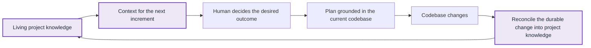
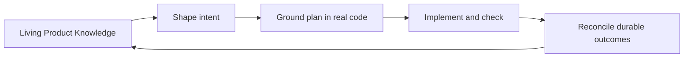
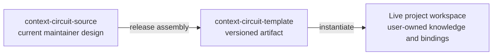
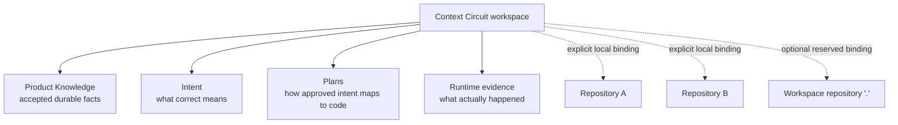
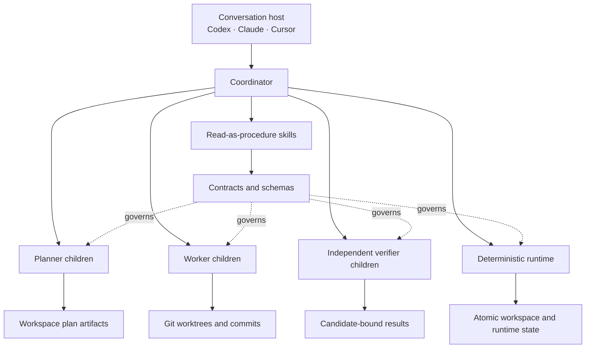
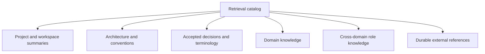
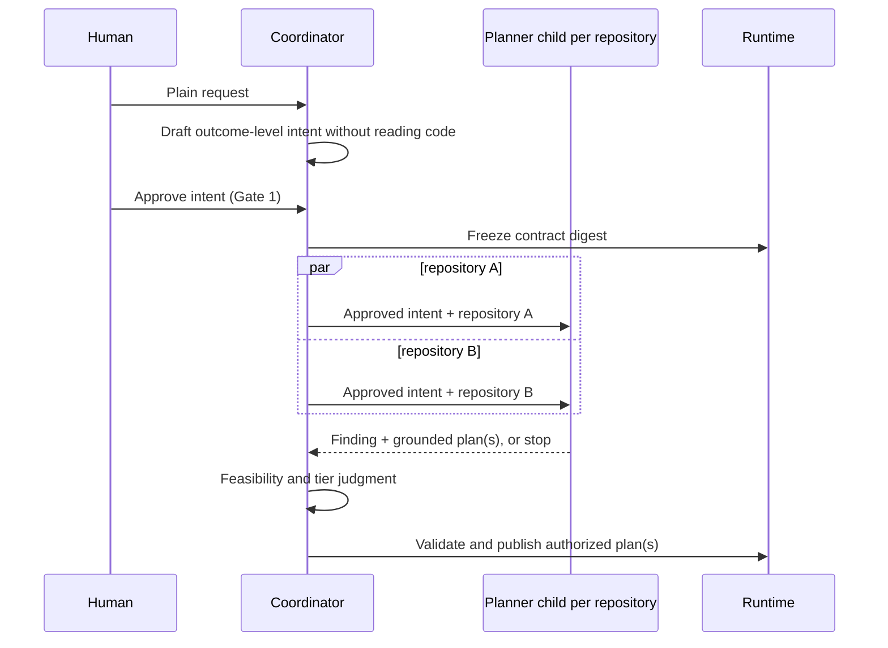
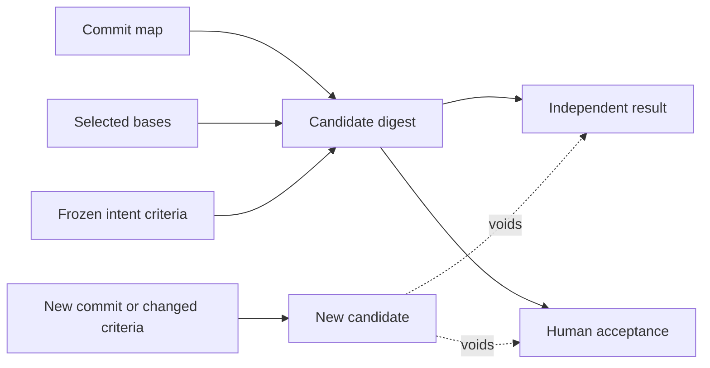
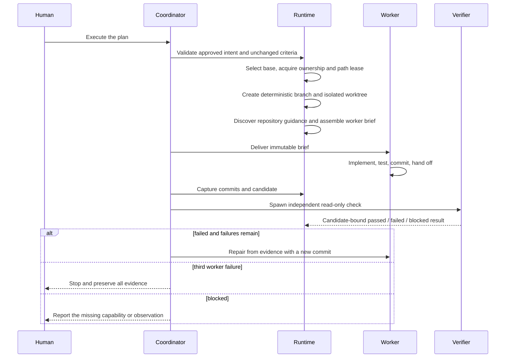

# Context Circuit — Core Concept v1.0

> A maintainer-facing conceptual map of Context Circuit v1.0: how living Product
> Knowledge preserves a product or project's accepted understanding, grounds
> each new increment, and is reconciled as the codebase changes—and how the trust
> workflow keeps that circuit dependable.
>
> This document is descriptive, not authoritative. Binding rules live in
> `.context-circuit/wrapper/contracts/invariants.yaml`; record shapes live under
> `.context-circuit/wrapper/contracts/schemas/`; the conversational contract
> lives in `.context-circuit/wrapper/adapters/WORKFLOW.md`. Where this document
> disagrees with an owner, the owner wins.

---

## 1. What Context Circuit is

Context Circuit is first and foremost a **living documentation system for a
product or project**.

Its reason for existing is to make project knowledge durable, current, and
reusable across increments of work. Instead of forcing every new conversation
to reconstruct the project from source code, chat history, old plans, and human
memory, Context Circuit stores the accepted understanding of the project as
structured, human-readable, agent-retrievable Product Knowledge.

That knowledge stays alive through a continuous circuit:

The output of one increment becomes trusted context for the next. Over time,
the workspace accumulates a living model of the product—its purpose,
architecture, domains, decisions, constraints, vocabulary, repository
boundaries, and current behavior—rather than a pile of disconnected execution
records.

AI-assisted implementation is how the circuit advances, not the center of the
product. Intent approval, repository-grounded planning, isolated execution,
candidate-bound verification, and explicit delivery exist to ensure that both
sides of the circuit remain trustworthy:

- code changes reflect a human-approved outcome; and
- living documentation reflects the durable truth of the changed codebase.

For each increment, the supporting trust workflow lets a human answer four
questions:

1. What project knowledge grounded this change?
2. What outcome did I authorize?
3. What exact repository state was independently checked?
4. What durable knowledge should now ground the next increment?

Context Circuit protects that workflow by separating **decision**,
**construction**, **assurance**, **knowledge reconciliation**, and **delivery**.

There are exactly **two human gates**:

- **Gate 1 — intent approval:** the human approves what “correct” means.
- **Gate 2 — delivery:** the human authorizes an irreversible external action,
  such as opening a pull request, merging, pushing, or deploying.

Everything between those gates is mechanical or evidence-producing. Execution
still starts only when the human asks for it, but it adds no new approval gate.
Marking work done is an explicit human status action, but it is not an authority
gate and does not imply delivery.

The gates protect change authority; the **knowledge circuit is the product's
continuity mechanism**:

Without this return path, Context Circuit would only be an execution harness
with stored notes. With it, each increment leaves the project better understood
than it found it, and the next increment begins from accepted product truth.

---

## 2. The source, the released template, and a live workspace

This repository is the **maintainer source**. It assembles a released template;
the template is then instantiated as a user's live workspace.

The source itself is not version-bound. It may lead the last published template
while a release is being prepared. The wrapper manifest records the current
runtime and template assembly metadata.

The release boundary has three classes:

| Class | Meaning | Main contents |
| --- | --- | --- |
| Shipped and replaceable | Product machinery upgraded as a unit | `.context-circuit/wrapper/`, `.agents/skills/`, `.context-circuit/agents/`, `.context-circuit/docs/`, host bridges |
| Mutable seed | Blank files copied when a workspace is created | `template/` |
| Never shipped | Maintainer or user state | `context/`, `intent/`, `plans/`, `publication/`, `sources/`, tests, scripts, local bindings, runtime evidence |

An upgrade replaces machinery and preserves user-owned state. Product Knowledge,
intents, plans, repository bindings, member identity, publications, and runtime
evidence do not become disposable merely because the wrapper evolves.

---

## 3. One living project model above one or more repositories

A Context Circuit workspace is the durable knowledge and coordination layer for
a whole product or project, not another name for a Git repository. Repositories
hold implementations; the workspace holds the living cross-repository
understanding that gives those implementations meaning.

Repository identity is split deliberately:

- `workspace.yaml` carries portable logical identity, an optional
  credential-free URL, and optional clone guidance.
- `repositories.local.yaml` carries machine-local paths and the required
  `base_branch` used for execution and as the default pull-request target.
- `default_branch` is setup guidance only. It is never silently substituted for
  `base_branch`.
- Missing, ambiguous, unsafe, non-Git, or identity-mismatched bindings fail
  closed; the system does not scan the machine for a convenient substitute.

Multiple people can allocate stable intent and plan identifiers without
colliding. `members.yaml` owns non-overlapping numeric bands; each machine picks
one roster member in gitignored `member.local.yaml`. Member identity affects
allocation only—it never appears in public IDs or execution branch names.

---

## 4. The architecture supports the living knowledge circuit

The architecture exists to keep the knowledge circuit dependable. Its governing
line is:

> **Living project truth lives in Product Knowledge; judgment lives in roles;
> procedure lives in skills; product rules live in contracts; deterministic
> state transitions live in the runtime.**

The runtime is intentionally model-blind and provider-neutral. It validates
identities and records, allocates IDs, freezes digests, prepares branches and
worktrees, arbitrates locks and path leases, builds candidates, and records
evidence atomically. It does not interpret Product Knowledge, write intents or
plans, decide feasibility or tier, launch agents, run product-specific tests, or
automatically deliver, complete, publish, deploy, or clean up work.

Skills are read-as-procedure packets, not independent authorities. Host-native
slash commands may expose them conveniently, but no host bridge creates a new
route, role, or permission.

---

## 5. Authority and one-rule-one-owner

When instructions conflict, the fixed authority order is:

1. Host and system instructions.
2. The workspace safety spine and conversational workflow.
3. Workspace identity and invariant ownership.
4. Product Knowledge.
5. Approved intents.
6. Derived plans.
7. Runtime evidence.

Lower layers never rewrite the meaning of higher layers. In particular, runtime
evidence cannot approve an intent, alter Product Knowledge, or mark a plan done.

Every product rule has one canonical owner. The invariant catalog names the
promise and maps its concern to that owner. Roles, skills, adapters, schemas,
and tests may refer to the rule's effect, but must not grow parallel versions of
the same policy.

The v1.0 trust core is organized around these families:

- knowledge and passive-source boundaries;
- intent, approval, planning, and member-safe allocation;
- candidate identity and consequence-tiered assurance;
- execution, repository grounding, verification, repair, and preservation;
- completion, archive, and knowledge reconciliation;
- repository identity, stacking, concurrency, and delivery;
- runtime, host evidence, skills, pairing, and external publication.

---

## 6. Product Knowledge is the core product

Product Knowledge is not an accessory to execution, merely context supplied to
a model, or a snapshot taken before planning. It is the **core product of
Context Circuit**: the living, accepted documentation of the product or project,
shared by humans and agents across conversations, repositories, and increments.

The plans, roles, runtime, evidence model, and delivery boundaries exist to make
this knowledge dependable. They provide a disciplined way to move from what the
project is now, through one approved change, to an updated understanding of what
the project has become.

It answers questions such as:

- What is this product and how is it structured?
- Which decisions and constraints are currently in force?
- What vocabulary does the team use?
- Which domains and repositories own which concerns?
- What should a future agent retrieve before shaping or implementing a change?

The knowledge base is organized as small human-readable context units plus a
retrieval catalog. The catalog carries stable IDs, summaries, topics, aliases,
domains, repositories, decisions, constraints, freshness, status, and durable
provenance. It routes a reader to the smallest relevant set of pages instead of
forcing every agent to ingest one giant project document.

“Living” has concrete operational meaning:

- **Context gathering writes the live documentation in place.** There is no
  proposal sidecar and no separate knowledge-acceptance gate.
- **Intent authoring retrieves from it first.** The coordinator shapes the
  human's request against accepted product truth before target code is read.
- **Planning uses it together with repository evidence.** Missing or conflicting
  knowledge becomes an explicit question, assumption, or risk, never an invented
  decision.
- **Mark-done closes the knowledge circuit.** When completed work changed durable
  product truth, the coordinator reconciles the live pages and retrieval catalog
  in place.
- **The runtime never authors knowledge.** Execution records, worker claims,
  verifier results, candidate acceptance, and delivery are evidence or actions;
  none automatically becomes Product Knowledge.

Knowledge reconciliation records the durable result—not the temporary route by
which it arrived. Live pages do not cite a particular intent, plan, or source
file, and the decisions page records what is now true, why, and with what
consequence rather than listing edited paths or ephemeral artifacts. This keeps
the documentation useful after plans are archived and source layouts change.

The knowledge circuit is deliberately non-blocking. A later plan may begin even
if an earlier change's knowledge reconciliation has not happened yet; absence is
visible debt, not a hidden authorization gate. The coordinator remains
responsible for keeping the living documentation aligned with accepted product
truth.

The intended steady state is therefore stronger than “documentation exists”:

> Every managed codebase increment that changes durable project truth should
> leave the living Product Knowledge aligned with that new truth, so the next
> increment can retrieve it instead of rediscovering it.

That update is a reasoned reconciliation, not automatic documentation generated
from a diff. Code shows what changed mechanically; the coordinator determines
which consequences are durable project knowledge and updates the appropriate
human-readable units and retrieval metadata.

### Sources, intents, plans, and evidence remain separate

These artifacts have deliberately different jobs:

| Artifact | Meaning | Authority |
| --- | --- | --- |
| `sources/` | Passive raw evidence or design source | Never scanned; exact request-scoped reads only |
| `context/` | Living Product Knowledge | Durable accepted product documentation, retrieved and edited in place |
| `intent/<id>/` | One human decision about what correct means | Gate 1 freezes its criteria identity |
| `plans/<id>/` | Repository-grounded implementation derivation | Executes because its parent intent is approved |
| `.runtime/` | Private evidence and deterministic state | Proves events; grants no human authority |

An intent is deliberately authored **before reading the target code**. It holds:

- a goal and explicit non-goals;
- constraints;
- human-readable, outcome-level acceptance criteria;
- an optional coarse scope;
- a provisional consequence tier;
- optional intent dependencies.

Its ID is `iNNN-slug`. Approval freezes `contract_digest`, the identity of the
criteria-bearing decision. Changing those criteria requires re-approval and
invalidates downstream evidence by construction.

A plan is authored **after approval and after reading the real code**. Each plan
belongs to one approved intent and exactly one repository. It records grounded
tasks, concrete paths, risks, dependencies, and runnable checks that prove the
intent's outcome criteria. Plan IDs use `NNNN-slug`; plan status is only `draft`
or `done`. There is no plan-level `approved` state and no second approval gate.

---

## 7. The four roles

v1.0 has four distinct role shapes.

### Coordinator

The root conversational actor. It interprets the request, authors the intent
without reading target code, takes human approval, dispatches children, judges
planner findings, coordinates execution and verification, and reports effects in
plain language. It does not implement code, replace a missing planner, or
self-verify.

### Planner

The first actor allowed to inspect target code for a Standard or Critical
change. Intent approval spawns one planner child per repository in scope,
potentially in parallel. Each planner reads one repository and either:

- records that the intent is not feasible and writes no plan;
- surfaces an intent-level question that returns to Gate 1; or
- writes one or more single-repository plans and a finding.

The coordinator performs a feasibility check over the finding without reading
the repository and publishes the planner's work without rewriting its prose.

### Worker

The single bounded writer for one plan execution. It receives an immutable plan
snapshot and a deterministic brief, reads the target repository's own agent
guidance, works only in the prepared isolated worktree, runs checks, commits the
result, and records a handoff. Necessary intent-consistent expansion within the
same repository is recorded and independently reviewed. A second-repository or
approved-decision expansion stops for coordinator handling.

### Independent verifier

A separate read-only actor for Standard and Critical work. It checks the full
committed diff and the runnable evidence against the current candidate. It never
repairs, writes product files, changes status, or treats worker claims as proof.
If the host cannot create this actor with read-only access, the result is
host-blocked; the coordinator or worker never substitutes itself.

Host identity, permissions, model, effort, and provider status are bounded
evidence only. They may affect cost or speed, never authority or semantics.

---

## 8. Gate 1: approve the intent, then earn the plan

This ordering prevents two opposite failures:

- the human is not asked to approve implementation details they did not request;
- the agent cannot read code first and quietly reshape the human's desired
  outcome around what is easiest to build.

Planner questions have fixed dispositions. A question that changes goal,
constraints, outcome criteria, scope, tier, authority, or lifecycle returns to
Gate 1. An implementation choice stays in the plan. Something already answered
by the request is applied without asking again.

The feasibility check is a coordinator quality judgment, not a runtime safety
gate. Uncertainty fails upward. Scope safety is ultimately settled at delivery,
where the human sees the exact candidate; before then, writes remain isolated.

---

## 9. Candidate identity: evidence attaches to an exact change

A candidate is a deterministic digest of:

- the per-repository commit map;
- the selected base commits; and
- the intent's frozen `contract_digest`.

This is the heart of v1.0's trust model. Evidence is never “close enough.” Any
new commit or re-approved criteria change creates a new candidate and voids old
verification and acceptance automatically. The rule is structural, not a role's
opinion.

---

## 10. Assurance scales with consequence

Context Circuit composes assurance from transparent risk signals and summarizes
it as one of three tiers:

| Tier | Shape | Result language |
| --- | --- | --- |
| Explore | Human-supervised direct collaboration; no plan or independent verifier before promotion | Never called verified |
| Standard | Approved intent, grounded plan, isolated worker, independent read-only verifier | Candidate may be verified |
| Critical | Standard mechanics with the highest consequence posture | Candidate may be verified; human retains explicit status and delivery decisions |

Signals include repository count, security or secrets, money, data migration,
production or deployment, irreversibility, and novelty. The human may raise the
tier. Uncertainty raises rather than lowers it, and any declared risk surface
prevents use of Explore to drop the verifier.

The runtime does not choose a tier. It provides a deterministic classifier over
declared facts and enforces the assurance floor at relevant boundaries.

### Explore and promotion

Explore is direct collaboration among the human, coordinator, and one worker in
one repository and one isolated `cc-pair` worktree. The human is the live oracle.
There is no plan, lease, execution record, verifier, failure counter, completion
record, or implied delivery. Commits occur only when explicitly requested.

If exploratory work becomes consequential, it is **promoted in place**: attach
an intent, raise the tier to Standard or Critical, spawn the planner, create the
plan of record, derive a candidate, and bring in the independent verifier. The
work does not need to be discarded and restarted merely to enter the trust
system.

---

## 11. Execution, grounding, verification, and repair

Execution creates branch `cc/<plan-id>/<repository-id>` in an isolated worktree
from a captured base. The connected base checkout is never modified. The worker
must commit before verification; every repair is a new commit, never an
amendment that hides the attempt.

Repository-local guidance is discovered from the execution worktree and
rendered into a fixed worker brief. Context Circuit owns scope and safety;
repository guidance owns how code should be written inside that boundary. A
conflict stops rather than silently choosing one.

Each verifier rejection increments the worker-failure count, including the
initial implementation. The third failure stops the execution. A missing host
capability or unavailable external observation is a block, not an invented
worker failure. Failure, interruption, and blocking preserve branches,
worktrees, commits, handoffs, results, and runtime records.

---

## 12. Plan stacks and safe concurrency

Plans may declare dependencies. The runtime determines readiness from dependency
evidence and path availability; the coordinator may overlap only plans that are
provably independent, up to a host policy fan-out width.

Path leases reserve `(repository, path-region)` and remain held until delivery,
not merely until verification. Equal, ancestor/descendant, or repository-wide
regions overlap. A competing unrelated plan blocks; a declared descendant may
build on its predecessor.

Base selection is deterministic:

- no same-repository predecessor → current recorded base tip;
- one predecessor → predecessor branch tip;
- several predecessors → runtime-authored integration merge;
- cross-repository predecessors → ordering only, never a shared Git base.

If an upstream plan changes after a dependent's base was built, the dependent's
base becomes stale and must be rebuilt. The system never silently verifies or
delivers against an obsolete stack base.

---

## 13. A code increment is not conceptually closed until knowledge returns

Three actions are often conflated, so v1.0 keeps them orthogonal:

| Action | What it changes | What it does not imply |
| --- | --- | --- |
| Verify | Records an independent result for one candidate | Does not mark done or deliver |
| Mark done | Changes a Standard/Critical plan from `draft` to `done` on explicit request | Does not require readiness and does not deliver |
| Deliver | Performs the specifically requested external action (Gate 2) | Does not mark done or update Product Knowledge |

Mark-done intentionally honors human status authority even when evidence is
missing or failed. When available, implementation evidence is summarized in a
completion record; missing evidence does not veto the status change. If the
completed plan changed durable product truth, the coordinator reconciles the
living documentation and its retrieval catalog in place. This is how the
product's current understanding survives beyond the execution. The reconcile is
not a third gate, and delivery neither starts nor substitutes for it.

Operationally, mark-done may complete even when reconciliation cannot yet be
finished, because knowledge debt must not become hidden execution authority.
Conceptually, however, an increment has not fully returned value to Context
Circuit until its durable outcome is available as context for the next
increment. The workspace should surface and resolve that knowledge debt rather
than treating the commit or completion record as sufficient documentation.

Delivery operates on exact covering tips. Stacked plans already nested in one
repository tip form one change set and one pull request. Sibling stacks form
separate pull requests. Different repositories remain separate candidates and
deliveries. Delivery reuses each member plan's candidate-bound pass; it does not
spawn a fresh shared verifier.

Before a pull request opens, a drift guard checks the recorded base against the
current `base_branch`. A stale candidate is brought forward and re-verified.
Missing source branch, target branch, provider, or remote blocks delivery rather
than triggering inference or a silent push.

Archiving is organization only: it moves an exact named intent or plan without
changing status, execution, delivery, or evidence. Archived material stays out
of ordinary context until explicitly restored.

---

## 14. External publication is orthogonal and one-way

Context Circuit can publish plans or discussions to external systems through an
explicit `cc-publish` action. This surface is intentionally outside the core
workflow:

- it is opt-in and manually triggered;
- it reads only declared workspace artifact types;
- it writes only its own configuration, field intent, and publication records;
- data flows from the workspace outward, never back into core state;
- credentials and provider payloads remain at the host or connector layer;
- core planning, approval, execution, verification, completion, and delivery do
  not trigger, wait on, or depend on publication.

External artifacts must be self-contained for readers who cannot see the
workspace. Internal paths, mechanism names, and evidence identifiers do not leak
into the published text. Stable plan or task identifiers may appear only as
human mapping aids.

---

## 15. The conversational experience

The product exposes effects rather than machinery:

| Human request | Context Circuit effect |
| --- | --- |
| “What is this project?” | Retrieve and explain the living project knowledge |
| “Gather context about X.” | Update durable Product Knowledge in place |
| “Work on this with me.” | Start or resume Explore collaboration |
| “Shape what I want to build.” | Draft an intent without reading target code |
| “Approve the intent.” | Freeze Gate 1 and spawn planner children |
| “Execute it.” | Run the authorized grounded plan in isolation |
| “Run the ready stack.” | Execute dependency-ready plans safely |
| “What happened?” | Summarize evidence without mutating state |
| “Mark it done.” | Change human plan status; reconcile knowledge if needed |
| “Open a pull request.” | Exercise Gate 2 for the exact covering candidate |
| “Publish this plan to X.” | Perform a separate manual one-way publication |

The coordinator reports in the user's vocabulary. Internal paths, branch names,
runtime records, host adapters, and model tiering stay hidden unless diagnostics
are explicitly requested.

---

## 16. Safety spine

The whole system reduces to these durable separations:

1. Treat living Product Knowledge as the core: every increment starts from it
   and returns durable truth to it.
2. Read and orient before mutating.
3. Read passive sources only when the exact source is named.
4. Approve desired outcomes before the first planner reads target code.
5. Derive every plan from an approved, unchanged intent.
6. Keep implementation isolated from the connected base checkout.
7. Bind verification and acceptance to an exact candidate.
8. Require an independent read-only verifier at Standard and Critical.
9. Fail consequence tiering upward and preserve every failed attempt.
10. Keep verification, mark-done, delivery, publication, archive, and cleanup
   separate.
11. Let each rule have one canonical owner and each state transition be atomic.
12. Keep credentials, provider payloads, and machine paths out of portable state.
13. Never add AI attribution to commits, pull requests, reviews, or comments.

---

## 17. One-paragraph summary

Context Circuit v1.0 is a living documentation system for products and projects.
Its core asset is durable, retrieval-oriented Product Knowledge: accepted
understanding that grounds each new increment and is reconciled after durable
codebase changes so it can ground the next one. Across one or more repositories,
the trust workflow protects that circuit: a human approves an outcome-level
intent before a planner reads code; repository-specific planners earn executable
plans; one worker implements each plan in isolation; candidate identity binds
the exact commits, bases, and frozen criteria; assurance scales from
human-supervised Explore to independently verified Standard and Critical work;
and delivery is a second, separate human gate over the exact change. The runtime,
roles, skills, contracts, and evidence are supporting machinery. Their purpose is
to ensure that accepted understanding produces controlled change and that the
lasting truth of that change returns to the living project knowledge used by the
next increment.

---

*Descriptive companion to `.context-circuit/wrapper/contracts/invariants.yaml`,
`.context-circuit/wrapper/contracts/schemas/`,
`.context-circuit/wrapper/adapters/WORKFLOW.md`, and
`.context-circuit/wrapper/manifest.yaml`.*
