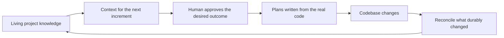
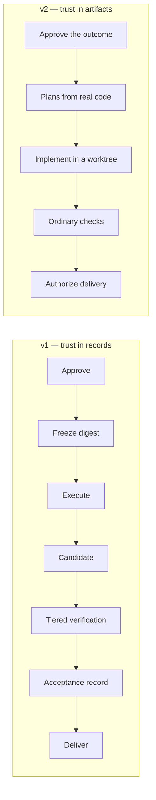
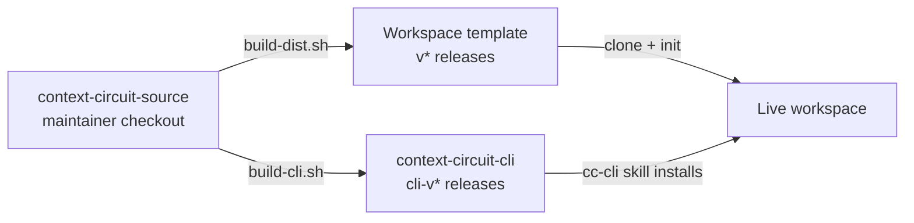
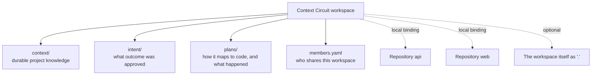

# Context Circuit — Core Concept v2.0

> A maintainer-facing conceptual map of Context Circuit v2.0: how a shared
> workspace keeps a product's accepted understanding alive across one or more
> repositories, how a small Go executable keeps the bookkeeping dependable, and
> why v2 moves trust out of the product's own records and into the real
> artifacts a human can check.
>
> This document is descriptive, not authoritative. The binding instruction is
> `product/AGENTS.md.in`, shipped into a workspace as `AGENTS.md`; the command
> surface is owned by `internal/cli` and `product/docs/commands.md`; the file
> contract is `product/docs/workspace.md`. Where this document disagrees with an
> owner, the owner wins.

---

## 1. What Context Circuit is

Context Circuit is a **living documentation system for a product or project**,
with a coordination layer attached so that documentation stays true.

Its reason for existing is unchanged from v1: make project knowledge durable,
current, and reusable across increments of work, so that a new conversation
starts from accepted understanding instead of reconstructing the project from
source code, chat history, and human memory.

The output of one increment becomes trusted context for the next. AI-assisted
implementation is how the circuit advances; it is not the center of the product.

What v2 changes is **how the middle of that circuit is kept honest**.

---

## 2. The v2 thesis

v1 tried to make trust a property of the system's own records. It built
consequence tiers, frozen contract digests, candidate identities, execution and
verification records, host evidence, path leases, and automatic repair loops —
a machinery whose output was a set of artifacts that *looked like* proof.

v2's central claim is that this was proof of the wrong thing:

> A record proves that the system wrote a record. The branch, the diff, the
> passing check, and the sentence the human actually said are the only things
> that prove anything about the work. v2 keeps those, and stops manufacturing
> the rest.

Three consequences follow, and they explain nearly every v2 decision:

1. **Git is authoritative, not the workspace.** Plan notes describe what a
   session believed; `worktree list`, a real branch, and a real diff describe
   what is. On resume, the notes are read *after* the diff, never instead of it.
2. **Mechanism splits from judgment.** A Go executable does what can be done
   dependably and identically every time — allocate IDs, edit YAML, resolve
   bindings, drive Git, derive an order from recorded dependencies. Everything
   requiring interpretation belongs to the agent, in the open, in the
   conversation.
3. **The system does not claim what it has not seen.** The CLI's `agent dispatch`
   returns `launch_required: true` rather than pretending a subagent ran.
   `agent setup` writes a native role file and refuses to call that proof the
   host loaded it. `record order` reports advice and states that it ran, merged,
   and reserved nothing. The release notes say plainly that whether a coding
   host follows the shared instruction is not established by the tests.

The knowledge circuit survives the rewrite intact — and in fact gets stronger
(§7). The trust machinery around it does not.

---

## 3. Three artifacts, two release lines

v1 shipped one thing: a template containing its own shell runtime. v2 separates
the product into a **workspace template** and a **separately released CLI**,
assembled from one maintainer source.

| Product | Version file | Tags | Contents |
| --- | --- | --- | --- |
| Workspace template | `VERSION` | `v*` on the template repository | instruction, docs, skills, blank seed |
| CLI | `CLI_VERSION` | `cli-v*` on the source repository | the Go binary for six platforms |

The separation is not packaging convenience. It makes the version a workspace
depends on an explicit, shared, recorded fact: each workspace pins its CLI in
`.context-circuit/CLI_VERSION`, versions install side by side under one version
store, and the CLI warns on stderr when it is run against a workspace pinning a
different one. A machine can hold a dozen workspaces on a dozen CLI versions
without any of them negotiating. See
[versioning and distribution](system-design/context-circuit/v2.0.0/core/versioning-and-distribution.md).

Three classes of material exist in the source, and only the first two ship:

| Class | Meaning | Contents |
| --- | --- | --- |
| Shipped instruction | The product's behavior | `product/` — `AGENTS.md.in`, docs, `cc-cli`, `cc-dispatch` |
| Mutable seed | Copied into a new workspace | `template/` |
| Never shipped | Maintainer history and user state | `sources/`, `context/`, `plans/`, `release/requests/`, `internal/`, `scripts/` |

`scripts/release-manifest.txt` is the exact source-to-output mapping, and
`assets.go` embeds only what the manifest names.

---

## 4. One project model above one or more repositories

A workspace is the durable knowledge and coordination layer for a whole product,
not another name for a Git repository. Repositories hold implementations; the
workspace holds the cross-repository understanding that gives them meaning.

Repository identity is split deliberately, and the split is what lets one
workspace travel between machines:

- `workspace.yaml` carries the **shared** logical ID, the default base branch,
  and recorded relationships between repositories.
- `repositories.local.yaml` carries **this machine's** checkout paths, and is
  gitignored. `member.local.yaml` carries which member is active here.
- Cloning a shared workspace onto a second machine is `member use` plus
  `repo connect` with the existing IDs — never a second `init`.

Records are workspace-global: `i001-add-billing`, `p0001-billing-api`, with a
member appearing only as `created_by`. IDs are reserved permanently in
`.context-circuit/ids.yaml` and are never reused after archival or deletion.

A member may hold an **optional allocation band** — a numeric block it allocates
from alone, so two clones that cannot see each other never choose the same
number. Band 1 writes `i100` and `p1000`; band 2 writes `i200` and `p2000`;
unbanded members take the numbers no band claims, which is why a solo workspace
still counts from `i001`. v1 *required* a band and so stamped every ID with an
accident of authorship; v2 keeps the mechanism and drops the requirement.

A file lock serializes one directory, and bands cover banded members offline.
Neither is a distributed allocation service, and v2 says so rather than claiming
coordination it does not implement.

---

## 5. The seam: what Go owns, what the agent owns

This is the load-bearing decision of v2.

| Concern | Go executable | Agent |
| --- | --- | --- |
| Identity and IDs | Allocate, reserve, never reuse | Choose a meaningful slug |
| Records | Create, link, append notes, stamp dates | Write everything a human reads |
| Repositories | Resolve bindings, report Git state | Decide which repositories a change touches |
| Knowledge | Locate catalog entries; report boundary violations | Read, judge, and write every note |
| Worktrees | Create, reuse, move, repair, remove through Git | Decide whether isolation is warranted |
| Environment | Clone ignored `node_modules` and `.env` with CoW | Read setup instructions; finish the setup |
| Ordering | Derive waves, start refs, integration merges | Choose the shape; perform the merges |
| Subagents | Resolve settings; write native role files; return a spec | Launch, wait, inspect, integrate |
| Approval and delivery | Record what the human decided | Ask, and never answer on the human's behalf |

The executable is **model-blind and credential-free**. It holds no LLM keys,
invokes no model API, runs no application setup, executes no plan, starts no
review, and never commits, pushes, merges, or deploys. Its refusal to do these
things is not a limitation to be routed around; it is the product boundary.

Equally, the agent never fabricates what the executable owns. It does not invent
an ID, hand-roll a branch name where `worktree prepare` has a convention, or
decide a plan is complete because it looks complete.

See [the executable and the agent](system-design/context-circuit/v2.0.0/core/executable-and-agent.md).

---

## 6. Two human decisions, and nothing pretending to be one

v2 keeps exactly two decisions that only a person can make, and refuses to
simulate either:

- **Approving the intended outcome.** Before detailed code investigation, the
  agent writes an `iNNN-slug.md` intent — goal, non-goals, constraints,
  observable success criteria, rough repository scope — and presents it.
  *Neither a command, nor an editable approval note, nor another agent can
  supply human consent.* Approval already given in the conversation for that
  exact outcome counts; asking twice for the same thing does not.
- **Authorizing an outward action.** Commit, push, PR creation, merge into a
  base branch, deployment, external publication, and deletion of workspace data
  each require explicit authorization, and authorization already given is reused
  rather than re-requested.

Everything between them is ordinary work done in the open. There is no plan
approval gate: after intent approval the agent reads real code, writes linked
`pNNNN-slug.md` plans, presents them, and proceeds. Detailed paths in a plan are
descriptive planning information, not an enforcement contract — a new file
inside the approved outcome is explained and recorded, not re-gated. Only a
material change to the outcome or its success criteria reopens approval.

Two boundaries make this hold rather than drift:

- **`check` is a diagnostic, not a gate.** It reports broken links, duplicate
  IDs, dependency cycles, unknown repositories, stale worktree associations, and
  knowledge-boundary violations. Nothing waits on it.
- **A stacked run's authorization is scoped and stated.** Confirming a run
  authorizes worktree preparation, implementation commits on `cc/*` branches,
  and local integration merges that assemble a dependent plan's base — and
  explicitly not push, PR, merge into a base branch, deployment, or deletion.

See [authority and delivery](system-design/context-circuit/v2.0.0/core/authority-and-delivery.md).

---

## 7. Shared knowledge is still the core product

`context/` holds durable project knowledge: architecture, conventions,
decisions, domain rules, terminology, repository relationships. `context/INDEX.md`
is a catalog that routes a reader to the smallest relevant set of notes, and
`context/glossary.md` maps the words the team says out loud to the identifiers
the code uses.

v2 tightened this layer in three concrete ways, each one a response to a way the
knowledge rotted in practice:

**A note describes the project, never the machinery that produced it.** A note
may not name a plan record, an intent record, or a file under `sources/`.
Records are archived and rewritten while knowledge is meant to outlast them, and
a recorded evidence path becomes a standing instruction to reopen material that
must stay passive. The durable anchor is a repository path written with the
logical repository ID — `api@internal/billing/dunning/`, `web@src/features/<feature>/`
— exact or patterned, and never a local checkout path. `check` reports any line
that crosses the boundary.

**One note is one unwrapped catalog entry.** The entry carries its own link, the
repositories it applies to in braces, the question it answers, the terms a
reader would actually search for, and the date it was last confirmed. Retrieval
matches whole lines, so a wrapped entry returns a fragment carrying no link.
`check` reports a catalog entry pointing at a missing note and a note no entry
lists — the two halves are written in the same edit.

**Completion is where the circuit closes.** Marking a plan done appends a
completion note, stamps a `completed` date in frontmatter, and returns the
catalog entries scoped to that plan's repositories: *a candidate set to judge,
never a list to rewrite.* Most completions change no durable concept, and
recording that in the note is the normal outcome, not a skipped step. Where
meaning did change, the note and its catalog entry move in one edit and the
reviewed date advances. Several plans completed together reconcile once across
the set.

The division of labor is the same seam as everywhere else: Go can locate the
candidate entries and flag a line that breaks the boundary; only the agent can
decide whether a concept actually changed meaning.

See [the knowledge circuit](system-design/context-circuit/v2.0.0/core/knowledge-circuit.md).

---

## 8. Isolation without ceremony

Worktrees are optional. The agent picks a working strategy from repository
instructions, existing work, task needs, and stated preference, and the
executable performs the Git mechanics. For a plan the defaults are branch
`cc/<plan-id>/<repository-id>` and path `.worktrees/<plan-id>/<repository-id>`.

The rules that matter are conservative by construction:

- Preparation never resets an existing branch, never force-checks-out, never
  stashes, and never overwrites unrelated files. A branch or path already
  holding work is inspected and resumed, or a new location is chosen.
- No fetch happens implicitly, and fetching implies neither rebase nor reset.
- Removal preserves dirty, untracked, and ignored files unless `--discard`
  carries explicit authorization. A removal keeps the branch; branch deletion is
  separate. Marking a plan done removes neither.

What v2 adds is **copy-on-write environment reuse**, aimed at the most common
reason people avoid worktrees: a new working copy means a fresh `node_modules`.
Preparation discovers ignored `node_modules`, `.env`, and `.env.*` entries in
the bound checkout and clones them with the filesystem's own mechanism —
clonefile on macOS, FICLONE on Linux, ReFS block cloning on Windows — falling
back to independent copies. Before reusing dependencies it compares tracked
package manifests, lockfiles, workspace definitions, and Node version files, and
skips with a reason when they differ.

The honesty rule applies here too: matching inputs do not prove the source
installation is complete or that its native modules are compatible, and the tree
is not an atomic snapshot. The report says what was cloned, what was copied, and
what was skipped; it never prints an environment file's contents, and those
contents never enter a prompt or a shared record.

See [worktrees and reuse](system-design/context-circuit/v2.0.0/core/worktrees-and-reuse.md).

---

## 9. Stacked plans: derive the order, then run it

Several plans of one intent used to mean guessing what could run beside what.
`record order` derives it instead, from recorded dependencies and completion
dates. It reports dependency waves, each plan's starting reference per
repository, the integration merges a fan-in needs, and which plans in a wave
share a repository — and it runs nothing, merges nothing, and reserves nothing.

Two shapes, with their costs stated rather than a single blessed answer:

| Shape | Wall clock | Merges | Fits |
| --- | --- | --- | --- |
| Waves | Overlapping plans run together | One integration merge per fan-in | Several repositories with independent plans |
| Linear chain | Strictly serial | None | A single repository with any fan-in |

Confirm the shape once, then run to completion without further prompting:
prepare each worktree from the reported start, perform the reported integration
merges with ordinary Git, dispatch a worker per plan, wait, inspect real diffs,
run the repositories' ordinary checks, record progress. A plan is marked
complete only when it actually landed and its checks passed — and because
`record order` reads completion to release the next wave, an unfinished plan
holds its dependents automatically. Recompute after each wave rather than
trusting the first result.

The stop conditions are explicit, and every one of them preserves all work:
failing checks after implementation or after a resolved merge; a conflict
outside the run or one needing a decision; a worker that cannot complete;
worktree preparation that refuses; skipped dependency reuse whose fallback setup
fails; or an order reporting a cycle, an unknown repository, or a broken link.
Completed plans are never unwound. The report names what finished, what is
stuck, and what is held behind it.

See [stacked execution](system-design/context-circuit/v2.0.0/core/stacked-execution.md).

---

## 10. Four roles, and a dispatcher that admits what it did

v2 keeps four role shapes — explorer, planner, worker, reviewer — as *capability
descriptions*, not authority levels and not risk gates.

| Role | Responsibility | Access |
| --- | --- | --- |
| explorer | Answer a specific codebase question with evidence | Read-only |
| planner | Investigate an approved intent and return a grounded plan | Read-only |
| worker | Implement assigned work and run normal checks | Edits within the assigned task |
| reviewer | Independently examine a diff on user request | Read-only; no fixes |

Role tiering is a concrete `(model, effort)` pair per role and host in
`.context-circuit/role-tiering.yaml`, every pair defaulting to `inherit`. **No
model catalog or cost ladder ships**, because any list of model names is stale
within months and a hardcoded quality order invites silent escalation. The
shipped file explains which roles repay an explicit setting — a planner runs once
per intent and everything downstream inherits its mistakes; a reviewer has to
catch what another model already convinced itself was fine — and then tells the
reader to check what their host actually supports.

`agent setup` materializes native role definitions for Codex, Claude Code, and
Cursor, preserving a customized file rather than overwriting it. `agent dispatch`
returns a resolved invocation with `launch_required: true`: the CLI has not
launched anything, and a dispatch specification is never evidence of completion.
The `cc-dispatch` skill performs the launch through the host's own tools, waits,
and integrates.

One subtlety v2 names explicitly because getting it backwards is costly:
parallelism happens on two axes and the correct brief is opposite in each. One
worker per plan **owns** its whole worktree and cannot collide with a sibling,
whose work arrives later through an integration merge. Several workers inside
one worktree genuinely **share** files and must preserve each other's edits.
`--shared` selects the second; claiming the wrong one either invites a worker to
guess at edits it cannot see, or lets it overwrite edits it can.

See [roles and dispatch](system-design/context-circuit/v2.0.0/core/roles-and-dispatch.md).

---

## 11. Independent review is requested, never triggered

Independent verification in v2 is a **manually requested read-only code review**,
usually after PR creation and optionally after delivery as an audit. It is
dispatched to a fresh independent context with the requested diff, the current
revision, relevant surrounding code, and the intent's success criteria. It
reports findings with locations and limitations. It does not modify code,
dispatch fixes, or post external comments unless asked.

What v2 removed is the surrounding compulsion. Review does not start from a risk
classification, does not run during execution, does not block a pull request,
delivery, or completion, and does not feed an automatic repair loop. Tests that
change files are implementation, not read-only review. If independence is
unavailable, the agent says so and offers an ordinary review — it never calls the
implementing session's own inspection independent.

---

## 12. What v2 does not have

The negative space is a substantial part of the design, so it is stated rather
than implied. v2 has no consequence tiers, no contract digests, no candidate
identities, no path leases, no execution or verification or host-evidence
records, no automatic repair loops, no external publication surface, no member
mandatory member bands, no compulsory delegation, and no acceptance harness.
`check` is
diagnostic. Plan status is a `completed` date or its absence.

Each removal was a judgment that the mechanism cost more in ceremony and
false confidence than it returned in safety — and in every case the thing it was
protecting is now protected by something a human can inspect directly. The
full accounting, mechanism by mechanism, is in
[retired machinery](system-design/context-circuit/v2.0.0/core/retired-machinery.md).

v2 also does not migrate a v1 workspace. Initialization is for fresh workspaces;
an existing v1 workspace keeps working with v1 and is never rewritten in place.

---

## 13. The conversational experience

The product exposes effects rather than machinery:

| Human request | Context Circuit effect |
| --- | --- |
| "What is this project?" | Retrieve and explain the shared knowledge |
| "Gather the billing rules from `sources/x.md`." | Read that named file; write durable notes |
| "Connect `../billing-api` as api." | Record the shared ID; bind this machine's path |
| "Add recurring billing to the API and web app." | Draft an intent; present it for approval |
| "Approved." | Read the real code; write linked plans; proceed |
| "Execute all plans of the billing intent." | Derive the order, confirm the shape, run it |
| "Open a PR for the API change." | Exercise explicit delivery authorization |
| "Independently review the PR." | Dispatch a fresh read-only reviewer |
| "Mark the billing plans done." | Append completion; reconcile durable knowledge |

Internal paths, branch names, role settings, and CLI invocations stay out of the
conversation unless diagnostics are requested. Commit messages follow the
repository's convention, default to `type(scope): imperative subject`, and never
carry agent attribution, credit, co-author, or generated-by text — a rule that
includes inspecting authored messages and removing injected attribution before
reporting delivery complete.

---

## 14. Safety spine

The whole system reduces to these durable separations:

1. Treat shared knowledge as the core: every increment starts from it and
   returns durable truth to it.
2. Read and orient before mutating.
3. Read passive sources only when the exact source is named.
4. Approve the intended outcome before detailed code investigation, and accept
   consent only from a human.
5. Keep the plan gate closed: plans are earned by approval, not re-approved.
6. Let Git be authoritative; read notes after the diff, never instead of it.
7. Preserve failed, partial, and interrupted work; a failure in one repository
   discards nothing in another.
8. Keep a note durable: no record, no intent, no evidence path inside `context/`.
9. Keep delivery, completion, cleanup, and branch deletion four separate acts.
10. Scope an authorization to the run it was given for, and reuse it rather than
    re-ask within that scope.
11. Keep credentials, environment contents, provider payloads, and machine paths
    out of prompts, logs, and shared records.
12. Report what was not established as not established.
13. Never add AI attribution to commits, pull requests, reviews, or comments.

---

## 15. One-paragraph summary

Context Circuit v2.0 is a shared workspace station for AI-assisted development
across one or more Git repositories. Its core asset is durable, retrieval-oriented
project knowledge that grounds each increment and is reconciled when a completed
plan changes what is true. A separately released Go executable maintains the
records, repository bindings, ID reservations, worktrees, copy-on-write
environment reuse, dependency ordering, and subagent role settings; the coding
agent owns understanding, planning, implementation, dispatch, and — on explicit
request — review and delivery. Exactly two decisions belong to the human:
approving the intended outcome before code is investigated, and authorizing any
outward action. v2 is a rewrite that retires v1's trust machinery rather than
reimplementing it, on the argument that a system's own records prove only that
the system wrote them: the branch, the diff, the passing check, and the human's
own words are what can be trusted, and the product's job is to keep those
legible, keep the knowledge around them current, and say plainly when something
has not been established.

---

*Descriptive companion to `product/AGENTS.md.in`, `product/docs/`,
`internal/cli/cli.go`, and `scripts/release-manifest.txt`. Written 2026-09-15
against the 2.0.0-rc.1 candidate.*
