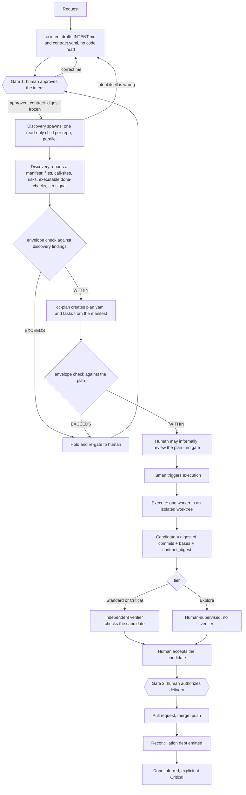
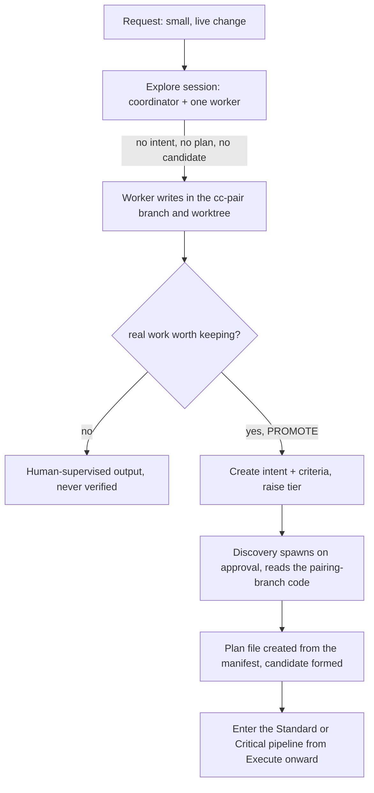
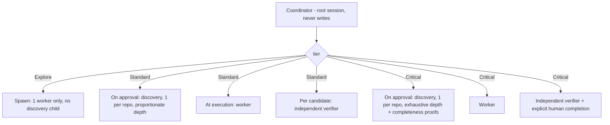
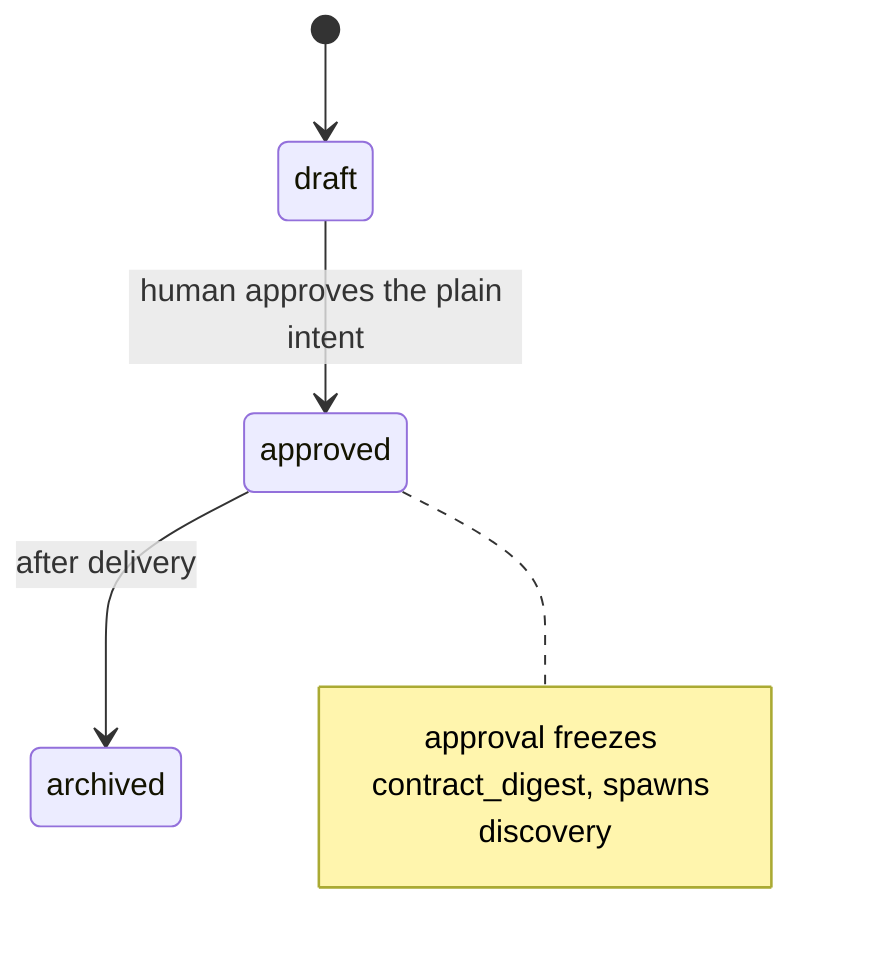
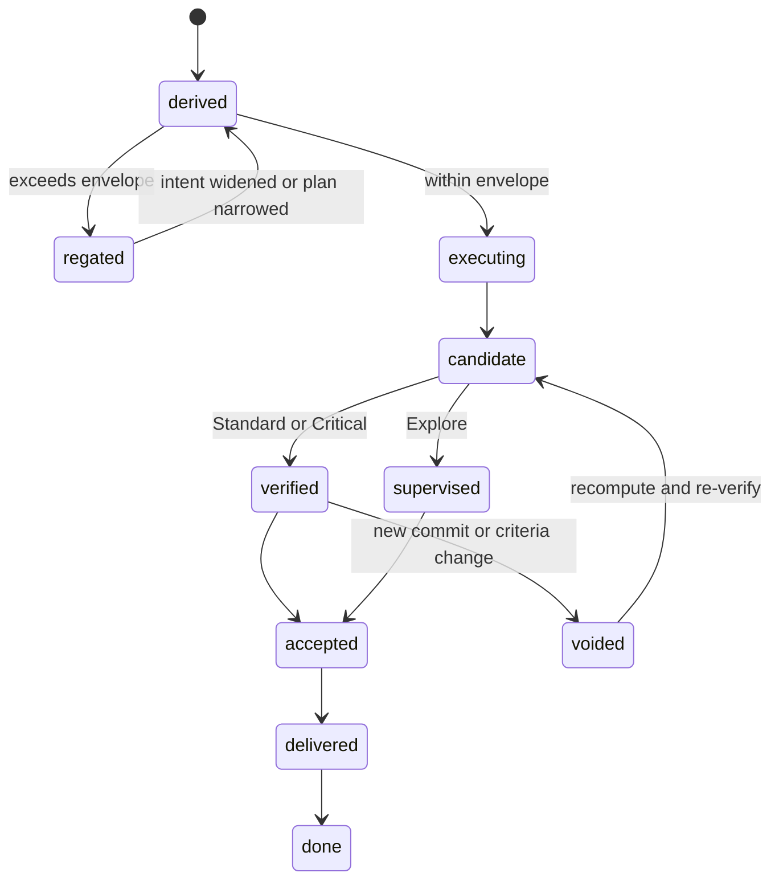
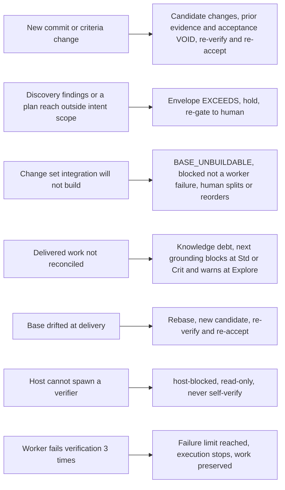
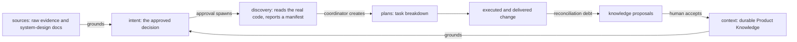

# Diagrams

Mermaid views of the full flow, the roles-per-tier, the object states, and the edge
cases, each with a short walkthrough. These render inline (the `cc-system-design`
convention). Node labels avoid parentheses so they render on every viewer.

## 1 — Core planned flow (Standard / Critical)

**Walkthrough.** A request becomes an **intent** — the decision, with its criteria and
scope — drafted with **no code read**. **Gate 1** is the human approving that plain
intent; approval both confirms the coordinator understood correctly and freezes the
criteria as a digest. Approval **spawns discovery**: one read-only child per
repository, in parallel, reading the real code and **reporting back a manifest** —
file/call-site map, concrete risks, a tier signal, and the executable checks that prove
the outcome criteria. The **envelope check** runs at two points — against discovery's
findings, and again against each plan — and is the only thing standing between
derivation and execution: stay inside the approved scope and work proceeds; step
outside and it is held and re-gated to the human. Discovery can also **kick back to the
intent** if the goal itself turns out to be wrong. From the manifest, the coordinator
**creates the plan(s)** (no plan gate); the human may informally review them, and
**execution is a separate, human-triggered action** — nothing runs until asked.
Execution is unchanged from today — one worker, isolated worktree. Its result becomes a
**candidate**: a fingerprint of the exact commits + bases + frozen criteria. The
**tier** decides what checks the candidate gets — an independent verifier at
Standard/Critical, human supervision at Explore. The human accepts the candidate, then
**Gate 2** authorizes the irreversible delivery. Two human gates total (the two
double-bordered nodes); everything else is mechanical.

## 2 — Explore and promotion

**Walkthrough.** Explore is the fast path (today's `cc-pair`) — the coordinator plus
**one worker**, live human supervision, and **nothing recorded** beyond a working copy:
no intent, no plan, no candidate. Most quick fixes end there, honestly labeled
"human-supervised, not verified." The interesting arrow is **PROMOTE**: the moment the
human decides the work is real, an intent and its criteria are created and approved,
the tier rises, discovery spawns and reads the code, and *only now* does a plan file
and a candidate exist. So Explore
is the one path that creates no plan — until it is promoted, at which point it joins the
Diagram 1 flow from Execute onward. This is the ramp that replaces the old cliff between
pairing and plans.

## 3 — Roles and spawning by tier

**Walkthrough.** There are four structural roles, and they are not all spawned every
time. The **coordinator** is the root session you talk to — it never writes code. The
discovery, worker, and verifier are spawned children whose presence the **tier
decides**: Explore spawns just **one worker** (no discovery child, no verifier — at
Explore the human reads the code live alongside the agent); Standard and Critical
spawn **discovery** automatically on approval (one child per repository, in parallel)
and add the **independent verifier** (once per candidate, after code). They never all
run at once — discovery, when spawned, happens right after approval, before any
worktree exists; the worker during execution; the verifier after each candidate.
Critical differs from Standard mainly by discovery's depth — exhaustive, with
completeness proofs required — and an explicit human completion instead of an
inferred one.

## 4 — Object states

**Walkthrough.** The **intent** (first diagram) has a tiny lifecycle: `draft` →
`approved` (which freezes the criteria digest) → `archived` after the change ships. The
**plan/candidate** (second diagram) is richer. A derived plan either executes (inside
the envelope) or is `regated` (outside it) and returns once the intent is widened or the
plan narrowed. Execution produces a `candidate`, which is `verified` at Standard/Critical
or `supervised` at Explore, then `accepted`, `delivered`, and finally `done`. The
load-bearing edge is `verified → voided`: **any new commit or criteria change voids the
candidate**, forcing a recompute and re-verify. That single transition is what makes "it
passed earlier" impossible — evidence cannot outlive the exact code and criteria it saw.

## 5 — Edge cases

**Walkthrough.** Each row is a mechanical branch, not a human gate — the design's safety
comes from these firing reliably rather than from asking a human at every step. C1 and C5
are the candidate rule doing its job (a change voids evidence). C2 is crown jewel 1 (the
envelope) pulling the human back in when scope drifts. C3 keeps the honest multi-repo
stance — combined work that will not build is blocked, never faked. C4 is the closed
knowledge loop refusing to let reconciliation be forgotten. C6 and C7 are preserved from
today (host-blocked never self-verifies; the three-failure cap stops and preserves).
Every one of them **fails safe**: it either re-checks, re-gates, blocks, or preserves —
none of them proceeds on a guess.

## 6 — Sources, intent, plan, knowledge

**Walkthrough.** This is the information flow around a change. `sources/` — raw evidence
and, for larger work, the multi-topic **system-design** docs — is passive material that
*grounds* an intent but carries no authority. Durable **Product Knowledge** (`context/`)
also grounds the intent. The **intent** is where authority sits: its approval spawns
**discovery**, which reads the real code and reports a manifest the coordinator uses to
create the **plan(s)**, which become an executed, delivered change. Delivery raises
**reconciliation debt**, which produces knowledge **proposals** — and only a **human
acceptance** folds
them back into Product Knowledge. The loop is closed but never automatic: the arrows into
`context` always pass through a human. This is also the layering that answers
"multi-topic big picture": it lives in `sources/system-design/` on the far left and
spawns one intent per topic.
