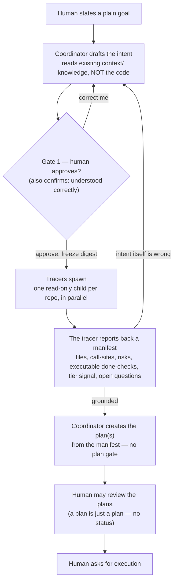

# Mechanism 1 — Intent front door + tracing + feasibility

Fixes pains 1 (no bigger-picture home), 3 and 4 (plan approval feels redundant).
Adds the single highest-leverage safety mechanism in the study, plus the tracing
phase that makes plans detailed instead of guessed.

## The problem it solves

Today the design→plan path is `sources/ → context-proposals → accepted Product
Knowledge → plan`. There is no first-class object for *the thing being built* and
— confirmed from `cc-system-design` — "there is no separate design-acceptance
gate." So the human's real decision (agreeing to the design) has no home, and the
system instead asks for its approval later, on the plan, which is a mechanical
elaboration the human already trusts. The gate is on the derivative.

There is a second, quieter problem. A lay human cannot describe the codebase — they
state a plain goal and may know nothing about the files. For a plan to be *detailed*,
something has to read the real code. Today nothing reliably does before the plan is
written: the coordinator plans from curated `context/` plus whatever files were
named, and the first first-hand read of the repository happens at execution, in the
worker — after the plan and scope are already fixed. When a detailed plan does appear
(observed in real sessions) it is because a trace/design phase *happened* to run
first, driven by the human, not because the lifecycle guaranteed it. v1.0 makes that
phase first-class: **tracing.**

## The object

A first-class `intent/` object, parallel to `plans/`:

```
intent/i0007-checkout-retries/
  INTENT.md        # human-facing: the bigger picture, reviewable as one thing
  contract.yaml    # the frozen human decision (schema below)
```

`INTENT.md` is what pain 1 asks for: a place to *see* what will be built — goal,
shape, what is deliberately out of scope — before it fragments into plans and tasks.

### `contract.yaml` — the frozen *human decision*, not a machine checklist

The intent is approved **before** the tracer reads the code, so `contract.yaml` can
only hold what a human can actually decide without seeing the codebase: the goal, the
boundaries, and *what "done" means at the outcome level*. The executable, per-file
checks are not authored here — they cannot be, because nobody has read the code yet.
The tracer produces them later, into the plan (below, and `tracing-and-grounding.md`).

```yaml
schema_version: 2
intent: i0007-checkout-retries
title: Retry failed checkout charges
goal: >
  A failed card charge at checkout is retried a few times before the order is
  marked failed — transient failures recover, real declines do not.
non_goals:
  - Changing the payment provider
  - Any change to refund logic
constraints:
  - No new runtime dependencies
  - Existing checkout latency budget unchanged
acceptance_criteria:            # OUTCOME level — what must be true, not how it is measured
  - A transient charge failure recovers without the order being marked failed.
  - A permanent decline is never retried.
scope:                          # coarse and OPTIONAL: bound repositories, if the human named any
  repositories:
    - id: checkout-service
      paths: [src/checkout/]    # a bound boundary; may be empty when the human names none
tier: standard                  # PROVISIONAL — the tracer may push it up (see M3)
status: draft                   # draft | approved   (approval freezes a digest)
contract_digest:                # set on approval; identifies the frozen decision
```

Rules that make it load-bearing:

- **Acceptance criteria are stated at the outcome level.** They say *what must be
  true*, in terms a human can approve — not the executable command that measures it.
  The runnable checks (the grep that proves no direct access remains, the test ids)
  are a **tracing output**, carried in the plan, not frozen here. The contract sets
  the goalpost; the tracer builds the measuring tape.
- **Approval freezes `contract_digest`.** Changing the frozen decision after approval
  is a new decision that re-enters the gate, and (via M2) voids evidence bound to the
  old contract.
- **`scope` is coarse and optional — on purpose.** A lay human states a goal, not
  file paths, so at approval they can at most name a bound repository or folder; often
  they name none. Scope here is not an enforced boundary — the concrete scope is settled
  at **delivery** (Gate 2), where the human sees and authorizes the exact diff and
  repositories. When the human *does* bind a repository, a required change that reaches
  beyond it is surfaced by the feasibility check (below); when they bind nothing,
  the tracer simply reports where the change lands.
- **`tier` is provisional.** It is the human's first guess at how carefully to check.
  The tracer can raise it (a change that turns out to touch auth/secrets/data is
  Critical whatever the human first thought); the raise surfaces at plan review.

## The flow — draft, approve, trace, plan, review

The order is the point. Tracing is expensive and must aim at a *confirmed* target,
so it runs **after** the human approves — and the approval doubles as the human
confirming the coordinator understood the plain ask.



Step by step:

1. **Draft — grounded in existing knowledge, not the code.** The coordinator
   interprets the plain ask into `INTENT.md` + `contract.yaml`: goal, non-goals,
   constraints, outcome-level acceptance, candidate repositories, a provisional tier.
   It reads the **existing `context/` Product Knowledge** as reference — what the
   project already knows about itself — but it does **not** read the codebase. On a
   brand-new project with no `context/` yet, drafting works from the human's request
   alone. **This is the intent/plan divide:** the intent is
   grounded in *existing knowledge* (context files, if any); the plan is grounded in
   *fresh tracing* (the real code, read after approval). Reading the codebase at
   intent time is the tracer's job, not the intent's.
2. **Gate 1 — the one upstream human decision.** The human approves the plain intent.
   This *is* the confirmation that the coordinator understood them, so the tracer never
   fires on an unconfirmed guess. Approval freezes `contract_digest`.
3. **Tracing (spawned on approval).** One read-only tracer child per repository,
   in parallel, reads the real code and **reports back** to the coordinator — a rich,
   durable manifest: the file/call-site map, integration points, concrete risks, a
   proposed task partition, the **executable "done" checks** that prove the outcome
   criteria, a tier signal, and any open questions. The tracer does *not* write plans.
   Full mechanism in `tracing-and-grounding.md`.
4. **Coordinator creates the plan(s).** From the manifest, the coordinator authors the
   plan(s) — it stays the sole author and gate-runner. The executable criteria and
   exact paths the tracer found land in the plan, not back in the frozen contract.
5. **Plan review — informal, no gate.** A plan is just a plan; it has no approval
   status. The human can read the plans and course-correct, and the natural checkpoint
   is that **execution is a separate human-triggered action** — nothing runs until the
   human asks, so review always has its moment. This is where a grounded surprise
   (e.g. "you said encode, but for auth tokens that is not protection") reaches the
   human, before any code is written.

Two feedback edges keep it honest:

- **The tracer can kick back to the intent.** Usually it feeds the plan. But if it
  finds the *intent itself* is wrong — the goal is infeasible, or means something
  bigger than approved — that cannot become a plan; it re-opens the intent for a new
  decision. Cheap, because nothing has executed.
- **Tier can be raised by the tracer**, surfaced at plan review, before execution.

## Plans become a derivation — no second gate

Once the intent is approved and the tracer has reported, the coordinator creates the
plan(s), and `plan.yaml` gains a required field:

```yaml
intent: i0007-checkout-retries
```

Because the human already approved the intent, **the plan carries no second approval
gate** (pains 3, 4). The approval did not disappear — it moved upstream to where the
decision actually lives (pain 1). A plan is a work product, not a gated object: the
human reviews it if they wish, and triggers execution when ready.

## One intent, one or more plans — and structuring larger work

An intent is one *decision*; a plan is one *execution*. The relationship is **1 : N**:

- A small change is one intent → one plan.
- A larger change is one intent → **several stacked plans** (for example an API plan
  and a consumer plan) that together satisfy the intent. Each names `intent: <id>`,
  each stays inside the intent's scope, and together they may form one change set
  at delivery (`concurrency-and-candidate.md`). Tracer fan-out is per repository,
  so a multi-repo intent naturally yields per-repo plans.

**Plan creation is automatic after tracing.** The human hears "here's the
breakdown" — not "approve this plan." The intent's approval authorizes execution
within the approved intent (INV-EXEC-01 reworked); execution is then a human-triggered
action, the one place approval and execution are distinguished.

**Genuinely separate decisions are separate intents.** If a request spans topics the
human would review and ship independently, each is its own intent — not one giant
intent. Intents may declare **dependencies on other intents** (mirroring inter-plan
`plan_dependencies`, INV-PLAN-05) so a multi-topic initiative can be ordered.

**The big multi-topic picture lives above intents, in `sources/system-design/`.** A
system design spawns multiple intents — typically one per concern — each approved on
its own:

```
sources/system-design/   the big picture, by concern, reviewed whole
        │  spawns
        ▼
intent/                  one coherent decision per topic, approved individually
        │  the tracer grounds, then derives
        ▼
plans/                   one or more execution plans per intent
```

`sources/` stays passive; the intent carries the authority
(`file-and-folder-structure.md`).

## The feasibility check — what the tracer's read is for

Once the tracer reads the real code, the coordinator runs the **feasibility check**
before writing any plan (full spec in `intent-feasibility.md`). It is a quality gate,
not a safety gate: it asks *is this buildable, and what does it take?* — not *did the
work stay inside the paths the human drew?* (a lay human draws almost no paths, so there
is rarely a tight boundary to enforce here). It has three outcomes:

- **Feasible** → the coordinator sets the tier and creates the plan(s) from the
  manifest. No human step.
- **Not feasible** → **held**: the coordinator stops, explains the blocker the tracer
  found, and suggests options for the human to decide. Cheap, because nothing executed.
- **Feasible, but it must change a repository or area beyond a bound scope** → surfaced
  as a question ("doable, but it also needs to change `payments-lib`, which you scoped
  out — include it, or find another way?"). The trigger is the tracer finding the work
  must *modify* an out-of-scope repository; merely reading one does not trigger it. When
  the human bound no scope, there is nothing to reach past.

**Scope-safety itself is not enforced here.** The guarantee that nothing ships beyond
what the human meant lives at **Gate 2 (delivery)**, where the human sees and authorizes
the exact diff and repositories, and everything before delivery is sandboxed in isolated
worktrees. The one safety-critical automated check is tier classification
(`intent-tier.md`), which fails upward. See `risks-and-open-questions.md`.

## Skills

- **New `cc-intent`** — author `INTENT.md` + `contract.yaml` (the plain human
  decision) and perform the single upstream approval (`intent-approve`, which freezes
  `contract_digest`). It reads the existing `context/` Product Knowledge as reference,
  but not the codebase — that is the tracer's job, after approval.
- **New `cc-trace`** — on approval, spawn the per-repo tracer children, collect
  their manifests, and run the feasibility check on the findings
  (`intent-feasibility.md`, `tracing-and-grounding.md`).
- **`cc-plan` changed** — creates the plan(s) from the trace manifest (not from a
  blind read of `context/`); sets `plan.intent`; never asks for a separate plan approval
  — the intent's approval already authorizes work within scope, and scope itself is
  settled at delivery (Gate 2).

## What stays the same

Grounding (INV-GROUND-*), the worker brief template, repository binding, and the
whole execution mechanic are untouched. The intent object sits *before* them; the
worker's execution-time repository read (INV-GROUND-01) now *confirms* the tracer's
findings rather than being the first contact with the code. The intent feeds the
outcome criteria the candidate (M2) is proven against; the tracer feeds the executable
checks that measure them.
