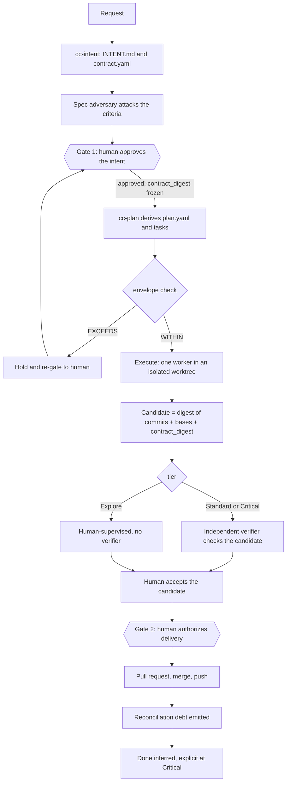
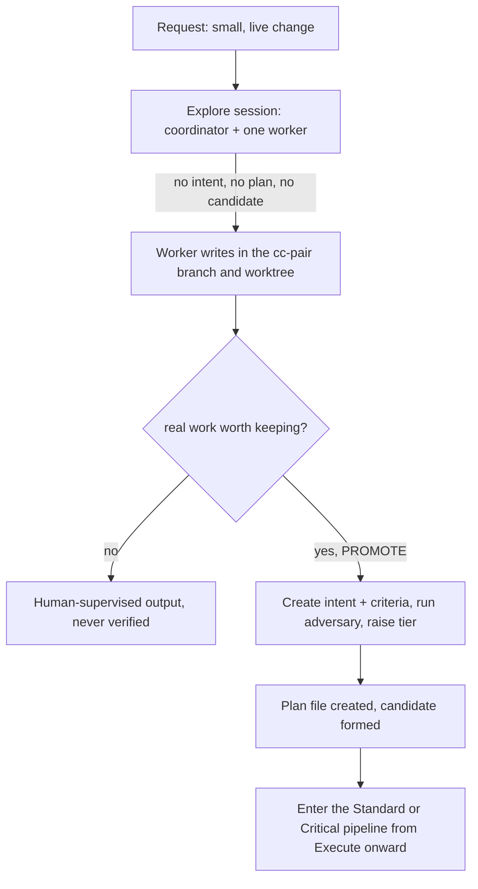
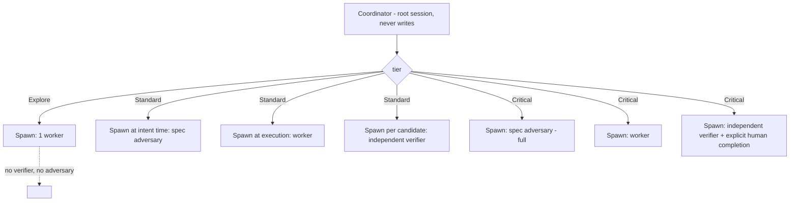
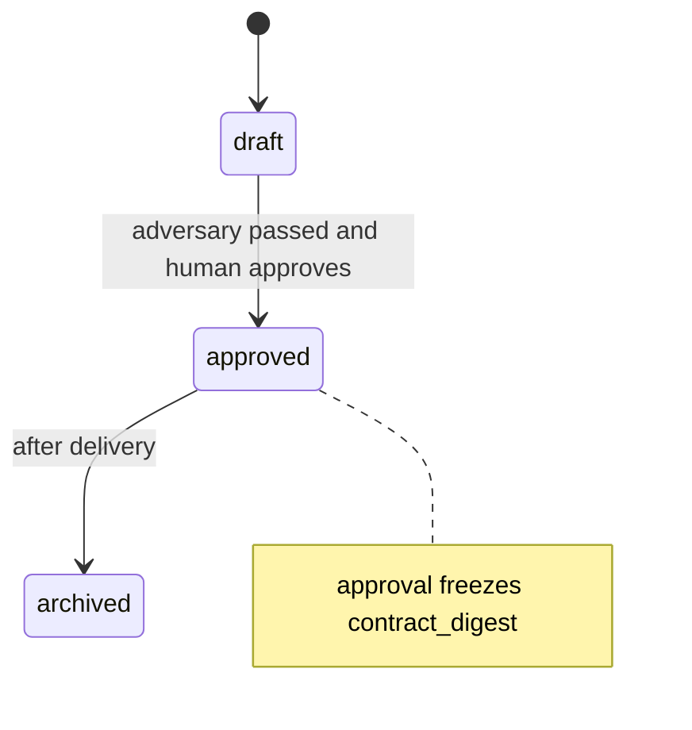
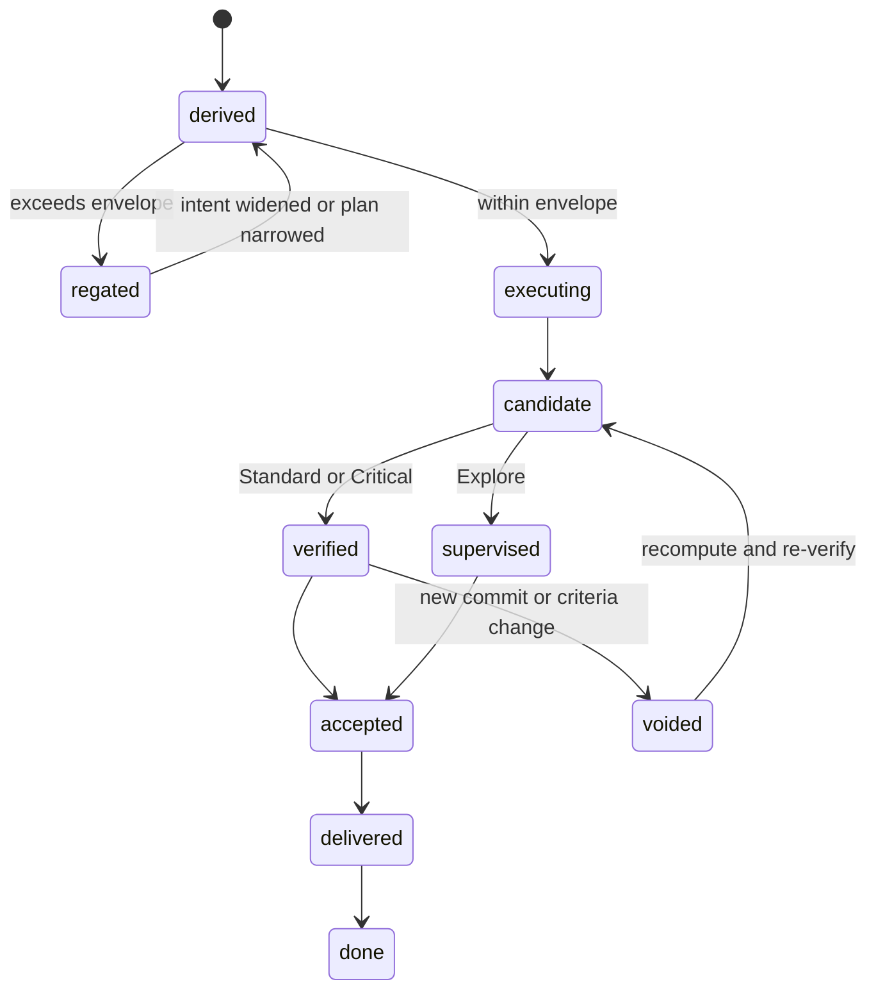
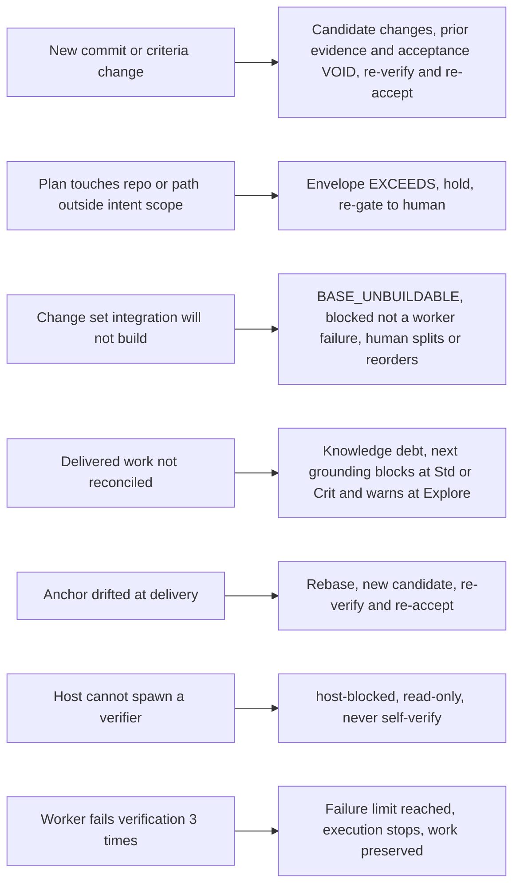
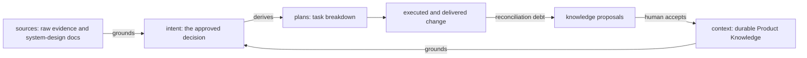

# Diagrams

Mermaid views of the full flow, the roles-per-tier, the object states, and the edge
cases. These render inline (the `cc-system-design` convention). Node labels avoid
parentheses so they render on every viewer.

## 1 — Core planned flow (Standard / Critical)

Where the plan is created, and the two human gates. This is the path for anything
above Explore.

## 2 — Explore and promotion

Explore creates no intent, no plan, no candidate — only the pairing session. A plan
first appears at **promotion**.

## 3 — Roles and spawning by tier

The coordinator is the root; the other roles are spawned children, and how many
depends on the tier.

## 4 — Object states

The intent and the plan each have a lifecycle; the candidate has none — it is an
identity that is recomputed and can go void.

## 5 — Edge cases

The branches that make the two-gate model safe. Each is a mechanical check, not a
human gate.

## 6 — Sources, intent, plan, knowledge

How material flows into a decision and back into durable knowledge. `sources/` stays
passive; `intent/` carries the authority; reconciliation feeds `context/`.

