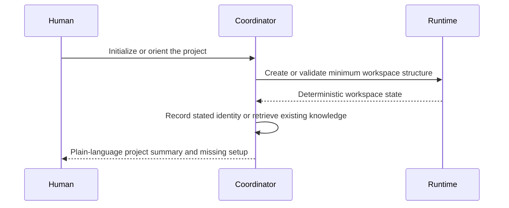

# 1. Workspace Initialization

## Human guide

### When to use this

Use initialization when starting Context Circuit for a product, project, or
multi-repository system that does not yet have a workspace. Use orientation when
the workspace already exists and you want to understand its current state.

### What you need to provide

At minimum, provide a project name and a short explanation of what it is. You do
not need to know the internal folder structure. If code already exists, say
whether you want to connect it now; initialization itself does not assume that.

### Example prompts

> Set up a workspace for Acme Billing. It handles invoices and payments.

> Set this up for our mobile banking product.

> What's already set up here?

> Can you give me an overview of this project?

### What happens inside

Initialization creates the minimum workspace and records only facts the human
actually supplied. Orientation reads project identity, the Product Knowledge
catalog, repository availability, member identity, and active-plan index.

### What you get back

You get a concise explanation of what was initialized, what remains unconfigured,
and the natural next action—usually gathering context, selecting a team member,
or connecting a repository.

### What does not happen

No repository is created, cloned, or connected without a separate request. No
Product Knowledge is invented. No intent, plan, execution, remote, or delivery
is created.

## Capability

Initialization turns an ordinary directory into a minimal Context Circuit
workspace. It establishes project identity and the empty structures needed for
living Product Knowledge, intents, plans, repository bindings, and private
runtime evidence. It does not invent knowledge, create a repository, clone code,
author an intent, or execute work unless those actions are requested separately.

## Inputs

The human supplies the project name and enough purpose to identify the
workspace. Repository information is optional at this stage. Facts that can be
safely inferred from the request may be recorded; uncertain product facts remain
unknown.

## Result

The initialized workspace has:

- portable project identity in `workspace.yaml`;
- an indexed `context/` area for living Product Knowledge;
- active indexes for `intent/` and `plans/`;
- committed team roster support in `members.yaml`;
- host-local files for repository and member identity when later configured;
- the shipped contracts, roles, skills, documentation, and deterministic runtime;
- a gitignored `.runtime/` area created as operations need it.

The runtime action `workspace-init` creates the deterministic minimum. The
coordinator then records only the identity and repositories the human actually
named.

## Orientation

Orientation is read-only. It reports, in plain language:

- the project's name and purpose;
- the important living-knowledge areas available through `context/INDEX.md`;
- registered repositories and whether they are connected on this machine;
- whether this machine has selected a roster member;
- active plans, and execution state only when requested.

Archived plans are not traversed during ordinary orientation. Missing facts are
reported as uncertainty, never filled by scanning unrelated folders.

## Initialization boundaries

Creating a workspace is not permission to create code. These remain separate:

- connecting an existing checkout;
- cloning a remote repository;
- initializing a new Git repository and initial commit;
- creating a remote or pushing;
- gathering project knowledge;
- drafting or approving an intent.

This separation prevents a vague setup request from materializing repositories
or external state the human did not request.

## Failure behavior

Unsafe paths, contradictory identity, or invalid structure fail closed. A partial
initialization must not masquerade as an initialized workspace. Credentials,
machine-specific repository paths, and provider payloads never enter portable
workspace identity.
