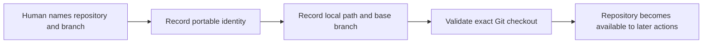
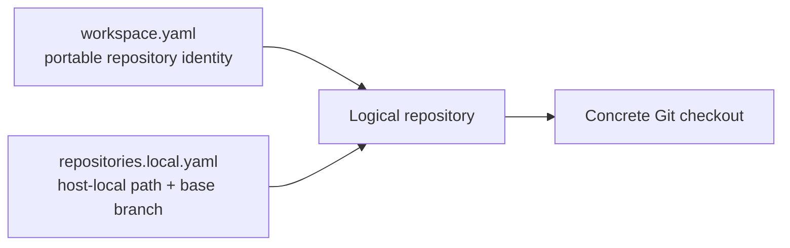

# 2. Repository Bindings

## Human guide

### When to use this

Use repository binding when Context Circuit needs access to an existing codebase,
when you want it to clone a known repository, or when a new project needs an
empty Git repository.

### What you need to provide

For an existing checkout: its logical name, exact path, and the branch work
should start from. For cloning: a credential-free URL and desired branch. For a
new repository: its name and intended base branch.

### Example prompts

> Connect the API repo at `/work/acme-api`. We work from `develop`.

> Add our web repo. It's at `https://github.com/acme/web.git`.

> Clone the mobile repo and use `main`.

> Create a new repo called `docs-site` using `main`.

> Is the payments repo connected here?

### What happens inside

Context Circuit separates shared repository identity from machine-local path and
branch selection. It validates the exact checkout instead of searching the
machine for something similarly named.

### What you get back

You get confirmation in project language: which codebase is connected and which
branch future work will use. A failure tells you the smallest missing fact or
invalid condition.

### What does not happen

Connecting never clones, pulls, pushes, or modifies code. Cloning and repository
initialization happen only when explicitly requested. Creating a remote and
delivery remain separate actions.

## Capability

Context Circuit coordinates one or more Git repositories without confusing the
workspace with those repositories. A repository binding connects a portable
logical repository identity to one concrete checkout on the current machine.

## Two-part identity

Portable identity may contain:

- a stable logical repository ID;
- an optional credential-free canonical URL;
- an optional `default_branch` used only as clone/setup guidance.

The host-local binding contains:

- the path to the checkout;
- the required `base_branch` used as the execution base and default pull-request
  target.

`default_branch` never silently becomes `base_branch`.

## Supported operations

### Register

Record a logical repository without assuming it is present on this machine.

### Connect

Bind an existing Git checkout. Connecting does not clone, initialize, pull, or
push. The runtime resolves and validates the exact binding.

### Clone

On explicit request, clone the named credential-free URL into
`repositories/<repository-id>/` by default, select the requested branch, then
record the local binding. Authentication remains in host Git configuration.

### Initialize

On explicit request, create an empty Git repository, establish its base branch,
and make the initial base commit required for isolated execution worktrees.
Creating a remote and pushing remain delivery actions.

### Bind the workspace repository

When the workspace root itself is a Git repository, it uses the reserved logical
ID `workspace`, path `.`, and its own recorded base branch.

## Resolution safety

Resolution is exact and bounded. The runtime refuses:

- missing or ambiguous bindings;
- non-Git destinations;
- traversal and unsafe symlinks;
- checkout identity that conflicts with the recorded repository;
- substitution of a similarly named path;
- filesystem scanning to find a convenient repository.

## Role in execution and delivery

At execution start, the runtime captures the recorded base-branch tip and
creates an isolated execution branch and worktree. The connected checkout is
never written. At delivery, the same recorded base branch is the default target;
a missing or renamed branch blocks rather than being replaced silently.
