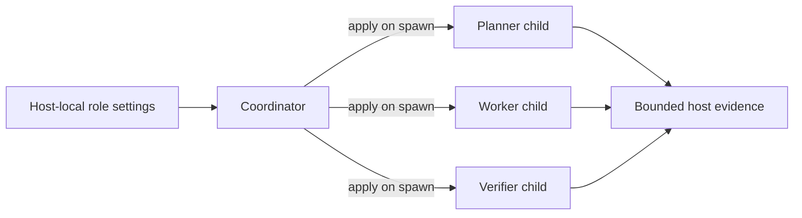

# 3. Agent Role-Tiering

## Human guide

### When to use this

Use role-tiering when you want different models or reasoning effort for planning,
implementation, and verification—for example, a strong worker with a faster
verifier, or fixed low-cost settings for routine work.

### What you need to provide

Name the host and concrete model/effort pair for any role you want to override.
Optionally say whether repairs may escalate above that starting point. Omitted
roles use host defaults.

### Example prompts

> Use Astra with high effort for coding, and medium effort for planning and
> checking.

> Always use Luna at low effort for verification.

> What models will the agents use here?

> Reset the planner model to the default.

> Which models were used in the last run?

### What happens inside



The coordinator selects the current host group, resolves defaults, applies the
pair when spawning each child, and records what was used. The runtime stores the
evidence but remains model-blind.

### What you get back

You get confirmation of the effective settings and any host limitation, such as
model-only control when per-child effort is unavailable.

### What does not happen

Model choice never approves work, changes assurance tier, expands scope, removes
the verifier, or creates more than three worker attempts.

## Capability

Role-tiering selects the concrete model and reasoning effort used for planner,
worker, and verifier children. Its only purpose is to tune cost, speed, and
capability. It never grants authority, changes scope, weakens verification, or
alters the three-failure limit.

Role-tiering is different from **assurance tiering**:

| Concern | Values | Effect |
| --- | --- | --- |
| Role-tiering | concrete `(model, effort)` per child role | cost, latency, capability |
| Assurance tier | Explore, Standard, Critical | required workflow and independent assurance |

## Configuration

`role-tiering.local.yaml` is gitignored, per-user, host-local configuration at
the workspace root. It is grouped by host because model catalogs differ:

```yaml
hosts:
  <host-id>:
    planner:
      model: <model-id>
      effort: medium
      escalate_on_repair: false
    worker:
      model: <model-id>
      effort: high
      escalate_on_repair: true
    verifier:
      model: <model-id>
      effort: medium
      escalate_on_repair: false
```

Only planner, worker, and verifier belong here. The coordinator is the root
session already selected by the human. Explore uses the worker entry and does
not launch a verifier.

If the current host or role has no entry, adapter defaults use the session's
current model: high effort for worker, medium for planner and verifier. A host
with one model uses that model for all children.

## Application

The coordinator reads the file from the workspace root before spawning a child.
It must not look inside repository worktrees, because local configuration is not
copied there. The host adapter applies supported fields to the actual spawn.
Recording a choice without applying it is not sufficient.

If a host supports per-child model but not per-child effort, operation degrades
to model-only selection without changing workflow semantics.

## Repair escalation

`escalate_on_repair: true` makes the configured pair the start and floor. After
a verifier rejection, a repair may raise effort first and then move up the
host-specific model ladder. It never lowers capability and never buys additional
attempts.

`false` is a hard pin. The same pair is used even on the third attempt. The
system respects that choice and reports its consequence honestly.

## Independence and evidence

Verifier independence means a separate read-only agent inspecting committed
state. It does not require a different model. Worker and verifier may use the
same model and remain independent; they may not be collapsed into one invocation
or share the worker's context as verification.

The model and effort actually used are recorded per attempt as bounded
`host_evidence`. The deterministic runtime stores but never interprets them.
They are shown only for explicit diagnostics.
