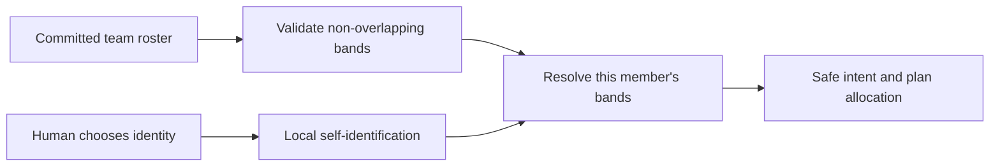

# 4. Team Member Records and Self-Identification

## Human guide

### When to use this

Use team-member setup when several people share the workspace or when a new
machine needs to know whose intent and plan number bands to use.

### What you need to provide

Usually, choose your name from the existing roster. If the roster is empty,
provide the first member name. You do not need to choose numeric ranges; Context
Circuit assigns safe defaults and validates overlap.

### Example prompts

> I'm Kao. Set this machine up for me.

> Who's on the team, and who am I set as here?

> Add me as Alice. I'm the first person using this workspace.

> Add Bob to the team.

> I ran out of plan IDs. Can you give me more?

### What happens inside

The roster remains shared in version control; the machine's selected identity
remains local. Allocation always considers active and archived IDs.

### What you get back

You get the selected member, whether allocation capacity is available, and a
clear explanation if the roster needs extension.

### What does not happen

Context Circuit never guesses a person, asks for a block number in normal chat,
reuses archived identifiers, or embeds member names in intent IDs, plan IDs, or
execution branches.

## Capability

Several people can create intents and plans in one shared workspace without
coordinating each identifier in real time. Context Circuit assigns each roster
member non-overlapping numeric bands and lets each machine identify which member
it represents.

## Shared roster

`members.yaml` is committed and portable. Each member has one or more
non-overlapping bands for:

- intent numbers, rendered as `iNNN-slug`;
- plan numbers, rendered as `NNNN-slug`.

The default allocation for a new member is 99 intents and 999 plans unless the
roster explicitly records another non-overlapping range.

## Local self-identification

`member.local.yaml` is gitignored and names exactly one existing roster member
for the current machine. It follows the same pattern as local repository
bindings: shared identity is committed; machine selection is local.

The workspace initializer does not choose a member automatically. On first use:

1. Validate the committed roster.
2. If local identity exists, resolve its member and bands.
3. If missing, show existing member names and let the human choose once.
4. If the roster is empty, let the human name the first member and create
   non-overlapping default bands.

The human is never asked to type a numeric block or range in ordinary chat.

## Allocation

The next identifier is one greater than the highest number ever used inside the
current member's band, considering active and archived records. IDs are stable
and never reused after archive, deletion from an index, title change, or restore.

Intent IDs stop at the exact representational ceiling `i999`. Exhausted bands
fail clearly. The remedy is to add another non-overlapping band to the roster,
not wrap or recycle old numbers.

Stack materialization reserves a consecutive in-band plan range atomically and
publishes every plan and index row or none. Retrying the same successful
invocation returns the original allocation.

## Safety properties

- overlapping member bands fail closed;
- duplicate active or archived numeric prefixes fail closed;
- member names never appear in intent IDs, plan IDs, or execution branches;
- local identity authorizes allocation only, never approval, execution, or
  delivery.
