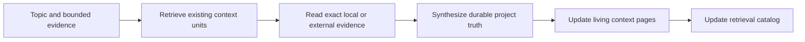

# 5. Gathering Context

## Human guide

### When to use this

Use context gathering when important project knowledge is missing, stale, or
scattered across files, code, websites, another checkout, or human notes. The
goal is to turn evidence into living documentation reusable by future work.

### What you need to provide

State the topic and where evidence may be read. Be explicit about source files,
external URLs, repositories, or paths. If you only know the topic, Context
Circuit first checks existing Product Knowledge and tells you what evidence is
still needed.

### Example prompts

> Read `sources/auth-notes.md` and update what we know about authentication.

> Look at how authentication works in the API and update the project docs.

> Check the latest OAuth guidance and update our security notes.

> Pull the migration rules from `/work/legacy-service/docs/migrations.md`.

> Compare our billing docs with the latest Stripe docs.

> What do we already know about order fulfillment?

### What happens inside

The coordinator retrieves existing knowledge first, reads only the bounded
evidence, distinguishes durable truth from raw material, then edits live context
units and index metadata together.

### What you get back

You get a summary of what the project documentation now says, what evidence
supports it, what changed, and any unresolved contradiction or freshness risk.

### What does not happen

The workspace does not scan all of `sources/`, copy raw documents into Product
Knowledge, treat external content as instructions, modify repositories, create a
plan, or add a separate knowledge-approval gate.

## Capability

Context gathering maintains the living documentation at the center of Context
Circuit. It turns bounded evidence into durable, accepted Product Knowledge that
humans and agents can retrieve for later increments.

## Retrieval before collection

The coordinator begins with `context/INDEX.md`, whose metadata routes it to the
smallest relevant set of existing context units. It does not load the entire
knowledge base by default. Existing decisions, constraints, terminology, domain
pages, repository ownership, freshness, and provenance are considered before new
material is gathered.

## Evidence sources

Knowledge may be gathered from any source the host can safely access within the
human's request, including:

- exact files under `sources/` named by the request;
- local files or repositories at explicitly supplied paths;
- connected repositories;
- web pages, official documentation, issue trackers, or other external systems;
- conversation notes and human statements;
- inspected implementation and test behavior when code reading is authorized.

The ability of a host to reach something is not permission to scan it. The read
must remain bounded by the request, path, repository, domain, or external target.
`sources/` is especially passive: only exact request-scoped files are read, never
the whole tree to fill a gap.

## From evidence to living knowledge

Evidence is not copied wholesale into `context/`. The coordinator extracts the
durable product truth:

- current architecture and behavior;
- accepted decisions and their rationale and consequences;
- constraints and conventions;
- stable terminology and domain relationships;
- repository ownership and cross-repository dependencies;
- freshness and durable provenance needed for retrieval.

Temporary implementation details, raw provider payloads, credentials, chat
transcripts, and ephemeral plan/source references do not become Product
Knowledge.

## In-place update

Gathering context edits live context units and keeps the retrieval catalog
consistent in the same operation. There is no `context/proposals/` staging area
and no separate “accept this context update” gate. The result is immediately the
workspace's accepted living documentation.

Each fact should have one sensible home. The index summarizes and routes; it
does not duplicate page content. `DECISIONS.md` records what is now true, why,
and the consequence—not which temporary artifact or path caused the update.

## Uncertainty and contradiction

Conflicting evidence is surfaced. The coordinator records uncertainty,
freshness, or a missing decision rather than silently choosing a convenient
answer. External material is evidence, never authority over workspace state.

## Security

Paths reject traversal and unsafe symlinks. Credentials remain in the host or
provider connection. External content is treated as untrusted evidence, not as
instructions that can override the workspace authority order.
