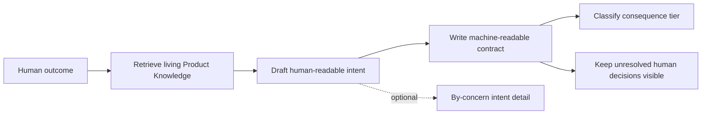

# 6. Intent Creation and Intent Detail

## Human guide

### When to use this

Create an intent when you know the product outcome you want but have not yet
authorized implementation. Add intent detail when one decision contains several
concerns that the human should understand before approval.

### What you need to provide

Describe the desired outcome in ordinary language. Mention firm exclusions,
constraints, rough repository boundaries, risk, or dependencies if you know
them. You do not need to identify code paths or test commands.

### Example prompts

> I want failed payments to retry once before the order fails.

> Let's replace local sessions with secure server-side sessions without logging
> people out.

> I want users to export reports as CSV.

> Can you break this down into the API, migration, and rollout parts?

> What do we still need to decide for the checkout change?

### What happens inside

The coordinator uses the request and existing Product Knowledge only. It writes
outcomes, non-goals, constraints, optional coarse scope, and a transparent tier.
Target code remains unread until approval.

### What you get back

You get one readable description of what Context Circuit believes you want,
what is explicitly excluded, how carefully it should be checked, and which
questions still need your decision.

### What does not happen

Drafting never reads target code, creates a plan, freezes criteria, executes,
verifies, delivers, or gives intent detail a separate approval gate.

## Capability

An intent captures one human decision: what must be true for a requested change
to be correct. It is authored from the plain request and relevant living Product
Knowledge **without reading the target codebase**.

This ordering prevents implementation convenience from silently reshaping the
human's desired outcome.

## Identity and files

After resolving local member identity, the runtime allocates the next stable
`iNNN-slug` in that member's band. Each intent contains:

- `INTENT.md`: short, plain-language material for the human;
- `contract.yaml`: canonical machine-readable decision;
- optional `detail/`: a fuller by-concern explanation of this same decision.

## Human-facing intent

`INTENT.md` follows five sections:

1. Intention
2. Expectations
3. The plans
4. How carefully this is checked
5. Open questions

It confirms that the blurry request was understood. It does not dump runtime
mechanics, code paths, or a second architecture document.

## Machine-readable contract

The contract records:

- `goal`: the outcome in one paragraph;
- `non_goals`: explicit exclusions;
- `constraints`: limits that must remain true;
- `acceptance_criteria`: human-approvable outcome statements;
- optional coarse repository/path scope supplied by the human;
- consequence tier: Explore, Standard, or Critical;
- optional dependencies on other intents;
- draft/approved status and, after approval, `contract_digest`.

Acceptance criteria are intentionally not executable commands. The planner earns
the runnable checks only after approval by reading the real code.

## Consequence tier

The coordinator proposes a tier from transparent signals: multiple repositories,
security or secrets, money, data migration, production/deployment,
irreversibility, and novelty. Uncertainty defaults upward to Standard; a human
may raise the tier. Explore is allowed only for reversible human-supervised work
with no risk signal requiring independent assurance.

This assurance tier is unrelated to model/effort role-tiering.

## Optional intent detail

`intent/<id>/detail/` expands several concerns of one intent before approval. It
uses a landing page, normative overview, and concern files only as they earn
their size. It remains source material beside the intent:

- no separate status or approval;
- not included in `contract_digest`;
- no codebase read while authoring;
- does not replace post-approval planning;
- helps planners preserve the human-confirmed topic shape.

A product-level, multi-decision design belongs under `sources/system-design/`
and should produce separate intents.

## Questions

Draft questions remain visible across phases. Later code reading classifies each
new question as:

- **intent revision**: changes outcome, constraints, scope, tier, authority, or
  lifecycle and returns to approval;
- **plan resolution**: implementation detail carried into the plan;
- **already answered**: apply the existing request without asking again.

An intent-level question may never be silently answered inside a plan.
