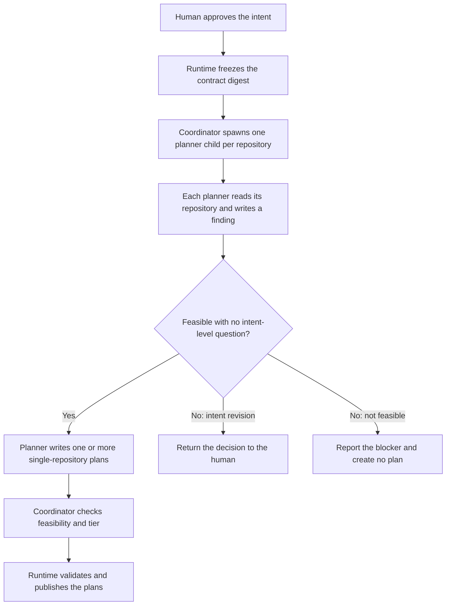

# 7. Intent Approval and Plan Creation

## Human guide

### When to use this

Approve when the intent accurately states the outcome you want. Approval allows
the first code read and causes grounded plans to be created when feasible.

### What you need to provide

Give an explicit decision on the named intent. You may approve it, request a
change, or approve and ask to execute in the same message. You do not need to
approve the generated plan separately.

### Example prompts

> This looks right. Approve it, but don't build it yet.

> Change the retry delay to five seconds before I approve it.

> Looks good. Approve it and build it.

> Approve the login change and show me the plan for the API and web app.

> The updated requirements look right. Approve them again.

### What happens inside

Approval freezes the intent's criteria identity. One planner child per scoped
repository reads current code, writes a finding, and—only when feasible—writes
single-repository plans with real paths, risks, tasks, and runnable checks. The
coordinator judges feasibility and publishes those files without rewriting them.

### What you get back

You receive either:

- a grounded implementation breakdown ready for execution;
- a human decision discovered from the code that requires revising the intent;
- or a concrete reason the outcome is not currently buildable.

For multi-repository work, the response explains the separate plans and their
ordering in product language.

### What does not happen

Approval alone does not silently execute. Plan publication is not a second human
gate. The coordinator does not inspect code or invent planner output. No plan may
contain more than one repository.

## Gate 1

Intent approval is the first human gate. The human approves what “correct” means,
not an implementation plan. Approval changes the contract from `draft` to
`approved` and freezes `contract_digest`, the identity of all criteria-bearing
content.

There is no confirmation token and no separate plan approval.

## Approval-to-plan continuation

At Standard and Critical, approval immediately spawns one independent planner
child per repository in scope. The coordinator does not read the target
repositories and cannot stand in for a missing planner. At Explore, no planner or
plan of record exists until promotion.

## Planner output

For one repository, the planner records a finding with observed revision,
feasibility, tier signal, out-of-scope reach, and classified questions. If
feasible, it writes one or more plans containing:

- the approved intent relationship;
- exactly one repository per plan;
- tasks and intra-plan dependencies;
- grounded paths and risks;
- Product Knowledge references;
- runnable acceptance and verification checks;
- optional dependencies on other plans.

The coordinator judges feasibility from the finding, may add cross-child
dependency edges, validates, and indexes the plans. It does not rewrite planner
prose, task bodies, paths, or earned checks.

## One intent to many plans

A small change may be one intent → one plan. A large intent may produce several
plans. Every plan remains single-repository. A multi-repository intent therefore
produces at least one plan per repository, with dependencies where ordering is
required.

Use one plan with several tasks when they share an execution and verification
boundary. Split into stacked plans when partitions are independently executable
or verifiable, have meaningful dependencies, or isolate failure surfaces.

## Authorization and invalidation

A plan is authorized when it names an approved intent whose criteria still match
the frozen digest. Plan status remains `draft`; there is no `approved` status.
Editing criteria after approval invalidates authorization, requires Gate 1 again,
and later produces a new candidate identity.

Plan publication does not execute anything. Execution begins only on a separate
human request.
