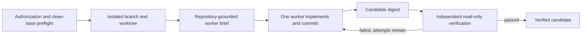

# 8. Plan Execution and Verification

## Human guide

### When to use this

Execute when an approved intent has a grounded Standard or Critical plan and you
want Context Circuit to implement it. Use repair when an independent check has
failed and attempts remain.

### What you need to provide

Name the plan or clearly identify its title. Optionally specify whether to stop
after verification. Task-by-task confirmations are unnecessary because the
approved intent and plan already bound the work.

### Example prompts

> Build plan 0031 and check it.

> Go ahead and build the session security change.

> Fix what failed in the CSV export check.

> What happened in the last run?

> Can I try the result before we ship it?

### What happens inside

The worker never edits the connected checkout. Verification occurs only after a
commit and binds to the exact commits, bases, and frozen criteria. Every repair
creates a new commit and candidate.

### What you get back

You get a plain-language outcome: independently checked, failed with actionable
evidence, or blocked because a required observation or host capability was
unavailable. Preserved work can be inspected or repaired.

### What does not happen

Execution and verification never mark the plan done, deliver, update living
Product Knowledge, push, merge, deploy, publish externally, or discard failed
work.

## Capability

Execution turns one intent-authorized Standard or Critical plan into committed
repository changes and candidate-bound independent evidence. Explore uses direct
human-supervised collaboration and has no plan execution until promoted.

## Preflight and isolation

`execution-begin` verifies:

- the parent intent is approved and its criteria unchanged;
- the plan and single repository are valid;
- the local binding and base branch resolve safely;
- the connected base checkout is clean;
- no other worker owns the execution.

It snapshots the plan, captures the base tip, creates deterministic branch
`cc/<plan-id>/<repository-id>`, and creates an isolated worktree. The connected
checkout is never modified.

## Repository grounding

The runtime discovers the target repository's agent guidance from the prepared
worktree and records a grounding manifest. It deterministically fills a fixed
worker brief; the coordinator adds only one task-focus line.

Context Circuit owns **what and where** the worker may change. Repository
guidance owns **how** to write correct code within that boundary. A conflict on
scope or safety stops execution.

## Worker

Exactly one worker handles all tasks in dependency order. It:

- reads the immutable snapshot and grounded repository guidance;
- implements inside the assigned worktree;
- runs the plan's checks;
- commits before verification;
- records changes, tests, assumptions, unresolved concerns, and repository
  friction in a handoff.

Task paths are grounded starting points, not an exhaustive allowlist. Necessary
intent-consistent same-repository expansion may proceed only when recorded for
complete-diff review. A second-repository or approved-decision expansion stops.

## Candidate

The runtime computes candidate identity from the latest commit map, selected base
commits, and frozen intent digest. A new commit or criteria change creates a new
candidate and voids all previous verification and human acceptance.

## Independent verifier

After commits are captured, the coordinator launches a separate read-only
verifier. It inspects committed state, replays runnable checks, evaluates every
acceptance and verification ID, reviews the complete diff and scope expansions,
and records `passed`, `failed`, or `blocked` against the current candidate.

Only `passed` satisfies verification. Worker claims are not evidence. If the host
cannot create a separate read-only verifier, execution is host-blocked; neither
worker nor coordinator may self-verify.

## Repair loop

On failure, evidence returns to the same worker. Each repair is a new attempt and
new commit; old commits are never amended to hide history. Every verifier
rejection, including the initial implementation, increments the worker-failure
counter. The third rejection stops the execution.

A host/external observation block is not counted as worker failure. Failure,
block, or interruption preserves all branches, worktrees, commits, handoffs, and
records.

## Non-effects

A passed verification does not mark the plan done, reconcile Product Knowledge,
open a pull request, push, merge, deploy, publish externally, or clean up.
