# 9. Stack Execution and Multi-Repository Work

## Human guide

### When to use this

Use stack execution when several authorized plans should run as one coordinated
increment, especially when plans depend on each other or span repositories.

### What you need to provide

Name the plans, an intent whose plans should run, a numeric range, or ask to run
the ready stack. Context Circuit resolves active plan IDs and skips anything not
authorized or not runnable.

### Example prompts

> Run plans 0031 through 0035.

> Build all the ready checkout plans.

> Run these plans one at a time.

> Run whatever can safely run at the same time.

> Continue the stack now that plan 0032 is fixed.

### What happens inside

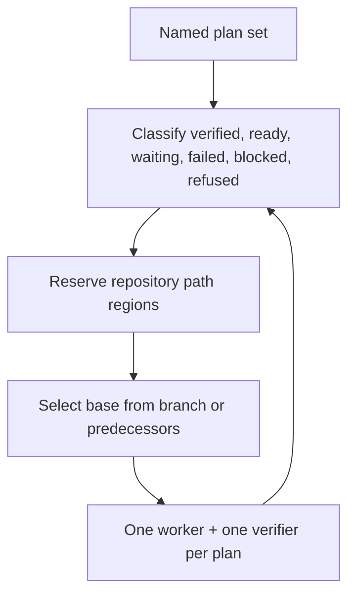

Each plan remains single-repository. Cross-repository edges order work; same-
repository dependencies also determine Git bases. Independent ready pipelines
may overlap, while atomic path reservations serialize conflicting work.

### What you get back

You get a per-plan outcome and an explanation of downstream effects: completed
checks, failures, blocks, waits, and refusals. Multi-repository progress is
reported by product effect rather than internal scheduling mechanics.

### What does not happen

Running a stack adds no approval, combines repositories into one plan or
candidate, marks plans done, opens pull requests, or delivers anything.

## System guide

1. [The essential idea](#the-essential-idea)
2. [Plans, tasks, and dependencies](#plans-tasks-and-dependencies)
3. [One plan always means one repository](#one-plan-always-means-one-repository)
4. [How the dependency graph is understood](#how-the-dependency-graph-is-understood)
5. [The readiness partition](#the-readiness-partition)
6. [Path regions and leases](#path-regions-and-leases)
7. [Base selection](#base-selection-ordering-becomes-real-git-history)
8. [Per-plan execution pipelines](#one-execution-pipeline-per-ready-plan)
9. [Concurrency](#fan-out-and-concurrency)
10. [Failure propagation](#failure-and-block-propagation)
11. [Resume behavior](#resume-behavior)
12. [Worked multi-repository example](#worked-multi-repository-example)

## The essential idea

Stack execution is a scheduler for a set of plans that are already authorized by
approved intents. It repeatedly asks three questions:

1. Which plans have all required predecessors independently verified?
2. Which plans can reserve their repository areas without conflicting with other
   active work?
3. What Git commit must each plan build on so its dependencies are actually
   present in its worktree?

The answers determine what runs now, what waits, and what cannot run. Stack
execution adds no new permission. Every plan still owns a separate execution,
worker, verifier, candidate, repair counter, and final outcome.

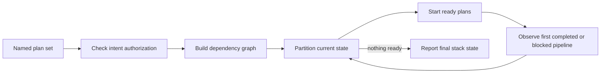

## Plans, tasks, and dependencies

There are two dependency levels, and they must not be confused.

| Dependency | Stored on | Meaning | Scheduling effect |
| --- | --- | --- | --- |
| Task `depends_on` | A task inside one plan | Order work handled by that plan's one worker | The worker executes tasks in dependency order |
| `plan_dependencies` | A plan | This whole plan depends on another independently executed and verified plan | The dependent plan waits for its predecessor |

Several ordered tasks do not automatically justify several plans. They remain in
one plan when they share one repository, one execution boundary, and one
verification boundary. Plans split when work is independently executable or
verifiable, crosses repositories, or needs an isolated failure boundary.

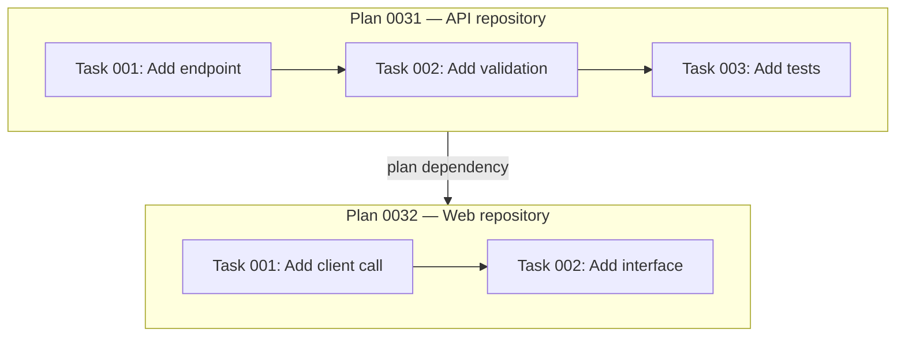

In this example, tasks inside plan 0031 are handled by one worker. Plan 0032
does not start until plan 0031 has its own candidate-bound verifier pass.

## One plan always means one repository

Context Circuit does not execute a “multi-repository plan.” It executes a
multi-repository **intent** as several coordinated single-repository plans.

This is a critical reliability boundary:

- each plan has one repository and one isolated Git history;
- each repository change gets its own candidate identity and independent check;
- a failure in one repository does not corrupt the execution record of another;
- cross-repository ordering is explicit instead of hidden inside one worker's
  handoff;
- delivery later follows actual repository tips rather than pretending several
  repositories have one Git candidate.

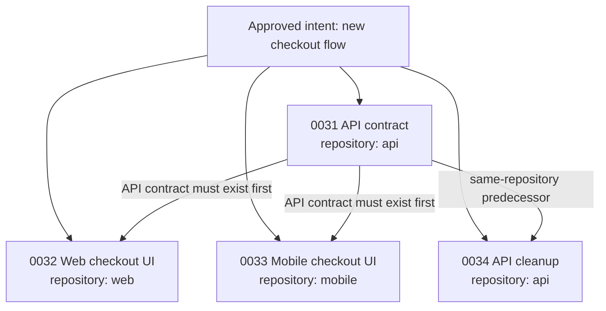

The edge from 0031 to 0032 or 0033 is a cross-repository ordering gate. The edge
from 0031 to 0034 is both an ordering gate and a Git-base relationship because
both plans modify the API repository.

## How the dependency graph is understood

Before running anything, Context Circuit validates that every dependency:

- names an existing active plan;
- does not point to itself;
- includes a reason;
- participates in an acyclic graph;
- belongs to the named run set or can be observed as an external predecessor.

A cycle cannot be scheduled because no member can become ready:

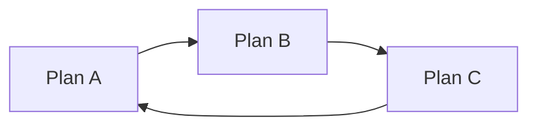

Rather than guessing which edge to ignore, validation fails and the plans must be
corrected. Dependency reasons are human-readable because they explain why an
edge exists and help distinguish a genuine prerequisite from convenient
ordering.

## The readiness partition

The scheduler does not march through plan numbers blindly. On every iteration it
partitions the entire requested set from current evidence.

| Bucket | Meaning | What happens next |
| --- | --- | --- |
| `verified` | Current plan candidate already has a valid independent pass | Do not rerun it; it may release descendants |
| `ready` | Authorized, never terminally run, all dependencies verified, required paths currently available | Candidate to start now |
| `waiting` | A dependency is not verified or a required path is busy | Leave it untouched and reconsider later |
| `failed` | Its execution reached the worker-failure limit | Hold its descendants; preserve evidence |
| `blocked` | A required base, host capability, or observation is unavailable | Hold its descendants; preserve evidence |
| `refused` | Its parent intent is not approved or its criteria changed | Do not execute; human authorization must be repaired |

The partition is recalculated whenever a pipeline finishes or changes state.
This makes the run resumable: a verified plan is not repeated, and fixing one
blocked plan can release only the descendants that depend on it.

### Example: readiness changing over time

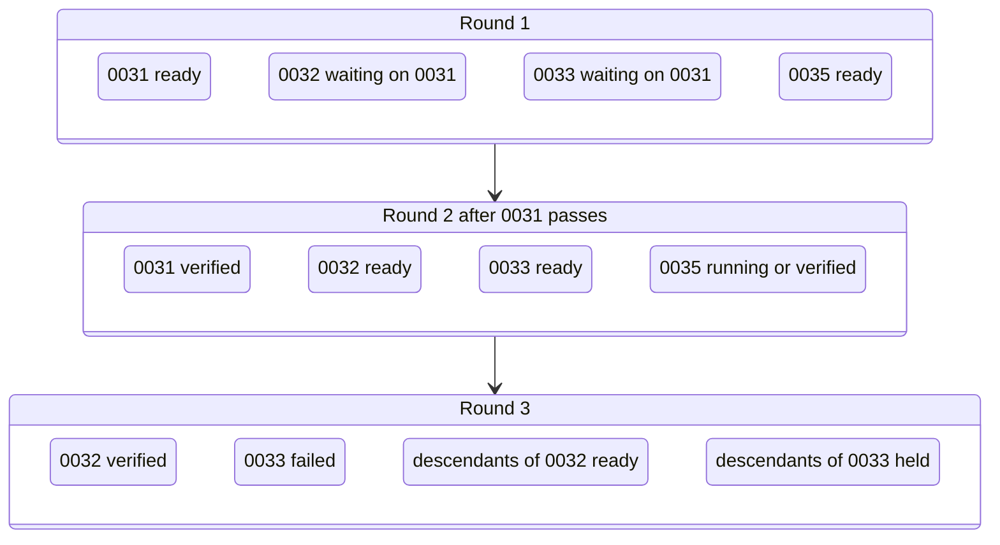

An unrelated ready plan such as 0035 may run alongside 0031. A failure of 0033
does not stop descendants of 0032 or unrelated plan 0035.

## Path regions and leases

Dependency order alone does not prevent two unrelated plans from editing the
same files. Context Circuit therefore reserves each plan's bounded path regions
inside its repository before execution.

Two regions overlap when:

- they are equal: `src/auth` and `src/auth`;
- one is an ancestor of the other: `src` and `src/auth/login.ts`;
- either is repository-wide `.`.

Paths in different repositories never conflict.

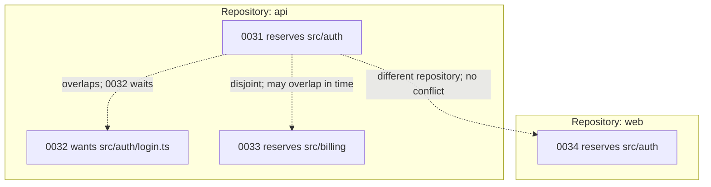

Acquisition is atomic. If two plans race for overlapping regions, the first
successful reservation proceeds and the other remains waiting. The coordinator
does not need to predict every conflict perfectly before trying.

A declared descendant is exempt from conflict with its predecessor because it
builds on that predecessor rather than competing with it. Leases remain held
until delivery, not merely verification, so unrelated work cannot occupy the
same undelivered area and create divergent candidates.

## Base selection: ordering becomes real Git history

When a plan becomes runnable, the runtime selects its repository base before the
worker starts.

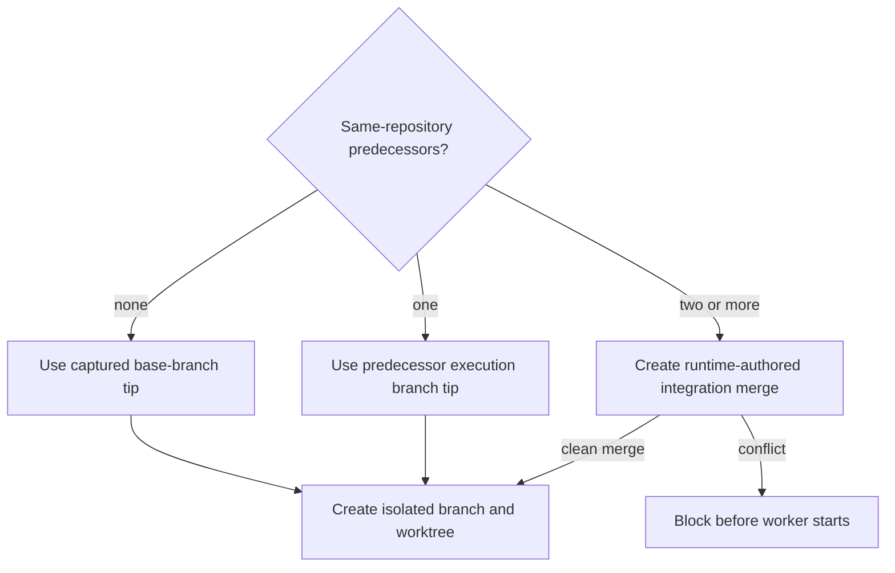

Cross-repository predecessors never supply a Git base. If the web plan depends
on an API plan, the web repository still branches from its own recorded base;
the API pass merely establishes that the required API change exists and has been
checked.

### One predecessor in the same repository

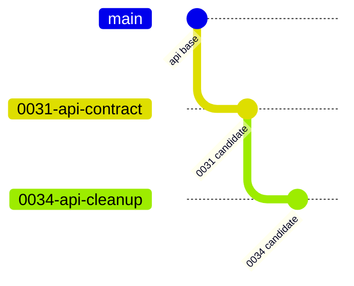

The second plan contains the first plan's work by construction. This creates a
covering tip that can later represent both plans in one pull request.

### Several predecessors in the same repository

When a plan depends on two same-repository sibling branches, the runtime builds
an integration base containing both. The integration merge is runtime-authored,
not a worker attempt. A conflict blocks before implementation and does not count
against the worker's three failures.

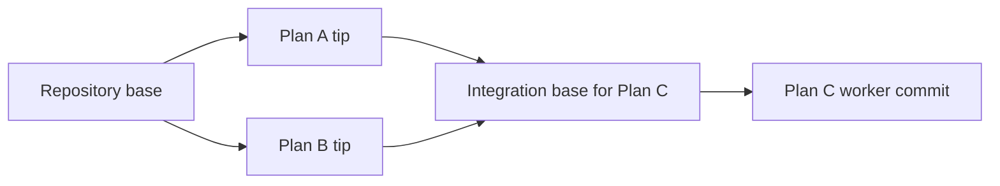

If an upstream plan is repaired after a dependent's base was created, the old
base is stale. Context Circuit rebuilds the dependent base from the new upstream
tip before the dependent reruns; stale dependency content is never silently
retained.

## One execution pipeline per ready plan

Every ready plan follows the same bounded pipeline as a single-plan execution:

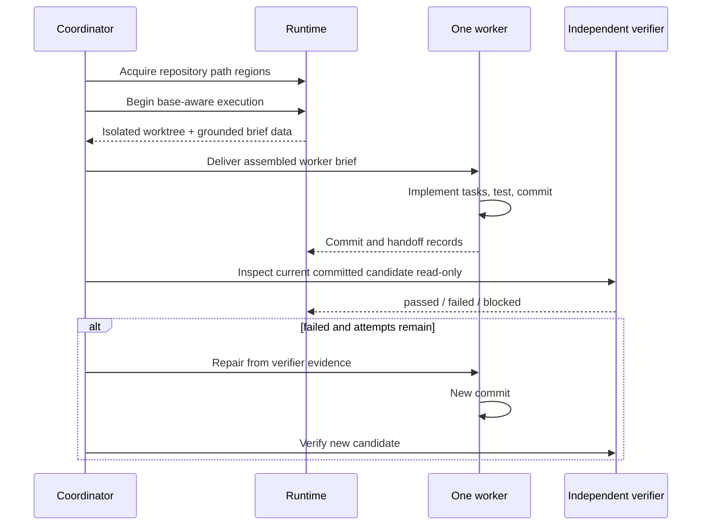

The pipeline's records never mix with another plan's pipeline. Concurrency means
several isolated pipelines are in flight; it does not mean several workers share
one plan, worktree, candidate, or verifier.

## Fan-out and concurrency

The coordinator chooses a fan-out width bounded by host capacity and its ability
to track pipelines. Width 1 gives deterministic serial behavior. A small width
such as 2 or 3 reduces wall-clock time for independent plans without changing
their semantics.

```mermaid
gantt
    title Example stack with fan-out width 2
    dateFormat X
    axisFormat %s
    section Pipeline 1
    0031 API contract       :a1, 0, 3
    0032 Web integration    :a2, after a1, 3
    section Pipeline 2
    0035 Billing cleanup    :b1, 0, 4
    0033 Mobile integration :b2, 3, 3
```

The diagram shows possible overlap, not fixed duration. When any pipeline
finishes, the coordinator repartitions the whole set instead of waiting for a
full batch to finish.

## Failure and block propagation

Failure propagates through declared dependencies, not through the whole run.

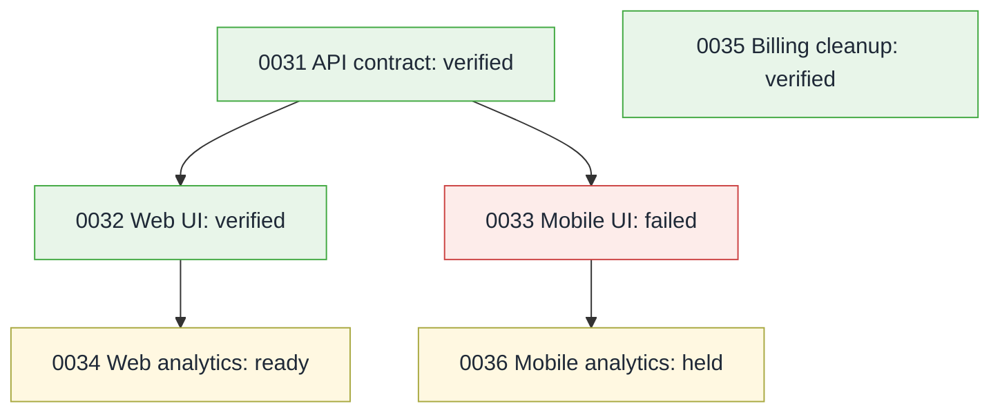

- A verifier rejection returns to the same worker and consumes one of three
  worker failures.
- The third rejection marks that plan failed and holds its descendants.
- A missing independent verifier, unavailable external check, or unbuildable
  integration base marks the plan blocked without inventing a worker failure.
- Branches, worktrees, commits, handoffs, and evidence are preserved.
- Unrelated graph branches continue.

## Resume behavior

A later “continue the stack” request starts from current evidence rather than
from the beginning. Already verified plans stay verified. Plans with active or
terminal executions are not duplicated. Newly repaired prerequisites may release
descendants. Waiting plans are reconsidered when path regions or dependencies
change.

This makes stack execution naturally resumable after human decisions, external
outages, repairs, or interrupted host sessions.

## Worked multi-repository example

Suppose one approved intent adds saved payment methods across three codebases:

| Plan | Repository | Depends on | Paths |
| --- | --- | --- | --- |
| 0041 Payment API | `api` | — | `src/payments`, `test/payments` |
| 0042 Web UI | `web` | 0041 | `src/checkout` |
| 0043 Mobile UI | `mobile` | 0041 | `app/checkout` |
| 0044 API audit events | `api` | 0041 | `src/audit` |
| 0045 Billing cleanup | `api` | — | `src/billing` |

### Round 1

0041 and 0045 have no dependencies. Their API paths are disjoint, so both can
reserve their regions and run concurrently.

0042, 0043, and 0044 wait for 0041.

### Round 2 after 0041 passes

0042 and 0043 become ready in different repositories. 0044 also becomes ready
in the API repository and uses 0041's branch tip as its Git base. All three may
run concurrently if the host has capacity.

### If 0043 fails

Only mobile descendants wait. The web plan, API audit plan, and unrelated billing
cleanup retain their own outcomes. Repairing 0043 creates a new mobile commit and
candidate without invalidating API or web candidates.

### At delivery

0041 and 0044 may share one API covering tip because 0044 contains 0041. Plan
0045 is an API sibling tip and therefore needs a separate pull request. Plans
0042 and 0043 are in different repositories and each needs its own pull request.
The five plans therefore produce four covering-tip deliveries, assuming all are
selected and current.

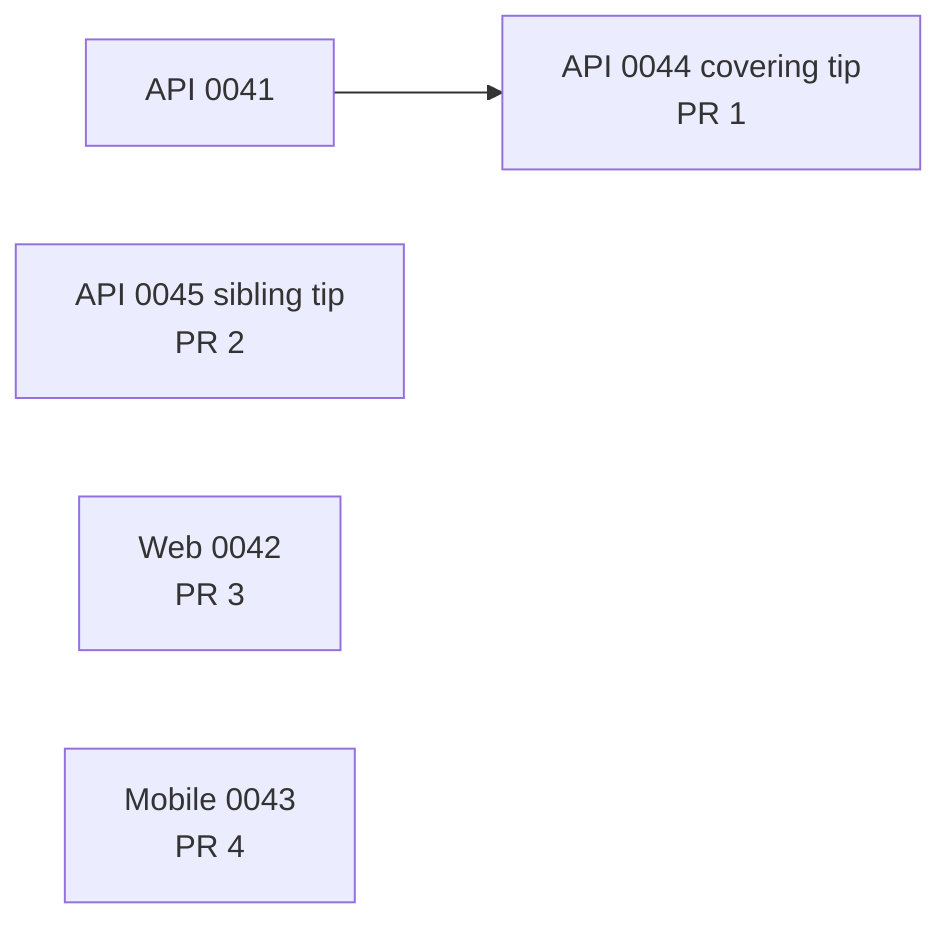

## What stack execution produces

The result is a per-plan state and per-plan candidate-bound evidence. The human
sees which work was independently checked, which failed, which is blocked, and
which remains waiting because of a prerequisite.

It does **not**:

- approve or re-approve intents;
- mark any plan done;
- combine repositories into one plan, candidate, or execution;
- open pull requests, push, merge, deploy, or publish;
- reconcile Product Knowledge;
- clean up failed or interrupted work.

Completion, delivery, and living-knowledge reconciliation remain separately
requested actions after the stack run.
