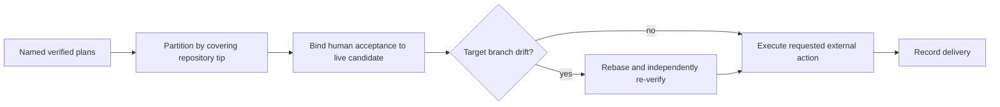

# 10. Delivery

## Human guide

### When to use this

Use delivery when you have reviewed the exact candidate and want an external Git
or deployment action. Opening a pull request, pushing, merging, and deploying are
separate requests; authorize only the one you intend.

### What you need to provide

Name the plan(s) or change set and the desired action. The recorded base branch
is the default target; name another target explicitly if needed. If several plans
are involved, Context Circuit determines the required covering-tip deliveries.

### Example prompts

> Open a pull request for plan 0031.

> Ship the checkout plans. How many pull requests will that need?

> Push the branch, but don't open a pull request yet.

> Open pull requests for the API and web changes.

> The main branch changed. Update our work and try the pull request again.

> Merge pull request 42.

### What happens inside

Linear same-repository stacks may share one pull request. Sibling tips and
different repositories require separate pull requests. Missing source, remote,
provider, or target blocks instead of triggering inference.

### What you get back

You get the exact external effect, target, resulting link when applicable, and
any blocked condition requiring a decision.

### What does not happen

Delivery never marks plans done, reconciles Product Knowledge, publishes to a
tracker, deploys when only a pull request was requested, or cleans up branches
and worktrees implicitly.

## Gate 2

Delivery is the second human gate and covers irreversible or externally visible
actions: opening a pull request, pushing, merging, or deploying. It is never
implied by execution success, verification, candidate acceptance, or mark-done.

The deterministic runtime prepares and validates delivery evidence but performs
no provider or Git-network action. The host or connector executes only the action
the human explicitly requested.

## Covering tips and change sets

Delivery is one pull request per **covering tip**:

- a linear same-repository stack whose last branch contains all predecessors is
  one change set and one pull request;
- sibling stack tips in one repository are separate pull requests;
- different repositories are always separate pull requests;
- cross-repository plans never become one combined candidate.

A change-set candidate is the live member-tip map. Each member must retain its
own candidate-bound independent pass. Delivery does not launch a fresh combined
verifier.

## Acceptance

Human acceptance (“this looks right”) binds to the current single-plan or
change-set candidate. If any member commit or frozen criteria changes, acceptance
becomes stale and must be taken again.

## Pull-request preparation

For each covering tip:

1. Resolve the exact execution source branch.
2. Use the repository's recorded `base_branch` as default target unless the
   human explicitly names another target.
3. Confirm source commits, provider/remote, and target branch are available.
4. Confirm candidate acceptance and per-plan independent passes are current.
5. Check delivery drift.
6. Open the requested pull request and record delivery.

The system never substitutes `default_branch`, invents a remote, silently pushes
an unpublished branch, or combines sibling tips by authoring a delivery merge.

## Drift guard

If the recorded base diverged from the current target tip, the execution branch
is rebased onto the current base and independently re-verified before delivery.
A rebase conflict blocks and preserves the work for human direction.

## Explore delivery

A completed direct-collaboration session is human-supervised and not verified.
Its pairing branch may be delivered only when the session is closed, the
worktree is clean, and the current base tip is already contained. Base drift does
not trigger automatic rebase; the work is brought forward in a new supervised
session.

## Non-effects

Delivery does not mark plans done, reconcile Product Knowledge, publish tracker
records, release leases by implication outside its recorded completion, or clean
up worktrees. Push, merge, deploy, and cleanup remain separately explicit.
