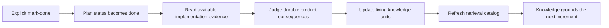
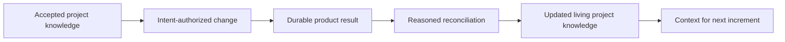

# 11. Context Reconciliation

## Human guide

### When to use this

Use mark-done and reconciliation when an increment's durable outcome should
become living project knowledge for future work. You can also request a
read-only knowledge-impact review before changing status.

### What you need to provide

Name the plan to mark done. If you know particular knowledge areas changed,
mention them, but the coordinator should inspect relevant accepted knowledge and
the implemented result rather than requiring you to enumerate documentation
files.

### Example prompts

> Mark plan 0031 done and update the project knowledge.

> What project docs need to change before we call this done?

> Mark the API and web work done and update how we document the login flow.

> Update the project knowledge after the migration.

> Is any of our project knowledge out of date?

> We're not doing this plan anymore. Mark it done.

### What happens inside

Status changes honor the human request even when evidence is absent. Knowledge
reconciliation is separate semantic work: only durable implemented truth is
folded into the documentation. A failed or abandoned plan does not make its
unimplemented intention true.

### What you get back

You get confirmation of plan status, which living-knowledge areas changed, what
is now considered product truth, and any remaining knowledge debt.

### What does not happen

Reconciliation does not deliver, push, merge, deploy, or copy execution logs into
documentation. Delivery does not substitute for reconciliation, and runtime
evidence never authors Product Knowledge automatically.

## Capability

Context reconciliation closes Context Circuit's central loop. It turns the
durable outcome of a completed codebase increment into updated living Product
Knowledge, so the next increment begins from what the project has become rather
than rediscovering it.

## Trigger

Standard and Critical plans remain `draft` until the human explicitly asks to
mark them done. `plan-complete` performs `draft → done` without treating
verification, acceptance, or delivery as completion.

When the completed plan affected durable Product Knowledge, that same mark-done
starts coordinator-led in-place reconciliation. Explore is planless and has no
completion record until promoted.

## What reconciliation does

The coordinator compares the durable implemented result with relevant existing
knowledge and updates the appropriate units:

- project and workspace summaries;
- architecture and domain behavior;
- accepted decisions, rationale, and consequences;
- constraints, conventions, and terminology;
- repository ownership and cross-domain relationships;
- freshness, status, summaries, aliases, and routing metadata in the index.

The update records **what is now true**, not a narrative of the execution.

## What does not become Product Knowledge

- commit hashes and temporary branches;
- worker handoffs or verifier prose as such;
- a particular intent, plan, or source-file citation;
- runtime status and provider payloads;
- credentials or host-specific paths;
- transient implementation steps with no durable product meaning.

Evidence may support the reconciliation, but it does not write or accept
knowledge automatically. The coordinator makes the semantic judgment; the
runtime remains knowledge-blind.

## Index consistency

Context units and `context/INDEX.md` are updated together. The index is a compact
retrieval catalog, not a copy of page bodies. A new or changed unit receives
accurate summary, topics, aliases, domains, repositories, decision/constraint
signals, freshness, status, and durable provenance where relevant.

## Completion and knowledge debt

Human status authority is absolute: a mark-done request succeeds even if the
plan was never executed, verification failed, or evidence is absent. When
evidence exists, an optional completion record summarizes it; missing evidence
does not veto status.

Likewise, a later plan may begin before earlier Product Knowledge is reconciled.
This avoids turning documentation freshness into hidden execution authority.
But the unreconciled state is knowledge debt: conceptually, the product loop is
not closed until durable truth is available to the next increment.

## Separation from delivery

Delivery never starts reconciliation, and reconciliation never authorizes
delivery. A project may document a completed result before or after its pull
request depending on human workflow; the actions remain explicitly separate.
