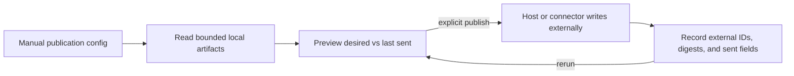

# 12. Publications

## Human guide

### When to use this

Use publication when people outside the workspace need plans, tasks, estimates,
dates, or open questions in another system. Publication is for outward
communication, not Git delivery and not synchronization back into the workspace.

### What you need to provide

Name the workspace material, destination provider and logical target, and whether
you want a preview or an actual publish. On first use, describe the desired
mapping, language/tone, and optional fields such as dates or estimates.

### Example prompts

> Show me how plan 0031 would look in our Jira Payments project.

> Send plan 0031 to ClickUp in Bahasa Indonesia.

> Change task 002's estimate to two and a half hours and show me the preview.

> What changed since we last sent this plan?

> Compare our dates with what's in the tracker now.

> Post the open questions to the engineering Slack channel.

### What happens inside

Plan publications create one parent item and child task items; thread
publications create one parent message and one reply per question. Stable records
make reruns update in place instead of duplicating items.

### What you get back

A preview shows a readable diff and states that nothing was pushed. A publish
reports items created, updated, skipped, or changed only in fields, plus the
external parent link.

### What does not happen

Publication never runs automatically, changes plan status, writes under plans,
imports provider state, updates Product Knowledge, triggers execution or
delivery, or stores credentials/provider payloads in the workspace.

## Capability

Publications send selected workspace information to an external system such as a
task tracker, documentation service, or chat platform. They are manual,
export-only, self-contained, and completely orthogonal to the core knowledge and
execution workflow.

“Publish” is reserved for this external surface. Git operations use “deliver,”
“push,” “pull request,” or “merge.”

## Configuration

Each publication lives under `publication/<name>/` and declares:

- kind, currently `plan` or `thread`;
- provider and credential-free logical target;
- direction, which must be `export`;
- trigger, which must be `manual`;
- bounded workspace artifact types it may read;
- provider field mappings and status mappings;
- optional language, tone, date, and estimate instructions;
- optional display-only provider drift read for previews.

Credentials stay in the host or connector. Provider payloads never enter
workspace files.

## Plan publication

A plan publication maps:

- one Context Circuit plan → one external parent work item;
- each plan task → one child item;
- task acceptance and verification statements → a checklist;
- `depends_on` → sibling dependency links, never child nesting.

Status flows outward from the plan through configured provider mapping and never
returns as plan authority. Optional dates and estimates live in publication-owned
`field-intent/`, not in the plan. Estimates are stored canonically as integer
minutes and converted at the provider boundary.

## Preview and consultation

Preview is a distinct manual dry run. It compares desired publication fields
with the last-published local snapshot and displays added, changed, and unchanged
values without provider writes. The human may edit publication field intent and
preview repeatedly.

If `preview.drift_read: true`, the preview may read current provider values for a
third display-only column. Those values are never persisted or treated as
authority. Without the opt-in, preview does not read the provider.

## Idempotent publication

Published records map workspace items to external IDs and store content digests
plus the fields last sent. Re-publication updates the same items, creates only
new missing items, and skips content and fields unchanged on both axes. A
field-only change still updates the existing item.

Provider fields not owned by the publication are left untouched.

## Thread publication

A thread publication sends a plan's open questions to chat:

- one self-contained parent message identifies the discussion;
- one reply per question includes enough context to answer it;
- reruns edit only the publication's own question messages;
- human replies are never edited or deleted;
- resolved questions remain as discussion history rather than being erased.

## Self-contained external text

An external reader must understand every item without access to the workspace.
Published text describes the work, not Context Circuit plumbing. It excludes
workspace paths, file names, internal evidence IDs, mechanism vocabulary, and
provider payloads. Stable plan/task numbers may appear only as human mapping
aids.

## Boundaries

Publication runs only on explicit invocation. It never triggers, waits on, or
changes context gathering, intent approval, planning, execution, verification,
completion, delivery, archive, or cleanup. It writes only its own config,
field-intent, and published records. External state never flows back into plans
or living Product Knowledge; any future inbound information must enter through
normal context gathering or intent authoring.

If the host cannot reach the provider, publication is host-blocked and changes
nothing.
