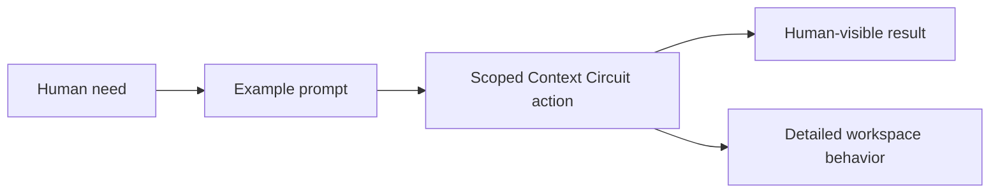
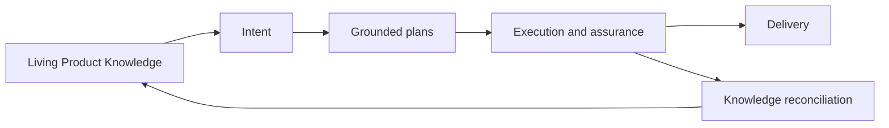

# Context Circuit v1.0 — Full Product Documentation

This documentation teaches a human how to use Context Circuit and then reveals
what happens inside the workspace. Every action chapter follows the same path:

1. **When to use it** — the situation this action solves.
2. **What you need to provide** — usually much less than an internal record needs.
3. **What you can say** — several realistic prompts for different cases.
4. **What happens inside** — the workspace flow, records, and safety boundaries.
5. **What you get back** — the visible result and likely next action.
6. **What does not happen** — consequential side effects that remain separate.

Each chapter then continues with a system reference describing the mechanism,
records, state transitions, and failure behavior. A reader can stop after the
Human guide to learn the action, or continue to understand its internals.

The documents are also maintainer-facing source material and remain subordinate
to the canonical owners in
`.context-circuit/wrapper/contracts/`, `.context-circuit/agents/`, and
`.agents/skills/`.

Context Circuit's core is **living Product Knowledge**. The workflow exists to
keep project understanding durable, current, and reusable: accepted knowledge
grounds the next increment; controlled codebase changes are made; durable
outcomes are reconciled back into the knowledge base.

## Reading order

1. [Workspace Initialization](01-workspace-initialization.md)
2. [Repository Bindings](02-repository-bindings.md)
3. [Agent Role-Tiering](03-agent-role-tiering.md)
4. [Team Member Records and Self-Identification](04-team-members.md)
5. [Gathering Context](05-gathering-context.md)
6. [Intent Creation and Intent Detail](06-intent-creation-and-detail.md)
7. [Intent Approval and Plan Creation](07-intent-approval-and-plans.md)
8. [Plan Execution and Verification](08-plan-execution-and-verification.md)
9. [Stack Execution and Multi-Repository Work](09-stack-execution.md)
10. [Delivery](10-delivery.md)
11. [Context Reconciliation](11-context-reconciliation.md)
12. [Publications](12-publications.md)

## Product boundaries

- `context/` is living, accepted project documentation.
- `sources/` is passive evidence and design material, read only when explicitly
  named or bounded by the request.
- `intent/` records what the human decided correct means.
- `plans/` records repository-grounded implementation derivations.
- `.runtime/` records private deterministic evidence; it never becomes Product
  Knowledge by itself.
- Delivery and external publication are separate explicit actions.
