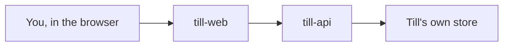

# Till — product brief

A one-person invoicing studio. You send invoices, record what got paid, and see
what is still outstanding — without a bookkeeper, and without a payments
platform in the first version.

## Who it is for

You, working alone: design, consulting, contract engineering. A handful of
clients, a few invoices a month, one currency (your own). You are the only
person who signs in.

## What v0.1 does

- Keep a **client directory** (name, email, optional notes).
- Create an **invoice** with line items (description, quantity, unit price).
- Give each invoice a **number that never repeats**.
- Move an invoice through **draft → sent → paid** (and **void** if you cancel
  it). Partial payment is allowed: an invoice can be **part-paid** until the
  remaining balance is zero.
- **Record a payment by hand** (date, amount, optional note). No card charges,
  no Stripe, no bank feed.
- See a **list of invoices** you can filter by status, and open one invoice to
  its full detail.
- **Sign in** as the owner. There is no client login and no public invoice
  page in v0.1.

## What v0.1 does not do

- Client portal or a shareable public invoice link.
- Automatic reminders, overdue emails, or late fees.
- Tax engine, multi-currency, or accounting export (CSV/PDF can come later as
  their own changes).
- Team members, roles, or permissions beyond "the owner is signed in".
- Charging cards or connecting a bank.

## Shape of the product

Two codebases, one product:

- **till-web** is the studio app: lists, forms, the invoice you look at.
- **till-api** is the source of truth: clients, invoices, payments, sign-in.

Concerns (not repositories): **identity**, **clients**, **invoices**,
**payments**, **the owner's app**.

## Decisions already made

- One owner. One currency, set once for the studio (not per invoice).
- Invoice numbers are sequential integers, starting at 1, never reused, even
  after a void.
- Payments are a log against an invoice. Deleting a payment is not in v0.1;
  if you typed the wrong amount, void and start a new invoice, or record a
  reversing note — that choice is still open (see below).
- Status is derived from the payment log plus an explicit "sent" mark. A draft
  has no payments. "Paid" means remaining balance is zero.

## Open questions (human decisions)

1. **Wrong payment amount.** If you record 500 instead of 50, do you edit the
   payment, delete it, or only add a reversing entry? v0.1 needs one rule.
2. **Sent means what.** Does "sent" only flip a status you set by hand, or does
   Till also email the client? v0.1 can be hand-only; email would be its own
   later change.
3. **Sign-in method.** Email + password, or a magic link to the owner's email?
   This is a security surface — treat it as a careful change, not a quick
   informal edit.

## Success for v0.1

You can sign in, add two clients, send an invoice, record a partial payment,
see the remaining balance, record the rest, and watch it show as paid. Nothing
is charged automatically. A second person cannot see or change anything.
