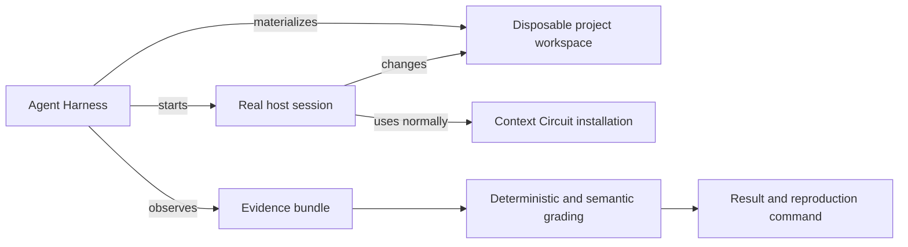
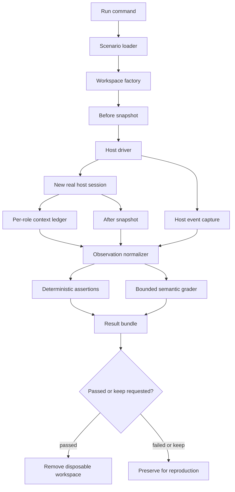

# Agent Harness: real-host scenario testing

## Capability

Agent Harness is an external system for testing how real coding-agent hosts
behave when they operate a product that uses Context Circuit. It constructs a
known temporary project condition, opens a new real host session, gives that
session a realistic human prompt, and evaluates the observable journey and
result.

The harness is not part of Context Circuit. It does not implement Context
Circuit lifecycle rules, call private lifecycle functions as a substitute for
the agent, or share Context Circuit runtime state. It treats a materialized
Context Circuit workspace as the system under test in the same way a person
would encounter it.

## Problem

Unit and shell tests can prove deterministic runtime behavior, but they cannot
show whether a real coordinator understands a human request, selects the right
capability, launches the required native children, respects phase boundaries,
or explains the outcome clearly. Transcript snapshots cannot solve this because
valid agent wording and implementation choices vary between runs.

The harness therefore needs realistic sessions without surrendering test
control. Project conditions must be reproducible, while host execution remains
real. Evaluation must prefer observable state and structured events over exact
language.

## Principles

1. **Real host, controlled world.** Every agent scenario starts a real Codex,
   Claude Code, or Cursor session. The temporary project, evidence, repositories,
   clocks where supported, and external test targets are controlled fixtures.
2. **External consumer boundary.** Agent Harness depends only on the released or
   assembled Context Circuit product surface. Context Circuit never imports the
   harness and contains no test-only behavior for it.
3. **Positive journeys first.** The foundation suite contains successful,
   representative user journeys. It does not deliberately induce outages,
   malformed state, policy refusals, or other negative cases.
4. **Observable outcomes over transcripts.** Files, Git state, lifecycle records,
   child topology, bounded reads, and communicated meaning are graded. Exact
   sentences and private reasoning are not.
5. **Independent scenarios.** A scenario declares its complete starting
   condition. It never depends on another scenario having run first.
6. **Evidence before verdict.** Every assertion points to captured evidence. The
   final pass or fail is reproducible and never rests only on the agent's claim.
7. **No production side effects.** Repositories, remotes, and integrations used
   by automated runs are disposable or dedicated test targets.
8. **Minimal role context.** A normal request gives each role only the context
   its responsibility requires. Broader reading is a separately declared path
   triggered by explicit human language, never an agent convenience.

## Fixed decisions

### Product separation

Agent Harness is developed, versioned, packaged, and run independently from
Context Circuit. During source development it may consume a locally assembled
Context Circuit artifact, but it must not reach into the source checkout as its
runtime environment. A run records the exact Context Circuit artifact and host
version it exercised.

### Test boundary

The default unit of testing is one new host session operating one disposable
workspace for one scenario. Multi-session scenarios may be added later, but are
not required by the foundation suite.

### Scenario families

The initial suite has three families and nine positive scenarios:

- fresh-project journeys;
- context-gathering journeys;
- intent, planning, and execution journeys.

The catalog and declarative scenario contract are defined in
[scenario-model.md](scenario-model.md).

### Workspace construction

The harness builds workspaces from small composable fixtures rather than copying
opaque snapshots of entire completed workspaces. Each run receives a unique
project root, optional source documents, one or more seeded Git repositories,
known local member configuration, and only the Product Knowledge and lifecycle
state declared by the scenario. Construction and cleanup are defined in
[workspace-factory.md](workspace-factory.md).

### Host execution

Host drivers share one lifecycle—probe, launch, observe, wait, terminate, and
collect—while translating that lifecycle to native Codex, Claude Code, and
Cursor interfaces. They do not normalize away meaningful host differences.
Authentication stays in the host; credentials are never copied into a fixture or
result. See [host-execution.md](host-execution.md).

### Role context boundaries

Context usage is a tested product outcome, not incidental telemetry. Every
scenario declares the normal context envelope for coordinator, planner, worker,
and verifier roles. The harness separately records context delivered in role
packets, active reads attributed to each role, the filesystem surfaces available
to that role, and input-token usage when the host exposes it. A role may use an
expanded envelope only when the user's prompt explicitly requests the additional
source, repository, history, archive, diagnostic, or other scope. See
[role-context-boundaries.md](role-context-boundaries.md).

### Evaluation

Mechanical facts use deterministic assertions. Human-facing meaning uses a
bounded semantic grader only when no mechanical observation can establish the
criterion. A scenario can pass only when all required assertions pass; semantic
grading cannot excuse contradictory filesystem, Git, runtime, or child-agent
evidence. See [observation-and-grading.md](observation-and-grading.md).

## System shape

## Foundation outcome

The foundation is complete when a maintainer can run any of the nine scenarios
against a selected real host, see the session while it operates, receive a
structured evidence-backed result, and reproduce a failed or questioned run in
its preserved workspace. Adding a new scenario should normally require fixture
composition and a scenario contract, not a new driver or grading program.
