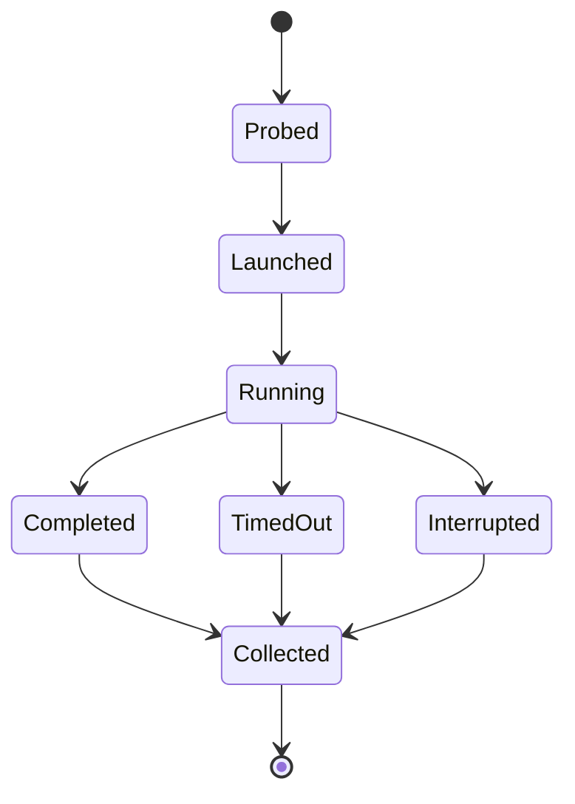

# Host execution

## Responsibility

Host execution starts and observes a new real coding-agent session. One driver
implements the common lifecycle for each supported host without pretending the
hosts expose identical capabilities.

Foundation hosts are Codex, Claude Code, and Cursor. A scenario may run on one
host or as a matrix across compatible hosts.

## Common driver lifecycle

The driver interface provides:

1. `probe` — report host identity, version, available model/session controls,
   child-agent support, event visibility, and authentication readiness;
2. `launch` — create a new session rooted at the prepared project and submit the
   scenario prompt;
3. `observe` — stream the native output and capture all host-visible events;
4. `wait` — return the native terminal state without inventing success;
5. `terminate` — end only the session belonging to the run;
6. `collect` — persist transcript, structured events, child topology, usage when
   exposed, and terminal metadata.

Drivers use supported host interfaces. Screen scraping is not the foundation
contract when a structured CLI, API, or native event stream exists.

The driver also maintains role attribution for the root session and every native
child. Tool reads, delivered role packets, command processes, and usage records
are attached to the originating role rather than flattened into one session log.
When the host cannot expose role-attributed reads or equivalent enforceable
evidence, a strict context-boundary assertion is inconclusive for that host; it
must not be reported as zero reads.

## Real-session requirement

A scenario labeled `real-host` passes only if the driver proves that a new native
session was created and reached a native terminal state. A replayed transcript,
mock response, or coordinator function called directly by the harness cannot
satisfy this class.

Child roles required by the journey must also be native children attached to the
root session. A second top-level process or a harness-emulated child is recorded
as a different topology and cannot satisfy a child-role assertion.

## Prompt submission

The driver submits the user-facing prompt without hidden instructions that teach
the expected answer. Harness metadata, assertion definitions, and grading rules
are never placed in the host context. The session receives only:

- the project and its normal instruction surfaces;
- the scenario's human prompt;
- explicit host settings declared by the scenario.

This preserves the distinction between preparing a condition and coaching the
agent through it.

## Host evidence

Every run records what the host can authoritatively expose:

- host name and version;
- model and reasoning setting when known;
- root session identifier;
- start, progress, and terminal timestamps;
- native child session identifiers and roles when visible;
- tool or command events when visible;
- context packet sizes, role-attributed active reads, and accessible filesystem
  roots when observable;
- usage and termination reason when visible.

Missing observability is represented as unavailable, not as an empty successful
observation. Assertions requiring unavailable evidence make the scenario
inconclusive for that host unless the same fact can be established independently
from workspace state.

## Authentication and secrets

Drivers use the operator's already configured host authentication or a dedicated
test account through the host's supported mechanism. They do not copy tokens,
configuration directories, cookies, or provider payloads into the run root.

Event and transcript collectors redact configured secret patterns before writing
artifacts. Redaction is defense in depth; the scenarios themselves contain no
real secrets.

## Time and cost controls

Scenarios declare a maximum session duration and optional usage budget supported
by the host. Reaching a limit terminates the session and produces a non-passing
run with preserved evidence; it is not reinterpreted as a product failure.

Matrix execution is opt-in. The normal development loop runs one selected host.
Scheduled compatibility runs execute the same scenario contract across all
supported hosts without duplicating scenario definitions.
