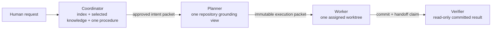

# Role context boundaries

## Responsibility

Agent Harness proves that each Context Circuit role uses the smallest context
needed for its normal responsibility. It distinguishes four facts that must not
be collapsed:

- **available:** the filesystem and connector surfaces the role could access;
- **provided:** content inserted into the role's initial or follow-up packet;
- **actively read:** content the role requested through a tool or command;
- **charged:** input tokens or equivalent usage reported by the host.

A missing read event is not evidence that a file was unread when the host cannot
observe or enforce reads. Strict scenarios pass only with role-attributed access
evidence or an enforced context view that makes undeclared content unavailable.

## Normal-request role envelopes

The baseline applies when the human makes an ordinary request without asking for
broader research, history, diagnostics, archived material, additional
repositories, or a named source.

### Coordinator

The coordinator receives the human conversation and the small workspace entry
surface. It reads the Product Knowledge index, selects only relevant accepted
knowledge units, and reads the one procedure needed for the routed action. It may
invoke deterministic runtime interfaces but does not read their implementation.

For intent creation, the coordinator does not read target repository code. It
does not traverse archived plans or unnamed `sources/` material. For context
gathering, it reads only evidence explicitly bounded by the human request.

### Planner

The planner receives the approved intent, its contract, optional intent detail,
the relevant accepted Product Knowledge selected for the change, and one
repository identity. It reads that one repository's own agent guidance and the
code, tests, configuration, and documentation needed to ground the approved
outcome.

It does not receive the full coordinator conversation, unrelated Product
Knowledge, another repository, archived plans, or unrelated source evidence. A
planner spawned for another repository has a separate envelope.

### Worker

The worker receives the immutable plan execution packet, only the Product
Knowledge pages named by that plan, and the assigned repository worktree. It
reads the repository guidance named in the brief, the planned implementation
areas, their necessary dependencies, and the tests needed to perform the work.

It does not receive unrelated plans, full workspace history, coordinator
conversation, another repository, or verifier context. A necessary same-repo
read beyond a task anchor is allowed when it supports the approved work and is
recorded as the role contract requires; this does not authorize indiscriminate
repository traversal.

### Verifier

The verifier receives the immutable plan snapshot, repository map, latest worker
commit, worker handoff as a claim, and named verification commands and evidence
identifiers. Its repository view is read-only. It reads the complete committed
diff plus the source, tests, and configuration required to independently verify
the declared outcomes and recorded scope expansions.

It does not receive the worker's private session context, coordinator
conversation, unrelated Product Knowledge, other plans, or writable product
access. It may read outside original task anchors only where the committed diff
or a verification dependency requires it.



## Explicit expansion

Different behavior is tested only when the human explicitly asks for it. An
expanded scenario must record:

1. the exact clause in the human prompt that grants broader reading;
2. the role to which the expansion applies;
3. the additional named source, repository, history, archive, diagnostic surface,
   or research target;
4. the expected purpose and stopping condition;
5. the revised context budget.

```yaml
context_policy:
  mode: expanded
  authority:
    prompt_clause: "Compare the PRD with the active API repository."
  coordinator:
    add_allowed:
      - source: sources/billing-prd.md
        purpose: extract product requirements
      - repository: api
        purpose: gather current implementation behavior
  budgets:
    provided_bytes_max: 96000
    active_read_bytes_max: 512000
```

The expansion is exact, not contagious. Naming the API repository does not
authorize reading the web repository. Naming one PRD does not authorize scanning
all of `sources/`. Asking for diagnostics does not authorize a product change.

## Enforcement and observation

The strongest driver implementation gives each role a filesystem view containing
only its declared envelope. Where native child creation requires a broader shared
workspace, the driver combines host events with process-tree or operating-system
read tracing and attributes access to the root or child session.

The context ledger records one normalized event per delivered or actively read
resource:

```yaml
role: planner
kind: active-read
resource: repository:reporting/src/export.ts
bytes: 4821
reason_class: implementation-grounding
authority: normal-planner-envelope
host_evidence: tool-event-184
```

Host background indexing is recorded separately when distinguishable. It does
not count as agent-provided context unless the host injects the indexed content
into the role session. If the driver cannot distinguish background access from
role access, strict read assertions are inconclusive rather than silently
passing.

## Budgets

Each scenario sets ceilings for provided bytes, actively read bytes, file count,
and input tokens when available. Budgets are role-specific and describe the
expected size of a normal request, not a universal constant. Results report both
absolute usage and the largest contributors.

A scenario fails when a role reads a forbidden surface or exceeds a hard declared
budget. It reports diagnostic variation when usage remains allowed but changes
materially from the scenario baseline. Token counts supplement resource-level
evidence; they never replace it because hosts tokenize and report usage
differently.

## Foundation assertions

Every one of the nine positive scenarios asserts:

- only expected roles are created;
- each role receives only its declared packet;
- no role actively reads a forbidden surface;
- every expanded read has explicit prompt authority;
- role context remains within the scenario's hard budgets;
- the result names unavailable measurements honestly.

These are positive-journey assertions: the requested capability still succeeds.
The harness is verifying efficient, role-correct behavior during success, not
constructing a prompt intended to provoke a refusal.
