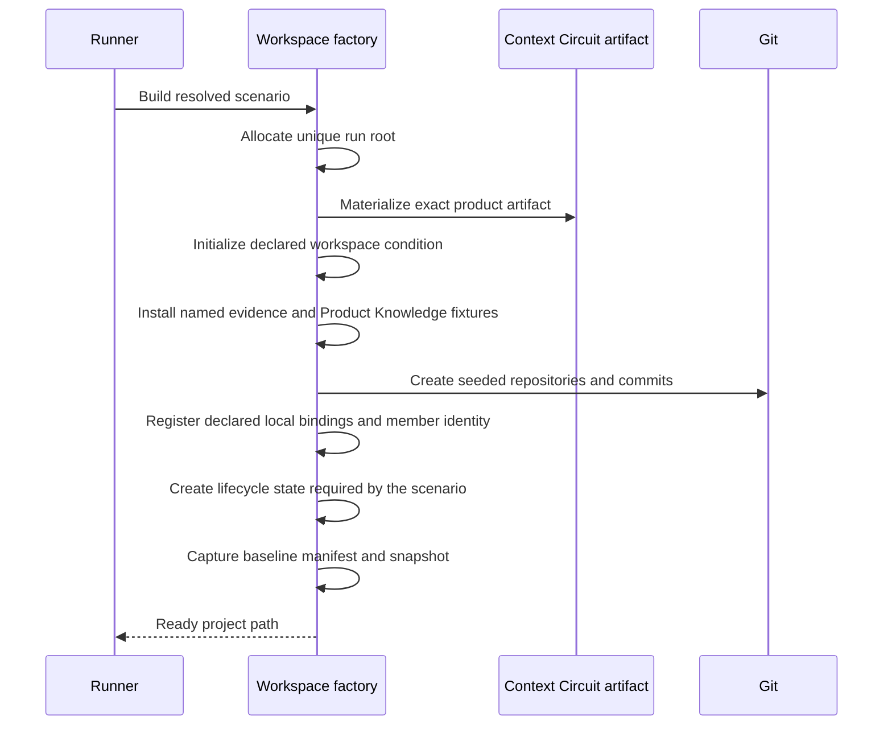

# Workspace factory

## Responsibility

The workspace factory turns a declarative condition into a disposable test world.
It owns project directories, materialized Context Circuit artifacts, source
evidence, repository fixtures, local configuration, initial lifecycle state, and
cleanup. It does not launch or grade the agent.

## Run layout

```text
<runs-root>/<run-id>/
  manifest.yaml
  project/                    # agent working directory
  repositories/               # seeded local Git repositories
    api/
    web/
  remotes/                    # optional local bare remotes
  inputs/                     # resolved prompt and immutable fixture inputs
  observations/
    before/
    after/
    events/
  result.yaml
```

The project and repositories use real filesystem paths. Paths in evidence are
normalized relative to the run root so results remain comparable and do not
expose unrelated machine locations.

## Construction sequence



Each builder step is idempotent within a newly allocated run. A failed build is
reported as harness setup failure and never presented as an agent result.

## Context Circuit artifact boundary

The factory accepts one immutable Context Circuit artifact reference:

- a released package or template version;
- an assembled artifact produced from a named source revision; or
- an explicitly supplied local artifact for development.

It records the artifact digest and source revision in `manifest.yaml`. The
artifact is copied or materialized into the project as a consumer would receive
it. The agent never operates inside the Context Circuit maintainer checkout.

## Fixture composition

Fixtures are small, named building blocks:

- **project identity:** name and purpose;
- **source evidence:** PRDs, architecture notes, or other request-bounded files;
- **Product Knowledge:** accepted context units plus their valid index;
- **repository:** a real Git repository with deterministic files, branches, and
  commits;
- **binding:** portable identity and the host-local connection to a repository;
- **member:** committed roster entry and selected local member identity;
- **lifecycle:** valid draft intents, approved intents, plans, or execution
  prerequisites needed by a later positive journey.

Fixtures may depend on other fixtures explicitly. The resolver rejects ambiguous
overwrites and records every selected fixture with its content digest.

## Repository fixtures

Repositories should be small but realistic enough to require genuine code
reading. A fixture includes source code, tests, documentation, dependency files,
and a fixed Git history. Repository creation sets deterministic author identity,
commit messages, branches, and timestamps where Git permits it.

The first repository set should include:

- a single-service application for repository context gathering;
- the same application accompanied by a compatible PRD;
- a reporting application suitable for the intent and planning journey;
- an executable application whose approved Standard plan can be implemented and
  verified by real children.

The repositories exist solely for Agent Harness and contain no dependency on the
Context Circuit source checkout.

## Isolation

Every scenario gets a new run root and new runtime state. Processes receive the
project directory as their working scope. The factory does not rewrite the
operator's general home or host installation. Stronger host-profile isolation
can be added by a driver when the host provides a supported profile mechanism.

External network access is declared by the scenario and driver. The foundation
journeys require provider access for the real host but do not require production
application integrations. Git delivery, when introduced later, uses local bare
remotes or dedicated test remotes.

## Retention and reproduction

Passing runs retain the resolved manifest, normalized observations, result, and
host/version evidence; their disposable project may be removed. Failed,
inconclusive, interrupted, or explicitly kept runs retain the complete run root.

Every retained result includes a reproduction command that selects:

- the scenario revision;
- resolved fixture digests;
- Context Circuit artifact digest;
- host and host version;
- prompt content;
- supported deterministic seed values.

A reproduction is a fresh run from the recorded inputs, not a continuation of
the original agent session.

