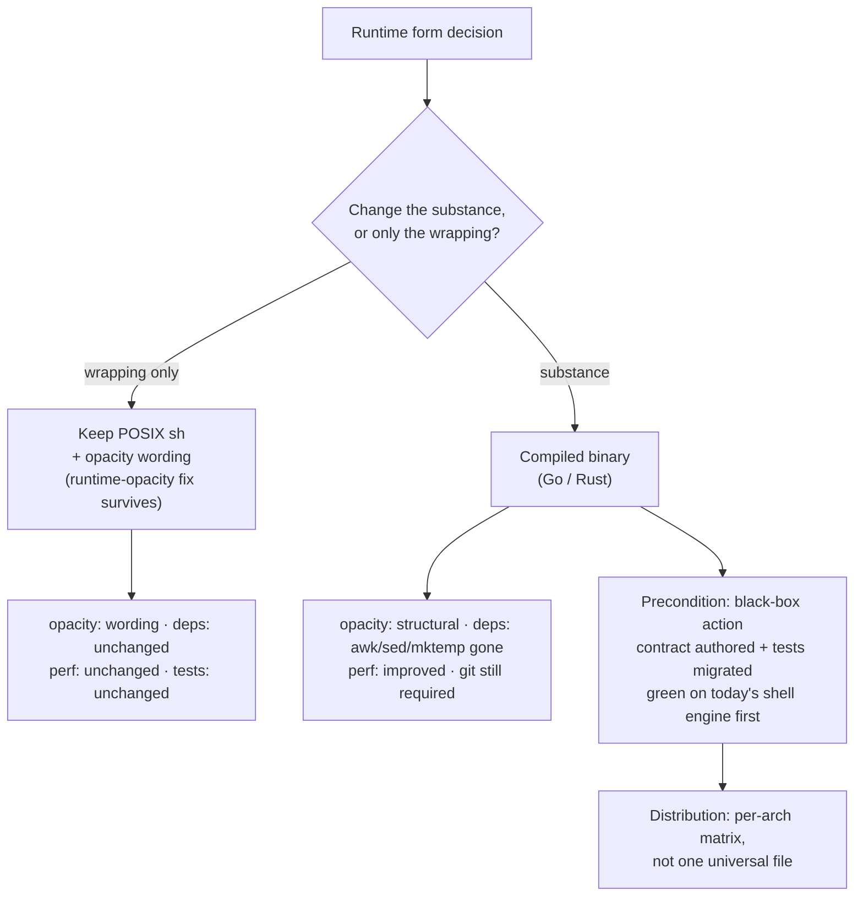

# Runtime form

A design scope in the [runtime-rearchitecture](../README.md) grouping. It governs
what the deterministic runtime is *made of* and how it is *verified* — not what its
actions do, nor the coordinator flow that calls them.

## Capability

Today the runtime is `wrapper/runtime/engine.sh`: a single POSIX sh file that is
**dual-use**. It is *sourced* by tests and adapters (`. engine.sh`, exposing its
`cc_*` functions into the caller's shell) and it is *invoked* as a thin CLI
(`sh engine.sh <action> <args>`, dispatched by `cc_main`, guarded so sourcing does
not trigger it). It owns the product's deterministic mechanism — safe path and
identifier checks, atomic writes and digests, workspace and repository-binding
validation, anchor/worktree preparation, base selection, plan-structure and
approval validation, the active plan index, execution/attempt records, commit
capture, verifier-result and read-only enforcement, the three-failure counter,
one-worker locking, completion eligibility, and repository grounding. It owns
**none** of the model-facing intelligence: no prompts, no Product Knowledge
interpretation, no routing policy, no confirmation cards, no automatic
PR/merge/push/deploy.

This scope decides the runtime's **form**: whether that mechanism keeps shipping as
a readable, sourceable shell library, or becomes a compiled, opaque, single-surface
artifact — and it defines the black-box contract that lets the form change at all
without rewriting the whole test suite.

## The problem — four goals the shell form cannot all satisfy

The question was raised with four goals held at once:

1. **Opacity** — users and agents should not read or depend on the runtime's
   internals. (This is the concern the v0.7.0 `runtime-opacity` scope addressed by
   *prohibition*; a live v0.6 run showed a real coordinator read `engine.sh` anyway,
   non-deterministically tripping the maintainer access gate.)
2. **Single-file distribution** — ship one self-contained artifact.
3. **Performance** — reduce the fork-per-`awk`/`sed` overhead of a shell
   implementation.
4. **Fewer runtime dependencies** — stop depending on `awk`, `sed`, `mktemp`
   (`git` is irreducible — every option shells out to it).

No single packaging trick delivers all four. `shc` and Cosmopolitan/busybox
bundles wrap the script but still need `/bin/sh`, still fork the same external
tools, and still ship an implementation that is at best obfuscated — they fail
performance and fewer-deps outright. **Only a reimplementation in a compiled
language delivers all four**, and that is a rewrite, not a change — which is why
this is a grouping-level design question, not a tweak.

But the shell form is also *load-bearing for how the product is tested*, and that
is the deeper cost. The suite verifies the runtime by **sourcing it and calling its
internal functions** (14 test suites, ~98 `cc_*` functions) and by **grepping its
source text** (7 suites assert strings like "no `git push`", "no `claude -p`", "no
`cc_probe`"). A compiled binary can be neither sourced nor grepped. So changing the
form invalidates the model by which the whole product is verified — see
[test-strategy.md](./test-strategy.md).

## Principles

- **The runtime is defined by its action contract, not its language.** Everything a
  caller needs is the set of CLI actions, their inputs, their printed result keys,
  their exit and reason codes, and the on-disk records they write. That contract is
  the invariant; the implementation behind it is replaceable. This principle is what
  makes both the binary option and the test-model migration possible.
- **Form delivers opacity; wording is only the backstop.** Opacity should be a
  property of the artifact (nothing readable to leak), not a rule the coordinator
  must remember on every run. Where the form stays readable, the prohibition
  wording (the v0.7.0 runtime-opacity fix) remains the mechanism.
- **Determinism and host-neutrality are invariant across forms.** Whatever the
  runtime is written in, it stays deterministic, host-neutral, and free of prompts,
  Product Knowledge interpretation, and routing policy (INV-RUNTIME-01). The form
  changes the substance, never the boundary.
- **`git` stays; nothing else is guaranteed.** Every option shells out to `git`.
  "Fewer dependencies" means removing the `awk`/`sed`/`mktemp` reliance a shell
  implementation forces, not removing `git`.
- **Test the contract, not the implementation.** Verification must bind to
  observable behavior — CLI in/out, exit codes, records on disk — so the form can
  change without touching most tests. The current white-box coupling is a liability
  to remove regardless of which form wins.
- **Ownership is unchanged by form.** The canonical rule owners stay under
  `wrapper/` (`wrapper/contracts/invariants.yaml`, `wrapper/adapters/AGENTS.md`). A
  new artifact is still the same mechanism owner the shell file is today.

## Fixed decisions

1. **The runtime is specified by a black-box action contract**, independent of
   implementation language: the CLI command set, each command's inputs, printed
   keys, exit/reason codes, and the records it writes. This contract is the anchor
   for both the form choice and the test migration, and it is authored before any
   form changes.
2. **No new invariant, role, or skill.** This scope changes an artifact and the
   corollary wording about reading it. INV-RUNTIME-01 and the path-lease /
   base-selection / repository-grounding owners keep their meaning and their home
   under `wrapper/`.
3. **Opacity is delivered by form, backstopped by wording** — not the reverse. If
   the form becomes compiled, the invoke-not-read boundary is structural and the
   runtime-opacity prohibition becomes largely moot; if the form stays shell, the
   runtime-opacity fix (say "must not read," state it once, close the information
   gap) is retained in full.
4. **`git` remains an allowed subprocess; determinism and host-neutrality hold in
   every option.**
5. **The white-box test coupling is removed regardless of route.** Tests bind to
   the action contract (Fixed decision 1). This migration is **contract-first**: the
   contract-level tests land and go green on today's shell engine *before* the form
   is allowed to change.

## Open forks (deferred to a later decision or plan)

- **A. Form route.** (i) **Keep POSIX sh**, apply the runtime-opacity hardening,
  and optionally ship it stripped of comments for opacity-without-rewrite;
  (ii) **compiled binary** rewrite (Go or Rust); (iii) **hybrid** — a thin shell
  CLI shelling into a compiled core, or a compiled core with the shell retained only
  as a compatibility shim during migration.
- **B. Language, if compiled.** Go (static single binary, trivial
  cross-compilation, clean `os/exec` for `git`) vs Rust. Recommendation leans Go for
  the cross-compile and static-link story; not fixed here.
- **C. Distribution.** Per-arch prebuilt binaries shipped in
  `context-circuit-template` (darwin/linux × arm64/amd64) vs shipping source plus a
  build step vs both. Note the genuine tension: a single POSIX file runs anywhere
  `/bin/sh` exists — *more* portable than any binary — so "single-file distribution"
  under a compiled form means an artifact **matrix**, not one universal file.
- **D. Migration / compatibility.** How a workspace mid-flight survives the swap.
  The `.runtime/` records are language-neutral YAML, so the state should carry over
  untouched; confirm and state the compatibility guarantee in the implementing plan.
- **E. Sequencing.** Contract-first (Fixed decision 5) means the test migration is
  independently shippable and lands first; the form rewrite is a later, separate
  step. This staging is the reason the work is a named grouping rather than one
  version's delta.

## Option comparison

Against the four goals and the two costs a rewrite imposes:

| Route | Opacity | Single artifact | Performance | Fewer deps | Cost: test rewrite | Cost: build matrix |
| --- | :--: | :--: | :--: | :--: | :--: | :--: |
| Keep POSIX sh (+ opacity wording) | wording only | ✓ (one file, runs anywhere) | ✗ | ✗ | none | none |
| Keep sh, stripped/minified | ~ (obfuscated, reversible) | ✓ | ✗ | ✗ | source-grep tests only | none |
| `shc` / Cosmopolitan wrapper | ~ | ✓ | ✗ (still `/bin/sh`) | ✗ | breaks source-grep | some |
| **Compiled binary (Go/Rust)** | ✓ (structural) | ✓ per-arch | ✓ | ✓ (`git` stays) | **full: off white-box** | **yes** |

The only route that satisfies all four goals is the compiled binary, and it is also
the only route that forces the full test-model migration and a distribution matrix.
The comparison is the decision surface for fork A; this scope does not pick the row.

## Boundaries

- This scope governs the runtime's **form and its test contract** only. It changes
  nothing about what an action does, how it is invoked from the coordinator's point
  of view, the run-stack / execute / verify control flow, or any role.
- It **does not retire or modify** the v0.7.0 `runtime-opacity` scope, which stays
  in place and active; it reframes opacity as a property of the runtime's form. The
  "must not read" wording fix is the mechanism only within the shell-stays branch of
  fork A; a compiled form would make the boundary structural instead.
- It asserts **no new invariant** and introduces **no new role or skill**. It
  neither approves, executes, verifies, completes, nor delivers anything.
- It is a **source design**, not a plan: it fixes the framing, constraints, and
  option set, and defers the route, language, distribution, and migration mechanics
  to a later decision and its implementing plans through the normal
  context-proposal path.
