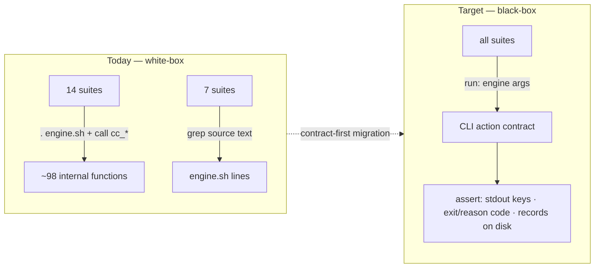

# Test strategy

The testing concern of [runtime-form](./design.md), at implementation depth. It
continues from `design.md` (Fixed decisions 1 and 5) and does not restate it. The
question it answers: **how Context Circuit verifies the runtime such that the
runtime's form can change without rewriting the suite** — and why that migration
must land *before* any form change, not after.

## Current state — verification is coupled to the shell implementation

The suite reaches *inside* the runtime in two ways, and both are tied to it being a
readable shell file:

- **White-box sourcing.** `test/lib/assert.sh` does `. "$ROOT/wrapper/runtime/engine.sh"`
  once, and **14 test suites then call the `cc_*` functions directly** — ~98
  distinct internal functions (`cc_scalar`, `cc_task_list`, `cc_base_prepare`,
  `cc_repair_allowed`, …). The unit layer tests *functions*, not commands.
- **Source-text assertions.** **7 suites grep the text of `engine.sh`** — e.g.
  `not_contains engine.sh "git push"`, `not_contains "gh pr"`, a `grep` for `git
  merge`, `not_contains "claude -p"`, `not_contains "cc_probe"`. They assert on the
  implementation's *source*, not its *behavior*.

Separately, the maintainer harness dimension C forbids the coordinator from
*reading* `engine.sh` at run time (the trigger for the v0.7.0 runtime-opacity
scope).

A compiled binary can be **neither sourced nor grepped**, and even a stripped or
minified shell file breaks the source-text assertions. So today's suite does not
merely need porting — its *unit of verification* (an internal function; a line of
source) cannot survive a form change at all.

## Target — a black-box runtime action contract

The unit of verification becomes the **action contract** from `design.md` Fixed
decision 1: for each CLI command, its inputs, its printed result keys, its exit and
reason codes, and the records it writes on disk. Tests drive the runtime as callers
do — `engine <command> <args>` — and assert on:

- **stdout** — the emitted `key: value` result lines (the `cc_emit` surface).
- **stderr + exit code** — the reason code on failure (the `cc_fail` surface).
- **the filesystem** — the records, indexes, worktrees, branches, and refs a
  command produces.

Nothing in that list mentions a language or an internal function name, so it holds
identically for the shell engine and for a compiled replacement.

### What the contract absorbs from the current tests

- **Function-level unit tests → command-level tests.** Internal helpers are
  verified *transitively* through the commands that use them. Where a helper needs
  fine-grained coverage that no command exercises directly, expose it through a
  dev-only `selftest`/diagnostic subcommand that is part of the contract — never by
  re-permitting a source read.
- **Source-text assertions → behavioral (and optional `strings`) checks.** "No
  `git push` in the source" becomes "running any command performs no push" (assert
  the observable effect); "no `claude -p`" becomes "the runtime never spawns a
  model" (no such process, no such output). For a compiled artifact these may be
  backstopped by a `strings`/symbol scan, but the primary assertion is behavioral.
- **Dimension C (forbidden read).** Under a compiled form it becomes largely moot —
  there is no readable implementation to forbid. Under the shell-stays form it is
  retained exactly as the runtime-opacity fix specifies.

## Migration is contract-first (and why it comes first)

The migration is staged so the suite never has a moment where the runtime is
unverified:

1. **Author the action contract** as the specification of the ~40 CLI commands.
2. **Add contract-level (black-box) tests** that drive the CLI and assert on
   stdout/stderr/exit/records — and get them **green on today's shell engine**,
   running *alongside* the existing white-box tests. Both layers pass at once; this
   proves the contract tests are faithful to current behavior.
3. **Retire the white-box layer** — the `. engine.sh` sourcing, the ~98 direct
   `cc_*` calls, and the source-text greps — once the contract tests cover their
   intent.
4. **Only now is the runtime free to change form.** With verification bound to the
   contract, a compiled reimplementation (or a stripped shell) is validated by
   re-running the same black-box suite against the new artifact.

This ordering is the reason the work is a **named grouping** rather than one
version's delta: step 2's contract-first test migration is independently valuable
and independently shippable on the *existing* shell engine, and the form rewrite
(fork A) is a later, separately-gated step that inherits a suite already
form-agnostic.

## Boundaries

- This concern covers **how the runtime is tested**, not what the tests assert about
  product behavior — the acceptance semantics of each command are unchanged; only
  the layer at which they are checked moves from inside the implementation to its
  contract.
- It introduces no new invariant, role, or skill, and no new gate. The maintainer
  harness stays the harness; this changes what its runtime-facing checks bind to.
