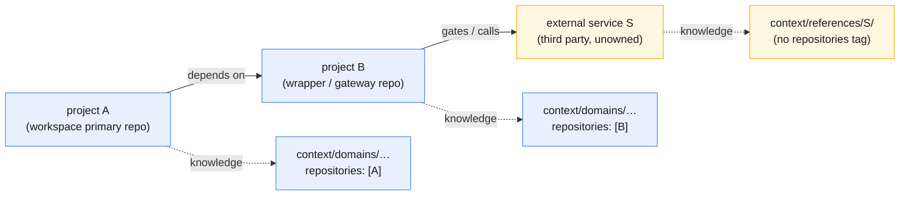

# context-references — design

## Capability

Give Product Knowledge a defined, correctly named home for reference knowledge
about **external services the workspace consumes but does not own** — for
example a third-party API that a dependency repository wraps or gates. This is a
new category in the `context/` layer: `context/references/`.

## Problem

Product Knowledge under `context/` is organized **by concept** — `domains/`,
`roles/`, and the tier documents (`ARCHITECTURE.md`, `DECISIONS.md`,
`TERMINOLOGY.md`, …) — and each knowledge unit is scoped to its source
repositories through the index unit's `repositories` metadata field
(`wrapper/contracts/schemas/context-index.yaml`).

That covers everything the workspace **owns**. It does not cover a thing the
workspace **depends on but does not own**: an external service.

Observed run that exposed the gap:

- Workspace is **project A**. A depends on **project B**, and B is a
  **wrapper/gateway to an external service** S.
- Gathering context, B's own knowledge was documented under `context/domains/`
  and tagged `repositories: [B]`. This is correct and stays unchanged.
- But **S itself** is not a repository. It has no `repositories` tag and no slot
  in the by-concept layout. With no defined home, the agent improvised an
  undocumented `context/reference/` folder to hold it.

A search of `context/` and `wrapper/contracts/` for "external service / external
API / third-party" returns nothing: the category is entirely undefined today.
The agent's instinct — a folder for the reference — was filling a real void; it
lacked only a defined, correctly named home.

## Principles

- **Own vs. consume is the axis.** Knowledge the workspace owns is organized by
  concept and scoped by repository. Knowledge about a consumed external service
  is neither — it needs its own category.
- **A wrapper repo is not its service.** B's wrapper behavior is the product's
  and belongs in `domains/`; S's API shape, auth model, error semantics, and
  rate limits are a third party's and belong in `references/`. Keeping them
  apart keeps each retrievable by the reader who needs it.
- **Formalize the instinct, do not invent a mechanism.** The agent already
  reached for a folder. The design names it, places it, and states when to use
  it — rather than adding a parallel tagging scheme.
- **Follow the existing naming convention.** Every collection directory under
  `context/` is plural (`domains/`, `roles/`, `proposals/`), so the category is
  `references/`, not `reference/`.

## The distinction, drawn

Owned repositories (A, B) → `domains/`, tagged by `repositories`. The external
service (S) → `references/`, no repository tag because it is not a repository.

## Fixed decisions

1. **Introduce `context/references/`** as a first-class category, one entry per
   external service, mirroring `domains/`: a per-service sub-directory with a
   `README.md` (e.g. `context/references/<service>/README.md`). Exact internal
   file shape is an authoring detail, not fixed here.
2. **`references/` is plural**, per the collection-directory convention.
3. **Owned knowledge is unchanged.** A wrapper/gateway repository's own
   knowledge stays in `domains/` tagged `repositories: [<key>]`. Only knowledge
   about the external service *itself* goes under `references/`.
4. **Register the category in the layout.** The `context/` index and the blank
   template seed both list the new route so it is discoverable and ships in
   fresh workspaces.
5. **State the convention once**, in the Product Knowledge conventions, with the
   owned-vs-external rule — so an agent reads the home instead of guessing it.

## Shape of the change (defers *how* to the owners)

Landing this design through the normal path touches three surfaces; each is
owned elsewhere and changed through its owner's normal action:

- **Layout / retrieval** (`context/INDEX.md`, and the seed
  `template/context/INDEX.md`): add `external references: context/references/` to
  the route-selected list.
- **Convention** (`context/CONVENTIONS.md`): external-service reference
  knowledge lives in `context/references/`; a wrapper/gateway repo's own
  knowledge stays in `domains/`, tagged by `repositories`.
- **The directory itself** (`context/references/`): created when the first
  external service is documented; it need not exist empty.

No core contract bump is required. The retrieval-catalog shape
(`wrapper/contracts/schemas/context-index.yaml`) is unchanged by the directory
approach.

## Deferred / out of scope

- **An `external_services` (or `references`) index-metadata field**, so an
  ordinary unit could also cross-link a service in addition to the directory —
  considered but not fixed; the directory stands alone first.
- **Recording the wrapper→service link in binding**: whether
  `repository-binding` should note that a bound repo is a gateway for a named
  external reference, making the B→S link explicit rather than inferred.

## How it feeds the rest — unchanged

This is source. It reaches Product Knowledge through the existing path: the
coordinator gathers context from this named design source, proposes the layout,
convention, and directory changes through the normal context-proposal path, and
a human accepts them. There is no separate design-acceptance gate.
