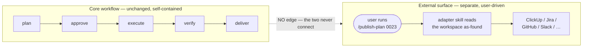

# Context Circuit v0.6 — External-surface (overview)

Status: authoritative source design for the v0.6 external-surface scope (delta on v0.5)
Revision: 1 — 2026-08-27

This is the **overview** of the external-surface scope: the capability, the
principles, and the shape of the solution. Each mechanism has its own detail file
(see [Detailed design](#detailed-design)). Read [README.md](./README.md) first for
the index, and [../../v0.5/core/design.md](../../v0.5/core/design.md) for
everything this delta builds on.

## The one capability

v0.5 keeps everything a workspace produces — plans, tasks, completion records,
context — **inside the workspace**. v0.6 adds a way to take that data and push it
to an **external system** the team already lives in (a task tracker, a chat
channel, a docs space), on demand.

The whole capability is one idea: an **external target** is a user-configured,
manually-triggered command that *reads Context Circuit artifacts as it finds them
and reflects them outward*. It is **not** a lifecycle stage, not a step of any
phase, and not something the core workflow ever calls.

The dashed line is crossed out on purpose: **there is no edge** between the core
workflow and the external surface, in either direction. They are peers that happen
to share a workspace. The surface runs only when, and exactly when, a human invokes
it.

## Problem

A team running Context Circuit still lives in ClickUp / Jira / GitHub / Slack.
Today the only way to reflect a plan there is to retype it by hand, which drifts
immediately and scales badly. The naïve fix — have `deliver` (or any phase) also
post to the tracker — is exactly wrong: it couples an external, credentialed,
provider-specific side effect to the deterministic core loop, adds weight to the
runtime and the agent, and quietly hands an outside system a foothold on plan
state. v0.6 gives the reflection a home that touches none of that.

## Goals

1. Let a user push Context Circuit data (starting with a plan and its tasks) to an
   external system with one explicit command.
2. Keep it **opt-in and manual** — nothing happens unless the user asks, every time.
3. Make it **general**: one backbone that hosts many *kinds* of target (tracker,
   chat, docs), with `publish-plan` as the first.
4. Add **zero weight** to the core workflow — no runtime code, no agent load, no
   reference anywhere in the plan/approve/execute/verify/deliver path.
5. Keep the external copy a **non-authoritative reflection**: `plan.yaml` remains
   the single source of truth for plan identity and status.

## Non-goals

- **No automatic triggering.** Never on approve, never on deliver, never on a
  timer. Manual invocation is the only entry.
- **No coupling to the workflow.** No hook, no callback, no lifecycle listener,
  no "emit on phase X." Nothing to wire, because nothing triggers it.
- **No import (this scope is export-first).** Data flows Context Circuit →
  outward. Pulling external issues *into* plans would bypass the human
  plan-authoring and approval gates and is out of scope; any future import must go
  through the normal authoring gate, never around it.
- **No bidirectional sync / no status flow-back.** The external item may drift
  (a human edits it); that is cosmetic and never returns to `plan.yaml`.
- **No provider code in the runtime** (v0.5 INV-RUNTIME-01). Network and
  credentialed calls live in the host / MCP layer.
- **No new authority.** The surface never changes plan status, approves, executes,
  verifies, completes, or delivers.

## Principles

- **Bind to data, never to control flow.** This is what makes "zero core-flow
  weight" a structural fact rather than a coding discipline. The surface is a
  *downstream reader* of workspace artifacts; the workflow is a *producer* that is
  unaware anything reads it.
- **A target is a command, not a link.** It has no standing relationship to the
  plan — it runs once, when invoked, against whatever is on disk at that instant.
- **The external copy is a reflection.** One-way, non-authoritative, idempotent
  on re-run; the workspace stays canonical.
- **The host carries the provider weight.** The runtime stays the small
  deterministic library it already is; adapters reach providers through the host
  (MCP), and configuration files never hold credentials.

## The backbone (what this scope actually adds)

Three small pieces, and nothing more:

1. **A user-owned config surface** — an `external-targets/` folder holding one
   `external-target.yaml` per configured target. It is **created on first use**,
   not shipped empty into every workspace, so no unexplained folder ever sits in a
   workspace the user never opted into. Detail in
   [configuration-and-records.md](./configuration-and-records.md).
2. **A manual trigger** — each target *kind* ships as an adapter **skill**
   (`.agents/skills/<kind>/SKILL.md`) the user invokes by name or slash command
   (v0.5 INV-SKILL-01). Skills are resolved only when explicitly invoked, so the
   trigger is isolated by construction.
3. **An isolation contract** — one invariant stating the orthogonality above so it
   is enforceable, plus the data boundary (reads declared artifacts, writes only
   its own records, credentials at the host). Detail in
   [contracts.md](./contracts.md).

No event system is needed: because nothing in the workflow triggers a target,
there is nothing to hook.

## What changes relative to v0.5

| Area | v0.5 | v0.6 (this scope) |
| --- | --- | --- |
| Reach of workspace data | stays inside the workspace | can be pushed outward, on demand |
| Trigger | — | a manual skill / slash command, never the workflow |
| Config | workspace / plan / context files | adds a user-owned `external-targets/` (create-on-first-use) |
| External records | — | authoritative per-plan mapping in the plan dir; derived catalog under `external-targets/` |
| Core workflow | plan → … → deliver | **unchanged**; gains no reference to the surface |
| Runtime | deterministic library | **unchanged**; no provider/network code (INV-RUNTIME-01) |

Everything else in v0.5 is unchanged. Note that "publication" in the v0.5 delivery
boundary (INV-DELIVER-01) means **git** publication (push the branch, open the PR)
and remains core-workflow; the external surface is a separate thing and must keep
that word qualified where the two meet (see [contracts.md](./contracts.md)).

## Detailed design

- [configuration-and-records.md](./configuration-and-records.md) — the
  `external-targets/` folder, `external-target.yaml`, create-on-first-use,
  authoritative-per-plan vs derived-catalog records, credentials boundary.
- [publish-plan.md](./publish-plan.md) — the first consumer: plan → work-item,
  task → child-item across ClickUp / Jira / GitHub / Notion (provider is a config
  field, list open-ended); containment vs dependency; one-way idempotent reflection;
  provider wrinkles; a worked trace.
- [contracts.md](./contracts.md) — proposed invariants, owner-map additions, the
  "publish" wording guardrail, and why no core contract bumps.

## Compatibility (summary)

Fully additive and opt-in. No existing plan, schema, runtime version, or workflow
phase changes. A workspace that never configures a target is byte-for-byte a v0.5
workspace plus the availability of the adapter skills. The plan schema does **not**
bump and `execution.yaml` does not change; unlike run-stack and repository-grounding
this scope needs no coordinated contract bump.

## Implementation order

Bounded, independently reviewable phases:

1. **Isolation contract** — add the external-surface invariant(s) and owner-map
   entries; assert the core workflow references nothing here.
2. **Config + records schema** — `external-target.yaml` and the per-plan mapping
   record; create-on-first-use behavior; derived-catalog regeneration.
3. **`publish-plan` adapter skill** — the first kind: the plan→work-item mapping,
   idempotent re-run, and the provider realizations, driven through host/MCP.
4. **Semantic verification** — a worked trace (configure a target, publish a plan,
   re-publish and update in place) plus an assertion that the core acceptance
   suite is unchanged by the surface's presence.

This design does not authorize implementation, delivery, or publication by itself.

## Final design decisions

- The external surface is **orthogonal to the core workflow** — a peer command,
  never a phase, trigger, gate, dependency, or side effect of any phase.
- A target runs **only on explicit manual invocation**, every time; no automatic,
  scheduled, or workflow-driven trigger exists.
- The surface is a **downstream reader**: it reads declared workspace artifacts and
  writes only its own records plus external side effects; it never mutates core
  Context Circuit state or plan status.
- The scope is **export-first**; import (external → plan) is out of scope and, if
  ever added, must flow through the normal plan-authoring gate.
- The external copy is **one-way and non-authoritative**; `plan.yaml` stays
  canonical (INV-PLAN-01); drift in the external item is cosmetic.
- Configuration lives in a **user-owned `external-targets/` folder, created on
  first use**, and is **credential-free**; credentials stay at the host / MCP layer
  (INV-SEC-01).
- Each target *kind* is triggered as an **adapter skill** (INV-SKILL-01); the host
  carries all provider/network weight (INV-RUNTIME-01 unchanged).
- The concept and this source scope are named **external-surface**; the user-facing
  workspace folder is **`external-targets/`**; the first kind is **`publish-plan`**.
- The scope adds **no core contract bump** — no plan-schema, execution, or
  runtime-version change.
