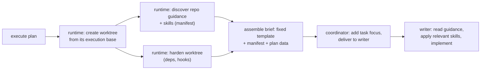

# Context Circuit v0.6 — Repository Grounding (overview)

Status: authoritative source design for the v0.6 repository-grounding scope (delta on v0.5)
Revision: 1 — 2026-08-26

This is the **overview** of the repository-grounding scope: making sure the
**writer** understands the target repository's own agent guidance and works in a
prepared environment, delivered through a generated brief rather than hand-authored
prose. Each mechanism has its own detail file (see [Detailed design](#detailed-design)).
Read [README.md](./README.md) first and [../../v0.5/core/design.md](../../v0.5/core/design.md)
for the execution model this delta extends.

## The problem

A writer works in a worktree of a **product repository** that ships its **own**
agent guidance — `AGENTS.md`, `CLAUDE.md`, skills, `.cursor/rules` — authored by
the repo owner to tell any AI agent how to work in that codebase. Under v0.5 the
execution brief never mentions those files, so the coordinator either
hand-injects repository knowledge into every writer prompt (fragile, and wrong the
one time it matters) or the writer flounders. The same brief also carries
execution-environment workarounds (symlinked deps, hook bypasses) that are really
symptoms of Context Circuit's own worktree setup.

## The three kinds of knowledge a writer needs — and who owns each

| Kind | Example | Owner | How it reaches the writer |
| --- | --- | --- | --- |
| **A. Repo-native agent guidance** | conventions, patterns, build/test, skills | the **repository** | **discovered** from the worktree and listed in the brief; the writer reads it in place |
| **B. Execution-environment mechanics** | dep provisioning, commit hooks | **CC runtime** | **eliminated** by worktree hardening (not documented, not hand-typed) |
| **C. Plan / Product Knowledge** | tasks, domain rules, decisions | CC | already delivered (plan snapshot + PK references) |

The whole scope is: deliver **A** by discovery, remove **B** by hardening, and
keep the coordinator from *authoring* any of it.

## What changes relative to v0.5

- The execution brief gains a **repository grounding** section (discovered files +
  a directive to read and honor them).
- Worktree preparation gains a **discovery** step and a **hardening** step.
- The fact-bearing sections of the brief are a **template filled from runtime data
  + the plan**, not coordinator free-composition.

## Principles

- **Reference, don't capture.** The repo owns its guidance; CC discovers and
  points at it, never copies it into Product Knowledge (no per-repo profile, no
  extra user step).
- **Discovery is deterministic.** A shell scan of the worktree can't forget or
  hallucinate a file the way an AI composing from memory can.
- **Deliver vs. author.** The coordinator *delivers* the brief; it does not
  *author* the repo facts inside it — those are template + runtime data.
- **Eliminate friction, don't document it.** B is CC-induced; harden the worktree
  so the workarounds vanish.
- **Graceful degradation.** Less repo guidance → CC's Product Knowledge (and, for
  greenfield, the accepted system design) carries more weight; the brief stays
  honest about what it found.

## Detailed design

- [discovery-and-manifest.md](./discovery-and-manifest.md) — the deterministic discovery function and the manifest.
- [writer-brief-template.md](./writer-brief-template.md) — the template, the grounding directive, precedence, deliver-vs-author, and the preflight.
- [worktree-hardening.md](./worktree-hardening.md) — provisioning a ready worktree so B disappears.
- [schema-and-contracts.md](./schema-and-contracts.md) — engine functions, the brief template, invariants, the manifest schema, the handoff field.
- [examples.md](./examples.md) — rich-repo, doc-less, and empty-repo briefs, plus acceptance criteria.

## Compatibility (summary)

Backward compatible. A repo with no agent guidance yields an empty manifest and a
brief that says so; nothing requires a repo to ship guidance. No `plan.yaml`
change, no per-repo profile to author. Worktree hardening changes how CC prepares
worktrees but not the isolation model.

## Implementation order

1. **Discovery** — the deterministic `cc_discover_repo_grounding` function and the manifest shape; record the manifest in the execution evidence.
2. **Brief template** — the writer-brief template with the required grounding slot and directive in `wrapper/adapters/`; the deterministic slot-fill + preflight.
3. **Worker contract** — the read-and-honor rule and precedence invariants.
4. **Feedback loop** — the handoff field routing repository friction to a proposal on the repo's own agent docs.
5. **Worktree hardening** — deterministic dep provisioning and hook handling (the heaviest runtime piece; may land as its own phase).

This design does not authorize implementation, delivery, or publication by itself.

## Final design decisions

- The writer is **required to read and honor** the target repository's own agent
  guidance, discovered live from the worktree.
- Discovery is a **deterministic runtime** step; it emits **data** (a manifest),
  not prompt text (INV-RUNTIME-01 preserved).
- The brief's fact sections are a **fixed template filled from runtime data + the
  plan**; the coordinator adds only task framing and delivers.
- **Precedence:** CC's safety and scope rules win on *what/where*; the repository's
  guidance is authoritative on *how to write code here* within that scope.
- **Reference, not capture** — no per-repo profile, no user capture step.
- **Hardening, not documentation** — CC prepares a ready worktree so
  execution-environment workarounds are unnecessary.
- Writer friction with a repo becomes a **proposal to improve that repo's own
  agent docs**, not a CC-side profile.
