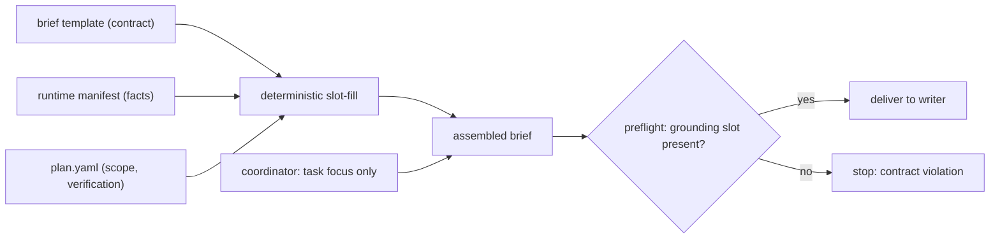

# Repository grounding — the writer-brief template

## Deliver vs. author

The coordinator **delivers** the writer brief — it is the AI that spawns the
writer. It does **not author** the fact-bearing parts. Those come from a **fixed
template** (a contract artifact in `wrapper/adapters/`) whose slots are filled
from the runtime's grounding manifest and the plan. The coordinator adds only a
one-line task focus and delivers.



## The template (slots in braces are filled from runtime + plan)

```md
# Writer brief — plan {plan_id}

You are the single bounded WORKER for this plan. Implement the entire plan and
make one commit. You are the only writer.

## Worktree (work only here)
Path:   {worktree_path}      Branch: {branch}   (base {base_commit})
Do not cd outside it; do not switch/create/merge/push/delete branches or run
git worktree; never write outside this path.

## Environment (prepared for you)
{environment}   # e.g. "ready: dependencies provisioned, commit hooks handled —
                #        do NOT install or modify dependencies"
                # or   "no dependency toolchain detected; the plan scaffolds it"

## Repository grounding — understand how this repo expects agents to work
{grounding_directive}   # rendered from the manifest — see below

## Plan (authoritative)
Snapshot: {plan_snapshot}   Implement tasks in the declared dependency order.

## Product Knowledge grounding
{product_knowledge}         # from plan.yaml

## Scope — allowed paths ONLY
{allowed_paths}             # from plan.yaml; anything else → STOP and report

## Execute · commit · handoff
- Implement all tasks; run the plan's verification commands: {verification}
- One implementation commit, Conventional Commits. Do NOT push or merge.
- Return the handoff (see below), including any repository friction as a proposal.

## Task focus
{task_focus}                # the ONLY coordinator-authored line
```

## The grounding directive (rendered from the manifest)

When the manifest is non-empty:

```md
Before you write any code, read and apply this repository's own agent guidance.
It is authoritative on HOW to write code here, within the scope this brief sets.

- AGENTS.md, CLAUDE.md — read in full; they govern conventions, build, and verify.
- Skills — all of this repo's skills are listed below. Read and follow only the
  ones RELEVANT TO YOUR TASK, choosing by description; skip the rest:
    - gezit-ui — DLS components via the private shadcn registry
    - gezit-illustration — brand illustration package usage
- .cursor/rules/ — honor any rule matching the files you change.

If anything here conflicts with this brief's scope or safety rules, STOP and report.
```

When the manifest is empty:

```md
No repository agent guidance was discovered (no AGENTS.md, CLAUDE.md, skills, or
rules). Ground your work in the plan and Product Knowledge, and follow any
patterns already present in the code.
```

## Who decides skill relevance

- The **runtime discovers and lists every** skill with its description — the
  writer cannot fail to know a skill exists (zero-miss).
- The **writer selects by relevance** — the agent doing the bounded task is the
  one who knows which skills its paths and behavior touch, and the menu lets it
  choose without opening each one.
- The **coordinator stays out of the relevance judgment** — it passes the
  runtime's *full* menu through verbatim, never reading or filtering the skills.
  It does not need to know them; pre-guessing "these two are relevant" is exactly
  the hand-made call that failed before.

The menu is therefore always the **complete discovered set**, never a
pre-selected subset. If a repo ships twenty skills, all twenty are listed with
descriptions and the writer picks; if it ships two, both are listed.

## Precedence

INV-GROUND (precedence, owned by `wrapper/contracts/invariants.yaml`):

> This brief's scope and safety rules are authoritative on **what** and **where**
> a writer may change. The repository's own guidance is authoritative on **how**
> to write code correctly here (conventions, patterns, build, test) **within that
> scope**. Where they conflict on scope or safety, the writer stops and reports;
> the repository's guidance never overrides a CC safety or scope rule.

Example: "repo says run `pnpm install`" never overrides "CC says do not touch
deps"; but "repo says use this error-handling pattern" governs the code.

## The preflight

Assembling the brief is deterministic slot substitution (host-adapter mechanics),
and a preflight verifies the assembled brief actually contains the required
grounding slot before the writer is delivered. A missing grounding section is a
**contract violation**, not silent — so the coordinator cannot omit it.
