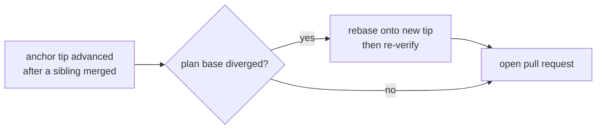

# Run-stack — delivery

Delivery is unchanged from v0.5 in every respect but one: it is separate,
explicit, per repository, per plan, and targets each repository's recorded
`anchor_branch`. v0.6 adds the **drift guard**.

## The drift guard

**INV-DELIVERY** (extended, owned by `wrapper/contracts/invariants.yaml`):

> When a plan is delivered and its recorded base has diverged from the current
> `anchor_branch` tip (because a sibling plan already merged), the plan is rebased
> onto the current tip and re-verified before its pull request opens. A plan is
> never merged from a base that no longer reflects the branch it will land on.

## Delivery order

Delivery follows the dependency graph. A **single-repository** stack merges as one
serialized rebase train — each plan rebased onto the freshly advanced tip and
re-verified. A **multi-repository** stack merges as one short train per repository.
Failed and held plans are reported as not delivered, with the reason attached to
each.
