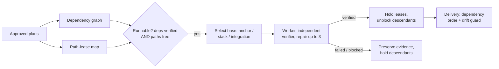

# Context Circuit v0.6 — Run-Stack (overview)

Status: authoritative source design for the v0.6 run-stack scope (delta on v0.5)
Revision: 2 — 2026-08-26

This is the **overview** of the run-stack scope: the capability, the principles,
and the shape of the solution. Each mechanism has its own detail file (see
[Detailed design](#detailed-design)). Read [README.md](./README.md) first for the
index, and [../../v0.5/core/design.md](../../v0.5/core/design.md) for everything
this delta builds on.

## The one capability

v0.5 executes **one approved plan per request**. v0.6 adds executing a **set of
approved plans in one run** — a *plan stack* — while guaranteeing that any
conflict between those plans becomes a scheduling decision made **before a worker
runs**, not a merge collision discovered afterward.

The product experience stays a normal conversation — *"execute approved plans
0001 until 0010"*. v0.6 introduces **no new authority**; it only decides order and
overlap among plans a human has already approved.

## Problem

A workspace commonly holds many approved plans that touch the same repositories.
Under v0.5 a user runs them one at a time by hand, and nothing detects that two
plans edit the same file or that one plan needs another's changes. Running them
independently produces avoidable merge conflicts; running a dependent plan against
a base that lacks its prerequisite verifies work against the wrong world. v0.6
makes the relationships explicit and lets the runtime honor them.

## Goals

1. Execute a named set of approved plans in one conversational request.
2. Run plans concurrently when it is provably safe; serialize them when it is not
   — without human bookkeeping.
3. Express dependencies between plans and build a dependent on its prerequisites
   without waiting for them to merge.
4. Preserve every v0.5 guarantee: one worker and one independent verifier per
   plan, the three-failure limit, human-controlled completion, separate delivery.
5. Remain backward compatible: existing single-plan plans and "execute plan X"
   behave exactly as before.

## Non-goals

- **No new authority** — concurrency never bypasses approval, completion, or delivery.
- **No heuristic scheduler in the runtime** — the runtime *detects* readiness and
  conflicts deterministically; the coordinator *decides* how many ready plans to
  start (v0.5 INV-RUNTIME-01).
- **No semantic-coupling guarantee** — leases prevent *textual* conflicts, not
  behavioral coupling across different files (model that as one plan or a dependency).
- **No automatic delivery** — verified plans are reported, not merged.
- **No cross-workspace scheduling** — a stack is a set of plans in one workspace.

## Principles (carried and added)

v0.6 keeps all v0.5 principles and adds two:

- **Concurrency is orchestration, not authority.** A stack run changes only order
  and overlap of already-approved plans; each is separately approved, verified,
  completed, and delivered.
- **Conflicts are prevented, not resolved.** Dependencies order the waves; path
  leases serialize file-level overlaps; a dependent's base already contains its
  prerequisites. A conflict the system cannot prevent (semantic coupling) is the
  author's to model — the design says so plainly rather than pretending to catch it.

## What changes relative to v0.5

| Area | v0.5 | v0.6 |
| --- | --- | --- |
| Execution request | one plan | one plan **or** a named set (stack) |
| Plan relationships | task `depends_on` within a plan | adds `plan_dependencies` **between** plans |
| Concurrency control | one-writer lock **per plan** | adds **path leases** per `(repo, path)`, composed with the per-plan lock |
| Execution base | anchor-branch tip | anchor tip, a **stacked** predecessor branch, or a runtime **integration base** |
| Delivery | separate, explicit, per repo | unchanged, plus a **drift guard** (rebase + re-verify) |
| plan.yaml schema | `schema_version: 1` | plans using `plan_dependencies` are `schema_version: 2`; manifest accepts `[1, 2]` |

Everything else in v0.5 is unchanged.

## Detailed design

- [plan-dependencies.md](./plan-dependencies.md) — inter-plan dependencies; same-repo vs cross-repo effect.
- [path-leases.md](./path-leases.md) — `(repo, path)` leases; INV-CONCURRENCY-01; what they do and don't guarantee.
- [execution-bases.md](./execution-bases.md) — anchor / stacked / integration base; where and when the merge happens; INV-CONCURRENCY-02; repair invalidation.
- [scheduling.md](./scheduling.md) — the run-stack loop, readiness, emergent waves, and failure/blast-radius containment.
- [delivery.md](./delivery.md) — dependency-order delivery and the drift guard.
- [schema-and-versioning.md](./schema-and-versioning.md) — the contract deltas and why plan schema bumps to 2 but execution does not.
- [examples.md](./examples.md) — the two worked walkthroughs and the acceptance criteria.

## Compatibility (summary)

Backward compatible and opt-in: existing plans have no `plan_dependencies`, stay
`schema_version: 1`, and behave as under v0.5; a v0.5 engine refuses a
`schema_version: 2` plan rather than running it dependency-blind. Detail in
[schema-and-versioning.md](./schema-and-versioning.md); template-upgrade
preservation follows v0.5 §20.

## Implementation order

Bounded, independently reviewable phases, each updating the semantic fixtures that
prove it:

1. **Plan contract** — add `plan_dependencies`; accept plan schema `[1, 2]`; add acyclic/reference validation.
2. **Lease layer** — lease schema + deterministic acquire/check/release in `engine.sh`; INV-CONCURRENCY-01.
3. **Base selection** — integration-base construction, the base-ref rule, repair invalidation; INV-CONCURRENCY-02.
4. **Readiness and run-stack** — readiness evaluation in the runtime; the run-stack conversational action.
5. **Delivery drift guard** — rebase + re-verify on base divergence.
6. **Semantic verification** — the two worked traces plus lease serialization, integration bases, failure containment, and drift rebase.

This design does not authorize implementation, delivery, or publication by itself.

## Final design decisions

- v0.6 is a delta on v0.5; all v0.5 decisions remain in force unless superseded here.
- A run executes a set of already-approved plans; concurrency adds no authority.
- Plans declare inter-plan `plan_dependencies`, distinct from task `depends_on`.
- A dependency is same-repo (a git base) or cross-repo (an ordering gate), derived per repository.
- Path leases extend the one-writer lock to `(repo, path)` scope and compose with INV-OWN-01.
- A dependent's base is the anchor tip, a single stacked predecessor branch, or a runtime-authored integration merge recorded as `base_commit`.
- A kept base reference lives in `refs/cc-base/<plan>/<repo>`, never nested beneath a branch ref.
- A failed plan holds only its descendants; the runtime detects deterministically, the coordinator decides launch concurrency.
- Delivery stays separate, explicit, and per plan, with a rebase-and-re-verify drift guard.
- Plans using `plan_dependencies` are `schema_version: 2`; existing plans stay `1`; `execution.yaml` stays `1`.
- `runtime_version` becomes `0.6.0`; the template release takes a minor (pre-1.0) bump at publish.
