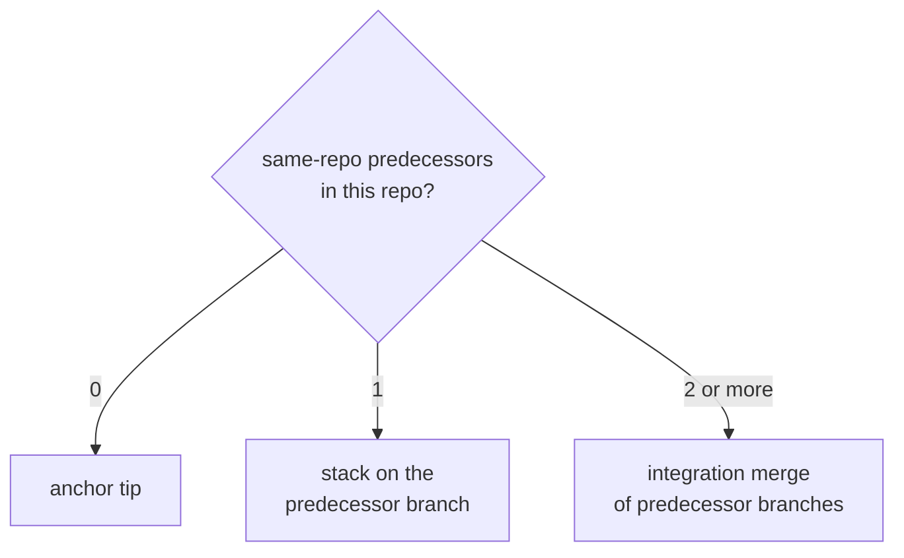
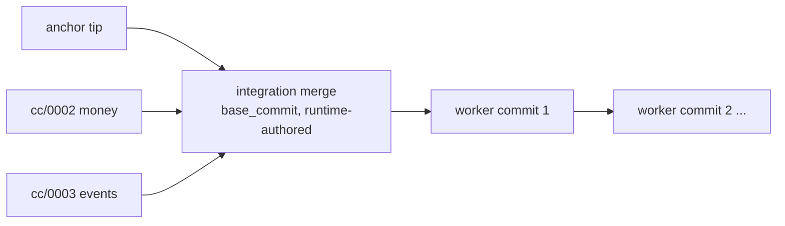

# Run-stack — execution bases

At the moment a plan becomes runnable, the runtime selects its base in each
repository it touches, **before the worker starts**.

## The three bases



```text
base(plan, repo) =
    integration_merge(all same-repo predecessor branches in repo)  # ≥2 predecessors
 ?? stack_on(the single same-repo predecessor branch in repo)      # exactly 1
 ?? anchor_tip(repo)                                                # 0
```

Cross-repo predecessors never affect the base; they are ordering gates only (see
[plan-dependencies.md](./plan-dependencies.md)).

## Where and when the merge happens

For the integration case the runtime — **not the worker** — performs the merge, on
the plan's own branch, in the plan's own worktree, before handoff:

```bash
# runtime setup for a dependent plan · deterministic · NOT a worker attempt
git -C <clone> worktree add -b cc/<plan>/<repo> \
      .runtime/worktrees/<plan>/<repo>  <anchor_tip_sha>
git -C .runtime/worktrees/<plan>/<repo> merge --no-ff \
      -m "cc: integration base <plan> (merge <dep-a>, <dep-b>)" \
      cc/<dep-a>/<repo>  cc/<dep-b>/<repo>
# record base_commit = resulting tip; then hand the worktree to the worker
```

The resulting history:



The integration merge is the first ancestor of the plan's branch, so it is
reachable and recoverable without a second ref. The worker always opens an
already-integrated tree and never performs or sees the merge.

## Clean by construction

Concurrent same-repo predecessors held **disjoint** leases (see
[path-leases.md](./path-leases.md)), so their branches touch different paths and
the merge cannot conflict. If two predecessors were *not* concurrent (overlapping
paths), the lease already serialized them, so the later branch already contains
the earlier one and is itself the base. Either way there is always exactly one
clean base, and no conflict is discovered at base-construction time.

## Base reference rule

**INV-CONCURRENCY-02** (proposed, owned by `wrapper/contracts/invariants.yaml`):

> A plan's base is the anchor tip, a single predecessor branch, or a
> runtime-authored integration merge recorded as `base_commit`. The integration
> merge is authored by the runtime before the worker starts and is never counted
> as a worker attempt. A base that cannot be built cleanly is a **blocked**
> execution, not a worker failure. If a named base reference is kept for
> inspection or repair, it lives in a reserved namespace
> (`refs/cc-base/<plan>/<repo>`) and is **never nested beneath a branch ref** (a
> ref cannot be both a file and a directory).

## Repair invalidation

If a predecessor is repaired after a dependent's base was built, the dependent's
integration base is stale. Before the dependent re-runs, its base is rebuilt from
the predecessor's new branch tip. A stale base never silently persists across a
predecessor repair.
