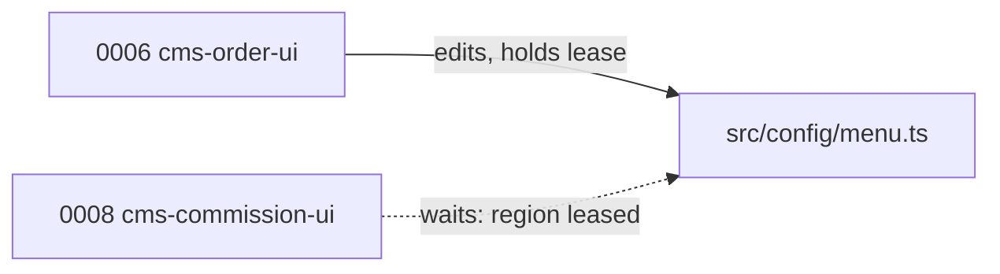

# Run-stack — path leases

## What a lease is

A **path lease** generalizes the v0.5 one-writer lock from *plan scope* to
*(repository, path-region) scope*. When an execution starts, it reserves the
`allowed_paths` it holds in each repository — the same union of bounded task paths
v0.5 already records per repository in the execution record.

**INV-CONCURRENCY-01** (proposed, owned by `wrapper/contracts/invariants.yaml`):

> While an execution holds a lease on a path region in a repository, no other
> execution that is **not a descendant** of the holder in the plan-dependency
> graph may acquire an overlapping region in that repository. A competing plan
> receives a read-only or blocked result — the same outcome a competing writer
> receives under INV-OWN-01 — and a live lease is never silently stolen.

This **composes with** INV-OWN-01; it does not redefine it. The per-plan writer
lock still holds. The lease adds a finer, path-level layer beneath it.

## Why "not a descendant"

A held lease blocks *unrelated* plans. A declared **dependent** does not conflict
with its prerequisite; it **builds on** it. Ordering in the dependency graph is a
handoff, not a collision, so a descendant stacks on or integrates the holder's
work (see [execution-bases.md](./execution-bases.md)) rather than being blocked.

## The case the lease catches that dependencies miss

Two plans can have **no dependency between them** yet both declare the same file:

`0006` and `0008` are unrelated in the dependency graph but both touch
`src/config/menu.ts`. The lease lets `0006` proceed and serializes `0008` behind
it — turning a would-be merge conflict into an ordering decision made *before*
either worker runs.

## What leases do and do not guarantee

- **Disjoint** leases in a repository → the plans may run concurrently, and their
  branches merge cleanly by construction (see [execution-bases.md](./execution-bases.md)).
- **Overlapping** leases → serialized, even when the dependency graph would allow
  concurrency.
- A lease prevents a **textual** conflict only. It does **not** prevent semantic
  coupling between different files — model that as one plan or a dependency.

## Lease lifetime

A lease is held from execution start until the plan is **delivered** (not merely
verified), so an unrelated third plan cannot grab the same region and diverge
before the verified work lands. Descendants are exempt. Lease records are runtime
evidence written atomically under `.runtime/`, owned by a new lease schema (see
[schema-and-versioning.md](./schema-and-versioning.md)); a partial record grants
nothing (v0.5 INV-RUNTIME-02).
