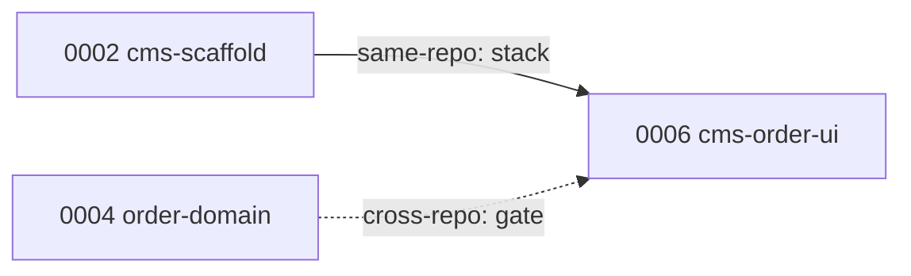

# Run-stack — plan dependencies

A plan may declare the other plans it depends on. This is **inter-plan** ordering,
distinct from the existing **intra-plan** task `depends_on`.

## The field

```yaml
schema_version: 2            # required when plan_dependencies is present
plan: 0006-cms-order-ui
title: CMS order UI
status: approved
# ... all existing v0.5 fields unchanged ...
plan_dependencies:
  - id: 0002-cms-scaffold
    reason: scaffolds the SPA this plan builds in
  - id: 0004-order-domain
    reason: consumes the order API contract this plan renders
```

Rules (owned by `wrapper/contracts/schemas/plan.yaml`, INV-PLAN family):

- `plan_dependencies` is **optional**. Its absence means no plan dependencies and
  the plan behaves exactly as a v0.5 plan.
- Each entry references an existing plan ID in the same workspace, with a reason.
- The dependency graph across a stack must be **acyclic**.
- A plan that declares `plan_dependencies` **must** set `schema_version: 2` (see
  [schema-and-versioning.md](./schema-and-versioning.md)); a plan without the field
  stays `schema_version: 1`.

## Same-repo versus cross-repo dependencies

A dependency's *effect* is **derived, not declared** — from the repository sets of
the two plans, evaluated per repository the dependent touches:

- **Same-repo dependency** — dependency and dependent both touch repository R. The
  dependent's execution base in R is built on the dependency's branch in R (a git
  base; see [execution-bases.md](./execution-bases.md)).
- **Cross-repo dependency** — the two plans share no repository. The dependency is
  a pure **ordering gate**: the dependent waits for it to verify, but there is no
  shared git base.



*Solid = same-repo dependency (dependent stacks on the predecessor's branch).
Dashed = cross-repo dependency (ordering gate only, no shared git base).* A single
dependency can be same-repo in one repository and irrelevant in another; each is
evaluated per repository the dependent touches. `0006` above gets both: it stacks
on `0002` (same repo) and is gated by `0004` (cross repo).
