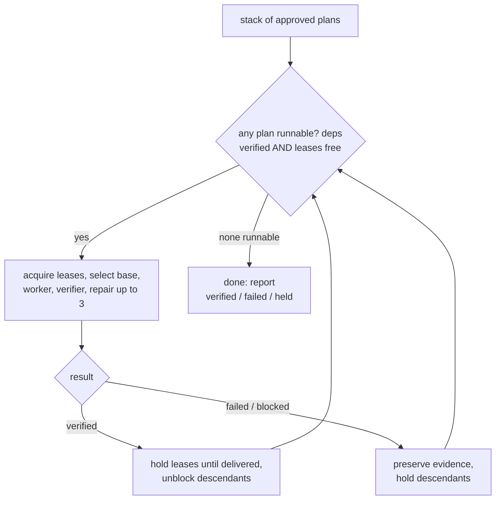

# Run-stack — scheduling and failure

## Readiness

A plan in the stack is **runnable** when both gates open:

1. every plan dependency is `verified`, and
2. every path region it needs is free in each repository (no overlapping
   non-descendant lease).

This is an **AND-join**: a plan waits for the latest of its dependencies and for
its paths to clear. Any dependency ending in `failed` or `blocked` leaves the plan
`held`.

## The loop

```text
until all plans terminal:
  ready = { p : all p.deps verified and leases_free(p.repo, p.allowed_paths) }
  for p in ready:                       # coordinator decides how many to start
    acquire_leases(p.repo, p.allowed_paths)
    base = integration | stack | anchor_tip     # execution-bases.md
    worktree → worker → independent verifier → repair(≤3)     # v0.5, unchanged
    on verified: hold leases until delivered; unblock descendants
    on failed | blocked: preserve evidence; keep descendants held
```



The runtime evaluates readiness and leases **deterministically**. The coordinator
chooses how many ready plans to launch, subject to the per-plan one-writer lock,
host child-creation limits, and host capability (a missing child capability yields
`host-blocked`; it is not a worker failure).

## Waves are an emergent property

"Waves" describe what the loop produces, not a scheduled structure. Concurrency
arises two ways: **across repositories** (plans in different repositories run
together) and **within a repository** (plans with disjoint leases run together). A
single-repository stack gets concurrency only from disjoint paths.

## Failure, blocking, and blast radius

- A **`failed`** plan (three worker failures) preserves all evidence for repair,
  per v0.5. Only its **descendants** are held; unrelated verified plans are
  untouched. A failure prunes a branch of the graph, not the whole run.
- A **`blocked`** plan (missing host capability, unbuildable base, external
  precondition) is preserved read-only and is not counted as a worker failure.
- **Single-repository caveat.** When many plans fan in to one integrating plan
  (for example a module-registry plan that depends on every domain), a single
  domain failure holds that integration and everything below it. The mitigation is
  structural, not runtime: keep the fan-in plan **late and thin**, and route each
  shared file (module registry, migrations index, root router) through **one**
  dedicated plan that depends on the rest, rather than letting many plans declare
  the same shared file.
