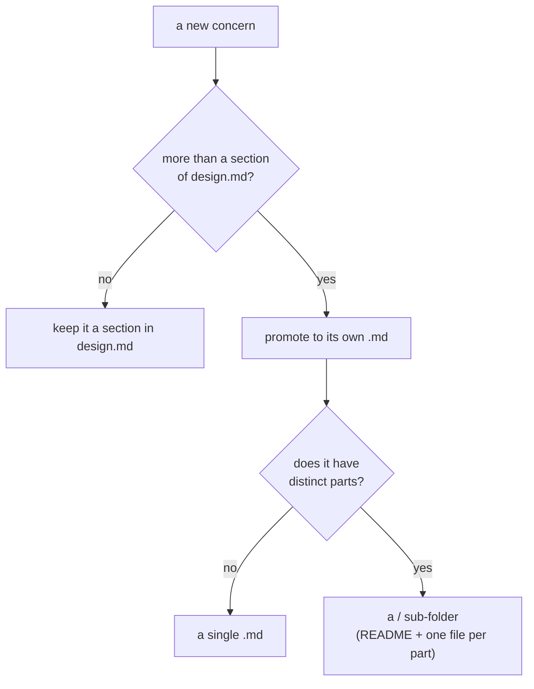

# System-design authoring — the rubric

This is the payload of the `cc-system-design` skill: where a system design lives,
how it is laid out, **how much detail belongs in each file**, and **how to split
it into scopes**. Getting these right is the entire value of the scope.

## Where a system design lives

Under `sources/` — it is source material, not a first-class area:

```text
sources/system-design/<product>/<version>/<scope>/
```

- `<product>` (or `<initiative>`) — the product being designed **as a whole**,
  **never a single repository**. In a single-product workspace this level may
  collapse to `sources/system-design/<version>/<scope>/`.
- `<version>` — the design revision (`v0.1`, `v0.6`, …).
- `<scope>` — a **concern** of the design (see "Scope separation" below).

`sources/` stays passive (v0.5 INV-SEC-02): the design is read only when a request
names it, and it carries no status. Authoring *into* `sources/system-design/` is a
normal write; the passive-read rule governs later reads, not this authoring.

## The three-tier layout

Every folder has a `README.md` **index**; each scope's normative content is
`design.md`; detail splits into files or sub-folders **as it grows**:

```text
sources/system-design/<product>/
  README.md                 # index of versions (landing + reading order)
  <version>/
    README.md               # version index: the scopes + the reading order
    <scope>/
      README.md             # scope landing/index
      design.md             # scope overview — NORMATIVE, readable end-to-end
      <detail>.md           # one concern each, split when it outgrows a section
      <sub-folder>/         # a concern that itself has parts (e.g. roles/)
        README.md
        <part>.md
```

## How much detail per file (altitude)

Calibrate by **what a reader needs from this file**, not by filling it:

| File | Altitude | Holds | Does NOT hold |
| --- | --- | --- | --- |
| `README.md` | orientation | what exists here + the reading order | design content, decisions, mechanism |
| `design.md` | normative overview | the capability, the problem, principles, the **fixed decisions**, and the shape of the whole — readable start to finish to understand the design **without** opening every detail file | exhaustive mechanism, per-field schemas, edge-case tables |
| `<detail>.md` | implementation depth | one concern's mechanism, interfaces/contract deltas, edge cases, the diagram that explains it | the other concerns; a restatement of `design.md` |

Rules of thumb:

- **`design.md` is the thing a reviewer reads first and can stop at.** If a
  reviewer must open five detail files to grasp the design, too much moved out of
  `design.md`; if `design.md` runs to many screens of mechanism, too much stayed
  in. It states *what* and *why* and the decisions; it **defers** *how* to detail
  files and links to them.
- **A detail file answers one question in depth.** Name it for its concern
  (`scheduling.md`, `path-leases.md`), not `details.md`.
- **Every fact lives once.** A detail file does not re-explain `design.md`; it
  continues from it. `design.md` references the detail file rather than inlining
  it.

## Scale-triggered splitting — do not pre-fragment

Split only when a concern earns its own file; keep it inline until then:



- A one-paragraph concern is a **paragraph in `design.md`**, not a file.
- A concern that grows past a section becomes its **own `<concern>.md`**.
- A concern with several parts becomes a **sub-folder** with a `README.md` index
  and one file per part (the way `roles/` holds `human-simulator.md`,
  `grader.md`, …).
- Start minimal — a `README.md` + a `design.md` — and grow. A brand-new design
  with five near-empty detail files is worse than one honest `design.md`.

## Scope separation — by concern, never by repository

A system design's value is describing **how the pieces fit** across the system.
So scopes cut by **concern**, not by git repository:

- Good scopes: `backend-topology/`, a domain (`commission/`), `cms/`, `agent/`, a
  cross-cutting flow (`order-flow/`).
- **Anti-pattern:** one scope folder per git repo. Keying the design per-repo
  fragments exactly the cross-repo coherence the design exists to capture.
- If one repository needs deep design detail, that is a **scope** within the
  product's design (e.g. a `backend/` scope), **not** a separate top-level design
  and **not** a new `<product>` entry.
- The `<product>` level names the product/initiative as a whole; a repo never
  appears at that level.

## Diagrams

Diagrams are fenced ` ```mermaid ` blocks embedded directly in the file they
explain — the durable form that renders on GitHub and most editors and travels
with the doc on any host. The skill may *preview* via a host mermaid plugin if one
exists but never depends on one: no plugin → it still emits the fenced mermaid.

## The reference implementation

This repository's own `sources/system-design/context-circuit/` **is** the worked
example: `<product>/<version>/<scope>/`, a `README.md` index and a normative
`design.md` per scope, detail files split scale-triggered (run-stack grew
`path-leases.md`, `scheduling.md`, …), sub-folders for parts
(`template-harness/roles/`), and mermaid embedded throughout. The skill points the
author at it as the canonical model — one convention, dogfooded.
