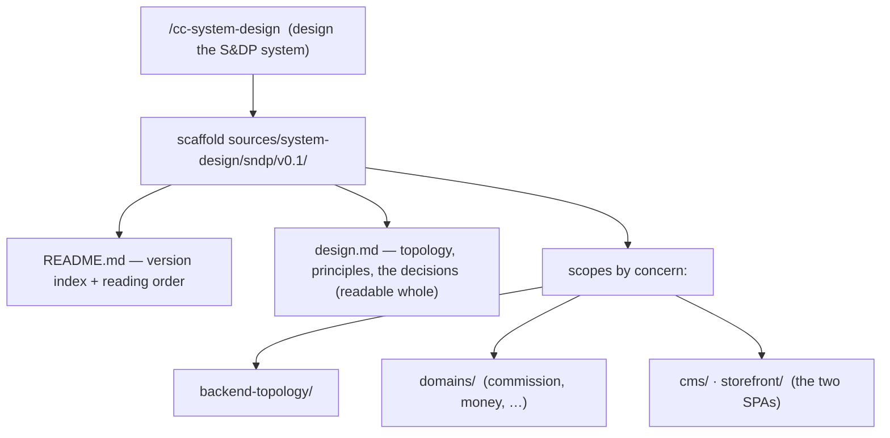

# System-design authoring — worked example and acceptance

## Worked example — structuring what sndp improvised

sndp is the canonical case: a real greenfield product whose author put a system
design under `sources/system-design/sndp/v0.1/` **by hand**, with no shared
convention for how to lay it out. With the skill, the same design is authored to a
consistent structure.

1. **Invoke `/cc-system-design`.** Grounded in the PRD (a named source) and the
   siboy / vite-template boilerplates (registered references), the skill scaffolds
   `sources/system-design/sndp/v0.1/` in the three-tier layout.
2. **Overview vs detail.** `design.md` states the single-service backend topology,
   the domain list, and the money/commission decisions at a readable altitude; the
   deep mechanics go into `backend-topology/`, `commission/`, etc. — split only as
   each concern outgrows a section.
3. **Scope by concern.** `commission/`, `money/`, `cms/`, `storefront/` are
   concerns of one cross-repo product — not one folder per git repository.
4. **Feed the existing flow.** The coordinator gathers context from the design
   source and proposes context units through the normal path; a human accepts
   those proposals; plans ground in the resulting Product Knowledge via the
   existing `product_knowledge` references.

The difference from today: the design has a **consistent structure** — the same
one this repo's own `sources/system-design/` uses — instead of being improvised.
There is no new gate, status, or record.

## Acceptance criteria

The system-design-authoring scope is acceptable when all v0.5 acceptance criteria
still hold and:

1. Invoking `cc-system-design` scaffolds a system design under
   `sources/system-design/<product>/<version>/<scope>/` in the three-tier layout
   (a `README.md` index, a normative `design.md`, detail files/sub-folders as
   concerns grow), with mermaid embedded as fenced blocks.
2. The skill applies the detail-per-file rubric: `README.md` orients, `design.md`
   is a readable normative overview, detail files carry one concern each at depth;
   it does not pre-fragment a small design into many near-empty files.
3. The skill separates scopes **by concern**, keys the top level on the
   product/initiative, and never creates one scope per git repository.
4. The skill only drafts structured source files: it never approves, accepts,
   plans, executes, or writes Product Knowledge, and it introduces no status,
   acceptance gate, or runtime record.
5. A system design feeds Product Knowledge and plans through the **existing** v0.5
   flow (gather context from the named source → context proposals → accepted PK →
   `product_knowledge` refs); no `plan.yaml` field and no plan schema change.
6. The scope changes no runtime: no `engine.sh` function, no `.runtime` record, no
   new schema, no new invariant, no WORKFLOW action, and no first-class `design/`
   area.
7. The skill ships in `context-circuit-template` (the four allowlist updates) and
   is resolved by path (INV-SKILL-01); the maintainer repo dogfoods it.
8. The semantic/contract suite covers: the skill is present and shipped, the
   allowlist count is correct, and the skill body carries the layout + detail +
   scope-separation rubric.
