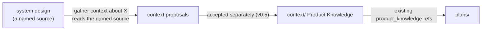

# System-design authoring — relationship to Product Knowledge

A system design and Product Knowledge must not become two homes for the same
facts. The distinction is unchanged from how v0.5 already treats sources vs
`context/`; this scope only adds that a system design is a *structured* source.

## The distinction

| | Product Knowledge (`context/`) | System design (a source) |
| --- | --- | --- |
| Answers | what the system **is** now | what a change **will be**, and why |
| Time sense | accepted, durable, present-tense | forward-looking, per-initiative |
| Shape | retrieval units (index, domains, decisions, terminology) | a narrative design (overview + details) |
| Lifecycle | updated only by accepted context proposals | **none** — it is a source; it is authored and then read |
| Audience | an agent locating grounding for a plan | a human (and agent) reasoning about the change |

Product Knowledge is the **distilled residue**; a system design is the
**reasoning that produces it**. One feeds the other — through the ordinary v0.5
flow, with nothing new.

## How a design feeds Product Knowledge and plans — the existing flow

1. The coordinator **reads the named design source** during ordinary context
   gathering (v0.5 "gather context about X") — sources stay passive; the design is
   read because the request names it.
2. It proposes **context units** for the durable facts the design establishes,
   through the **existing** context-proposal path (v0.5 INV-KNOWLEDGE). A human
   accepts those proposals exactly as today.
3. Plans ground in the resulting Product Knowledge through the **existing**
   `product_knowledge` references.

There is **no "accept the design" gate**, no emit-on-acceptance step, and no new
record. "Accepting" the design's ideas *is* accepting the context proposals it
motivated — the one existing acceptance, no second one.

## The rule

- A system design **references** Product Knowledge for what already exists and is
  the **place a change is argued**; the accepted result is recorded once, in
  `context/`, via the normal proposal path. It never holds a second canonical copy
  of an accepted fact.
- The design carries **no status**. It is a source; freshness/relevance is judged
  the way any source is, not through a lifecycle on the design itself.
- If design→plan traceability is wanted, it lives **on the design side** (the
  design lists the plans that slice it) — never as a new `plan.yaml` field.

## Why keep it out of Product Knowledge

Product Knowledge is optimized for *retrieval of accepted state*, not for
*deliberating a change*. Forcing a large forward-looking design into context units
before its ideas are agreed would pollute Product Knowledge with unaccepted
material or lose the reasoning entirely — which is what happened when sndp shoved
its design into `sources/` **without structure** and hand-derived context. This
scope fixes the *structure* of that source; it does not give the source a
lifecycle.
