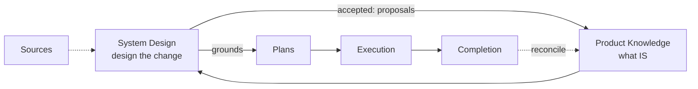

# Context Circuit v0.6 — System-Design Stage (overview)

Status: authoritative source design for the v0.6 system-design-stage scope (delta on v0.5)
Revision: 1 — 2026-08-26

This is the **overview** of the system-design-stage scope: making a **System
Design** a first-class, optional lifecycle stage between Product Knowledge and
Plans. Each mechanism has its own detail file (see [Detailed design](#detailed-design)).
Read [README.md](./README.md) first, and [../../v0.5/core/design.md](../../v0.5/core/design.md)
for the base lifecycle this delta extends.

## The one capability

Today, plans are grounded directly in Product Knowledge. That works for a bounded
change, but for anything larger — a new product, a new version, a cross-cutting
feature — you need a coherent **system design** *before* you can slice good plans.
v0.6 adds an **optional System Design stage**: design the change, get it accepted,
then let plans slice the accepted design.

## Problem

- **The workspaces already need it.** sndp put its system design in
  `sources/system-design/sndp/v0.1/` and hand-derived Product Knowledge from it —
  with no modeled stage, no acceptance gate, and no grounding link from plans back
  to the design.
- **Plans drift without a designed whole.** Grounded only in Product Knowledge,
  greenfield plans have no agreed "shape of the system" to slice against.
- **The maintainer repo already works this way.** This very design set is authored
  before any plan or implementation; v0.6 promotes that practice into a product
  capability the instantiated workspaces can use.

## Goals

1. An **optional** System Design stage between context gathering and planning.
2. A **human-accepted** design artifact that updates Product Knowledge and
   thereby grounds the plans that implement it.
3. A **clean boundary** with Product Knowledge: the design is the *change*;
   Product Knowledge is the *accepted durable state*.
4. **Reuse** the `<product>/<version>/<scope>/` layout and three-tier documents.
5. **Backward compatible**: a small change still goes straight from Product
   Knowledge to a plan.

## Non-goals

- **Not mandatory.** A bugfix or a bounded change needs no system design.
- **Not a second Product Knowledge.** A design flows *into* Product Knowledge; it
  never becomes a parallel copy of architecture, decisions, or domains.
- **No new execution authority.** Approval, completion, and delivery gates are unchanged.

## Principles

- **Design before planning — when the change is big enough.** Scale-triggered, the
  same discipline the layout convention uses.
- **One owner.** Product Knowledge owns durable accepted facts; a System Design
  owns the forward design of a change; accepting a design *updates* Product
  Knowledge through the existing context-proposal path.
- **A design is accepted, like a plan is approved.** Authoring and reviewing a
  design change nothing; an explicit human acceptance gate does.

## What changes relative to v0.5

| Area | v0.5 | v0.6 |
| --- | --- | --- |
| Lifecycle | Product Knowledge → Plans → Execution → Completion | inserts an optional **System Design** stage before Plans |
| Plan grounding | `product_knowledge` references | **unchanged** — plans ground in the Product Knowledge the design produced |
| Conversational actions | gather context, create/approve plan, … | adds *design the system*, *review design*, *accept design* |
| Acceptance records | context proposals, completion | adds a **system-design acceptance** record |
| Product skills | coordinator/worker/verifier packets | ships a **`cc-system-design`** authoring skill in the template |

Everything else in v0.5 is unchanged.

## Detailed design

- [product-knowledge-boundary.md](./product-knowledge-boundary.md) — the crux: design vs Product Knowledge, and how one flows into the other.
- [lifecycle-and-gates.md](./lifecycle-and-gates.md) — the stage's position, acceptance gate, plan grounding, reconciliation, and conversational actions.
- [workspace-layout.md](./workspace-layout.md) — where a system design lives (first-class `design/`), what the top level keys (the product/initiative, not a repo), the three-tier layout, the shipped `cc-system-design` skill, and diagrams.
- [schema-and-contracts.md](./schema-and-contracts.md) — the new design schemas, the shipped `cc-system-design` skill, the acceptance record, WORKFLOW actions, and invariants (no `plan.yaml` change).
- [examples.md](./examples.md) — a worked example (modeling what sndp did by hand) and the acceptance criteria.

## Compatibility (summary)

Optional and opt-in. Existing workspaces are unaffected and `plan.yaml` is
unchanged by this scope; a bounded change proceeds straight from Product Knowledge
to a plan. A workspace adopts the stage only when a change is large enough to
warrant designing first.

## Open questions (resolved in the detail files / review)

- **Location** — a first-class workspace `design/` area vs keeping designs under
  `sources/system-design/` (see [workspace-layout.md](./workspace-layout.md); the
  recommendation is first-class).
- **Granularity of acceptance** — whether a whole design must be accepted before
  any plan can slice it, or acceptance is per scope (see
  [lifecycle-and-gates.md](./lifecycle-and-gates.md)).

## Final design decisions

- The System Design stage is **optional** and scale-triggered; small changes skip it.
- A System Design is the forward design of a change; **Product Knowledge remains
  the single owner of accepted durable facts**, updated when a design is accepted.
- A design is **human-accepted**; authoring and review change nothing.
- An accepted design **emits Product Knowledge proposals** (separately accepted);
  plans then ground in that Product Knowledge as they already do — no new plan field.
- The stage **reuses** the `<product>/<version>/<scope>/` three-tier layout; the
  top level keys the **product/initiative as a whole, never a single repository**
  (cross-repo detail is a scope, not a separate design).
- The authoring skill **`cc-system-design` ships in the template** (a product
  skill), is triggered manually or by the *design the system* action, drafts but
  never accepts, and is dogfooded by the maintainer.
- No new execution authority; approval, completion, and delivery are unchanged.
