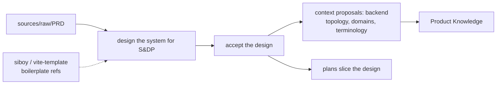

# System-design stage — worked example and acceptance

## Worked example — modeling what sndp did by hand

sndp is the canonical case: a real greenfield product that *needed* this stage and
improvised it. With the stage, the same work is modeled explicitly.

1. **Design the system for S&DP.** Grounded in the PRD (a source) and the siboy /
   vite-template boilerplates (registered references), the coordinator drafts
   `design/v0.1/` with scopes for backend topology, domains, commission rules, and
   the two SPAs — the material sndp currently keeps in `sources/system-design/`.
2. **Review, then accept.** Acceptance emits context proposals for the durable
   decisions (the single-service backend topology, the six domains, the money and
   commission rules, terminology) and enables plans to ground on the design.
3. **Accept the Product Knowledge proposals.** Separately, as today — the design's
   acceptance did not auto-write Product Knowledge.
4. **Plan against the accepted design.** The plans (`0001 scaffold`, the domain
   plans, the SPA plans) ground in the Product Knowledge the accepted design
   produced (the backend-topology decision, the domains) through the existing
   `product_knowledge` references — so a reviewer traces each plan to the agreed
   shape of the system, with no new plan field.
5. **Execute and reconcile.** At completion, actual-vs-design reconciliation marks
   the design delivered or flags divergence as further context proposals.

The difference from today: the design has a **home, an acceptance gate, and a
grounding link** — instead of being improvised in `sources/` and hand-derived.

## Acceptance criteria

The system-design-stage scope is acceptable when all v0.5 acceptance criteria
still hold and:

1. A user can author a System Design in `design/<version>/<scope>/` using the
   three-tier layout, and authoring/review changes no other state.
2. An explicit human acceptance moves a design `draft → accepted`, records an
   acceptance record, and emits context proposals for the facts it establishes —
   without auto-accepting them.
3. Accepted-design context proposals flow through the **existing** context
   acceptance path; nothing about Product Knowledge storage or acceptance changes.
4. Plans implementing an accepted design ground in the Product Knowledge it
   produced, via the existing `product_knowledge` references; this scope adds no
   `plan.yaml` field and no plan schema change.
5. The stage is optional: a bounded change proceeds from Product Knowledge to a
   plan with no design artifact and no added prompts.
6. Completion reconciles actual-vs-design, marking the design delivered or
   surfacing divergence as context proposals.
7. No worker/verifier behavior, repair loop, completion gate, or execution
   authority changes.
8. The semantic acceptance suite covers: authoring, the acceptance gate, proposal
   emission without auto-accept, grounding via Product Knowledge, the
   optional/skip path, and completion reconciliation.
