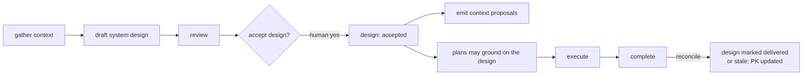

# System-design stage — lifecycle and gates

## Where the stage sits

The stage is inserted between context gathering and planning, and it is optional:



## Conversational actions

Added beside the v0.5 actions (owned by `wrapper/adapters/WORKFLOW.md` and the
coordinator role):

| You say | Action |
| --- | --- |
| Design the system for X. | Draft a readable system design, grounded in Product Knowledge and named sources. Does not accept or plan. |
| Review the design. | Non-accepting discussion; may update the draft. |
| Accept the design. | Explicit gate: draft → accepted. Emits context proposals and enables plan grounding. Accepts nothing else. |
| Create a plan for F. | As in v0.5, but plans may now reference the accepted design for grounding. |
| What's the design status? | Read-only summary of the design and its acceptance. |

These mirror the shape of plan approval and context acceptance: authoring and
review are inert; only an explicit human acceptance changes state.

## The acceptance gate

A system design has its own status, human-controlled:

```text
draft → accepted → delivered
```

- **draft → accepted** — explicit human acceptance. On acceptance the design
  *emits* context proposals for the durable facts it establishes and becomes
  available to ground plans. It does **not** auto-accept those proposals (see
  [product-knowledge-boundary.md](./product-knowledge-boundary.md)).
- **accepted → delivered** — recorded at completion of the plans that implement
  the design, during reconciliation.

Acceptance is recorded in a small acceptance record (see
[schema-and-contracts.md](./schema-and-contracts.md)); a partial record grants
nothing (v0.5 INV-RUNTIME-02).

## Grounding plans

Plans need **no new field**. A design's accepted decisions flow into Product
Knowledge, and plans ground on them through the existing `product_knowledge`
references — so a plan implementing a design is already grounded in it,
transitively. If design→plan traceability is wanted, it lives on the **design
side** (the design lists the plans that slice it), not as a per-plan reference.

## Reconciliation at completion

Completion already reconciles a plan's actual changes against Product Knowledge
(v0.5 §13.1). With a design in play, reconciliation also compares actual-vs-design:
the design may be marked **delivered**, or **stale** where implementation diverged,
surfacing the divergence as context proposals rather than silently accepting it.

## Scale trigger

The stage is used only when the change warrants designing first: a new product, a
new version, or a cross-cutting feature. A bounded change goes straight from
Product Knowledge to a plan — no design, no ceremony. This is the same
scale-triggered discipline the document layout uses.

## Open question — granularity of acceptance

Whether a whole design must be accepted before any plan can slice it, or a design
scope can be accepted independently so its plans proceed while other scopes are
still in draft. Recommendation: **per-scope acceptance**, so a large design
(multiple scopes) does not block all planning on its slowest part — mirroring how
the run-stack scope lets independent work proceed in parallel. To be confirmed in
review.
