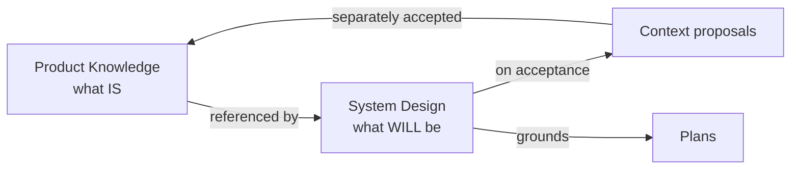

# System-design stage — the Product-Knowledge boundary

This is the decision the whole scope turns on: a System Design and Product
Knowledge must not become two homes for the same facts.

## The distinction

| | Product Knowledge (`context/`) | System Design |
| --- | --- | --- |
| Answers | What the system **is** now | What a change **will be**, and why |
| Time sense | Accepted, durable, present-tense | Forward-looking, per-initiative |
| Shape | Retrieval units (index, domains, decisions, terminology) | A narrative design (overview + details) |
| Lifecycle | Updated only by accepted proposals | Authored → reviewed → accepted per change |
| Audience | An agent locating grounding for a plan | A human (and agent) reasoning about the change |

Product Knowledge is the **distilled residue**; a System Design is the **reasoning
that produces it**. They are not competitors — one feeds the other.

## How a design flows into Product Knowledge

A System Design does two things when it is accepted, and neither duplicates
Product Knowledge:

1. **It references Product Knowledge** for what already exists (architecture,
   decisions, domains it builds on) — it does not restate those facts.
2. **On acceptance it emits context proposals** for the durable facts it
   *establishes or changes* (a new architecture decision, a new domain, new
   terminology). Those proposals go through the **existing** context-acceptance
   path (v0.5 INV-KNOWLEDGE) — a design being accepted does **not** auto-accept
   its Product Knowledge changes.

So a fact lives in Product Knowledge exactly once. The design is where the change
is *argued*; Product Knowledge is where the accepted result is *recorded*.

## The rule

- A System Design **references** Product Knowledge and **proposes** changes to it;
  it never holds a second canonical copy of an accepted fact.
- Accepting a design **enables** its Product Knowledge proposals and its plan
  grounding; it does not itself change Product Knowledge — that stays a separate,
  explicit acceptance (one owner, no silent writes).
- When implementation completes, reconciliation compares the actual change against
  the design and against Product Knowledge, exactly as v0.5 completion already does
  for plans — the design may then be marked delivered or stale.

## Why not just use Product Knowledge directly?

Because Product Knowledge is optimized for *retrieval of accepted state*, not for
*deliberating a change*. Forcing a large greenfield design into context units
before it is agreed would either pollute Product Knowledge with unaccepted,
forward-looking material or lose the reasoning entirely (which is what happened
when sndp shoved its design into `sources/` and hand-derived context). The stage
gives the deliberation a home with its own acceptance gate, and keeps Product
Knowledge clean.
