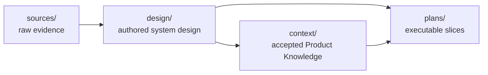

# System-design stage — workspace layout

## Where a system design lives

A system design is an **authored, reviewed, accepted** artifact — it behaves like
`plans/`, not like passive source evidence. So it earns a **first-class workspace
area** rather than living under `sources/`:



- `sources/` — raw inputs (PRDs, spreadsheets, prototypes). Passive; read when named.
- `design/` — **new**: the authored system designs, accepted and grounding plans.
- `context/` — accepted Product Knowledge (unchanged).
- `plans/` — executable slices of an accepted design (unchanged; grounded via the existing `product_knowledge` references).

**Recommendation: first-class `design/`.** The alternative — keeping designs under
`sources/system-design/` as sndp did — conflates an authored, accepted artifact
with passive evidence and gives it no natural acceptance home. Migrating sndp's
`sources/system-design/sndp/v0.1/` to `design/v0.1/` is a straightforward move
(the PRD stays in `sources/`).

## What the top level keys — the product/initiative, not a repo

The path is `sources/system-design/<product>/<version>/<scope>/` in the maintainer
repo, and `design/<version>/<scope>/` in a single-product workspace. The
`<product>` level names **the product or initiative being designed as a whole** —
never a single repository.

A system design is inherently **cross-repo**: its value is describing how the
pieces fit — architecture, cross-cutting flows, domains that span backend and
frontend. Keying it per-repo would fragment exactly the coherence it exists to
capture. If one repository needs deep design detail, that is a **scope** within
the product's design (for example a `backend/` scope), not a separate top-level
design.

- **Maintainer repo** — `<product>` = the product (e.g. `context-circuit`).
- **Workspace with one product/initiative** — the level collapses to
  `design/<version>/<scope>/`.
- **Workspace with several initiatives** — keep the level:
  `design/<initiative>/<version>/<scope>/`.

Scopes cut across repos **by concern** (backend, cms, agent, a domain) — matching
how sndp's design is organized — not one folder per git repository.

## Document layout inside `design/`

`design/` reuses the maintainer `<version>/<scope>/` three-tier convention (the
`<product>` level is dropped — a workspace is one product):

```text
design/
  README.md                 # index of versions
  v0.1/
    README.md               # version index (scopes + reading order)
    <scope>/
      README.md             # scope landing/index
      design.md             # scope overview (normative)
      <detail>.md           # detail files, split when a concern grows
      <sub-folder>/         # a concern with parts (like roles/)
```

Every folder has a `README.md` landing; each scope's normative design is
`design.md`; detail is split into files or sub-folders as it grows —
scale-triggered, exactly the rule the maintainer design set follows.

## Authoring — the shipped `cc-system-design` skill

Because the System Design stage is part of the product's core flow, its authoring
skill **ships in the template as a product skill** — not a maintainer-only tool:

- It lives at `.agents/skills/cc-system-design/SKILL.md` — a read-as-procedure
  packet the coordinator resolves by path (INV-SKILL-01). The shipped workspace
  never contains a host-specific skill directory or symlink.
- It is **triggered** either **manually** — a host may surface it as a
  `/cc-system-design` slash command, an optional host convenience that is never a
  separate route, role, or authority — or **when the user asks to design the
  system** (the *design the system for X* WORKFLOW action resolves the same packet).
- Its procedure: scaffold `design/<version>/<scope>/` in the three-tier layout,
  ground the draft in Product Knowledge and named sources, split detail files as
  they grow, and embed diagrams as fenced ```mermaid. It produces a **draft** and
  **never accepts** — acceptance stays the human gate (INV-DESIGN-01).
- The maintainer source repo **dogfoods the same skill** for its own
  `sources/system-design/` authoring — one skill, not two.

## Diagrams

Diagrams are fenced ```mermaid blocks embedded directly in the design files — the
durable form, rendered natively on GitHub and most editors, so a diagram travels
with the doc on any host. The skill may *preview* via a host mermaid plugin if one
exists, but never depends on it: no plugin → it still emits the fenced mermaid.
