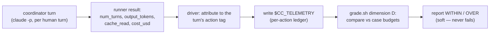

# Context Circuit v0.6 — Template harness efficiency ledger (overview)

Status: authoritative source design for the v0.6 template-harness delta (on v0.5)
Revision: 1 — 2026-08-27

This is the overview of the v0.6 template-harness change: making **dimension D
(the efficiency ledger)** a measured, evaluated dimension instead of a declared
but dormant one. Read [README.md](./README.md) first and the v0.5 base
([../../v0.5/template-harness/harness-and-evaluation.md](../../v0.5/template-harness/harness-and-evaluation.md)
§4.2, [../../v0.5/template-harness/roles/grader.md](../../v0.5/template-harness/roles/grader.md)
§D) for what this extends.

## The problem

v0.5 already defines dimension D — per-action turns/tokens vs a case's `budgets`,
soft and warning-only — and every case carries a `budgets:` block. But three gaps
make it inert and, worse, unfalsifiable:

1. **It is never measured.** The `claude-code` driver records the transcript and a
   file-access trace, but it never writes the `$CC_TELEMETRY` file. So `grade.sh`
   always prints "no telemetry … dimension D unavailable". No run has ever been
   compared to its budget.
2. **The token unit is undefined.** `max_tokens` never says *which* count. For a
   real run the numbers differ by ~100× depending on interpretation: a run's
   generated (output) tokens are tens of thousands, while the tokens *processed*
   (dominated by re-reading the growing conversation each agent-loop turn) are
   millions. The same run is 8% or 800% of budget depending on an unstated unit.
3. **The turn unit is mismatched.** The `max_turns` values (1–6) read like
   *conversational* turns, but the only turn count the runner emits (`num_turns`)
   is *agent-loop* turns — tens for a single plan, ~90 for a ten-plan
   orchestration. The budget silently conflates two different quantities.

Observed on the two v0.6 product-scope live cases (measured from the run output,
not from the grader, which reported nothing):

| Case | conv. turns | agent-loop turns | output tokens | context peak (cache-read) | cost |
| --- | --- | --- | --- | --- | --- |
| 11 repo-grounding (1 plan) | 2 | ~26 | ~9.7k | ~0.95M | ~$2.5 |
| 10 run-stack (10 plans) | 1 (+recap) | ~91 | ~37k | ~5.3M | ~$8.6 |

The case budgets were `execute-plan: {max_turns: 5, max_tokens: 120000}` (11) and
`{max_turns: 6, max_tokens: 400000}` (10) — bracketing *output* tokens loosely but
ignoring the dominant costs (context volume and dollars), and wildly under the
agent-loop turn counts.

## The fix (shape)

- **Measure from the runner's own output.** The host run result already carries
  `num_turns`, `usage.output_tokens`, `usage.cache_read_input_tokens`, and
  `total_cost_usd`. The driver derives a per-action ledger from it and writes
  `$CC_TELEMETRY` — no new instrumentation, no model call. See
  [telemetry.md](./telemetry.md).
- **Define the units.** `max_tokens` means **generated (output) tokens** for the
  action — the clean "work produced" measure. Context peak and dollar cost are
  **tracked and reported** but are diagnostics, not the token budget. `max_turns`
  means **conversational** turns; an optional `max_agent_turns` bounds the
  agent-loop count. See [budgets.md](./budgets.md).
- **Actually compare.** `grade.sh` dimension D reads the ledger and reports each
  action WITHIN or OVER its budget, with the observed vs. budgeted numbers — still
  **soft, warning-only**, exactly as v0.5 mandates. See [evaluation.md](./evaluation.md).
- **Recalibrate the cases** from measured actuals so a budget means something.

## Principles

- **Delta, not redesign.** Dimension D stays what v0.5 says it is — per-action,
  soft, warning-only, keyed on invariants not wording. This scope fills in the
  telemetry source and the units the base left open; it does not add a gate.
- **Measure, don't estimate.** The ledger comes from the runner's own result
  numbers, deterministically parsed — never from a model or a guess.
- **A budget must be evaluable.** A number you cannot compare unambiguously is not
  a budget. Every budgeted quantity names its unit.
- **Soft by design.** Usage is model- and price-dependent and non-deterministic;
  dimension D annotates and trends, and never fails a run (v0.5 §4.2). Promotion
  to a hard gate is explicitly **out of scope**.
- **Tooling only.** No product surface changes; nothing new ships.

## Compatibility

Backward compatible. A run with no telemetry still degrades to "unavailable"
(unchanged). The `$CC_TELEMETRY` format is extended additively; the legacy
three-column `action⇥turns⇥tokens` row stays readable. Cases whose `budgets` are
not recalibrated still grade (soft) against their old numbers.

## Implementation order

1. **Telemetry emission** — the `claude-code` driver derives the per-action ledger
   from each coordinator turn's run result and writes `$CC_TELEMETRY`.
2. **Grader compare** — `grade.sh` dimension D parses the ledger and reports
   WITHIN/OVER per action against `budgets`, still soft.
3. **Units + schema** — document the unit of each budgeted field; extend the case
   `budgets` schema with the optional `max_agent_turns` / `max_cost_usd` /
   reported context peak.
4. **Recalibration** — reset the per-case `budgets` from measured actuals with
   headroom.

This design does not authorize implementation, delivery, or publication by itself.

## Final design decisions

- Dimension D becomes measured and compared, but stays **soft, warning-only**.
- Telemetry is derived from the **runner's own result** (output tokens, agent
  turns, context peak, cost) — deterministic parse, no model, no new probes.
- `max_tokens` ≙ **generated (output) tokens**; `max_turns` ≙ **conversational**
  turns; agent-loop turns and dollar cost are tracked, optionally budgeted.
- No product change; maintainer-only, ships nothing (release manifest already
  excludes `test/` and `template-harness/`).
