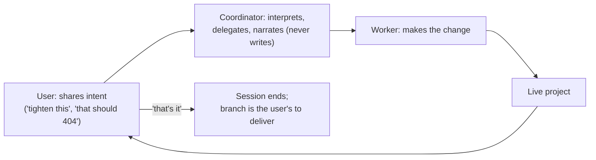
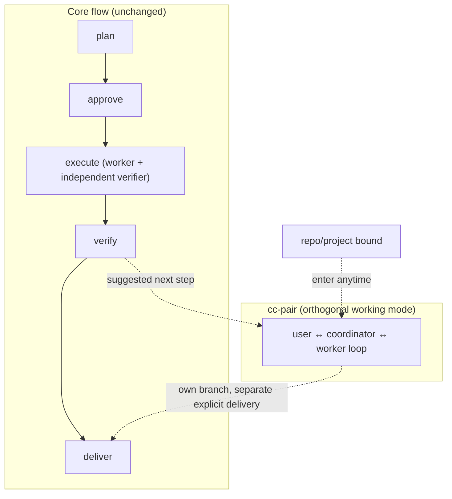

# Context Circuit v0.7.0 — Direct Collaboration (overview)

Status: authoritative source design for the v0.7.0 direct-collaboration scope
(delta on v0.6)
Revision: 1 — 2026-08-30

This is the **overview** of the direct-collaboration scope: the capability, the
principles, the central decisions, and the shape of the solution. Each mechanism
has its own detail file (see [Detailed design](#detailed-design)). Read
[README.md](./README.md) first for the index, and
[../../v0.5/core/design.md](../../v0.5/core/design.md) for everything this delta
builds on.

This scope supersedes the earlier `ui-refinement` framing (and its
`interactive-acceptance` restatement), which tried to model interactive work as a
plan *acceptance criterion* verified by a final independent pass. That was the
wrong frame: interactive work is a **way of working**, not a way of accepting a
plan.

## The one capability

v0.5/v0.6 are about **plans**: gather knowledge, write a plan, approve it, execute
it with one worker, check it with one independent verifier, deliver. That whole
apparatus exists to make AI changes trustworthy **when the human is not watching**.

Sometimes the human *is* watching — and wants to just work. "Let's tighten this
screen together." "Get this endpoint behaving the way I mean." "Poke at this with
me." No plan is worth writing; the human will judge the result live, in real time.

v0.7.0 adds exactly that: **`cc-pair`, a direct interactive collaboration mode**
with three actors — **user, coordinator, worker** — and nothing else. The user
shares intent; the coordinator interprets ordinary language and tells the worker
what to do; the worker does it; repeat until the user says "that's it." No
verifier, no lease, no execution records — a loop of orchestration.

## Where it sits — outside the plan lifecycle

`cc-pair` is **orthogonal** to the core flow. It is not a plan, not an execution,
and neither gates nor is gated by plan/approve/execute/verify/deliver.

It can be entered three ways (see [skill-and-contract.md](./skill-and-contract.md)):

- **anytime a repo/project is bound** — no plan needed to work directly;
- **by intent or `/cc-pair`** — the user asks to just work on something;
- **as a suggested next step after a plan or stack execution completes** — "want to
  refine this together before delivery?" — an *option offered*, never automatic.

## Why there is no verifier — and why that is not a hole

The core flow forbids self-verification (INV-VERIFY-01) so an AI never grades its
own homework **unwatched**. `cc-pair` does not remove that guarantee — it
**replaces the independent verifier with the human as the live oracle.** The human
watches and judges every step in real time, which is a *stronger* check than an
async AI verifier, not a weaker one.

The consequence must be stated plainly, or the mode becomes a backdoor: **pairing
output is human-supervised, never "verified."** It never inherits a plan's verified
status, never marks a plan done, and never delivers. Completion and delivery stay
separate explicit human actions (INV-COMPLETE-01, INV-DELIVER-01). If the user
wants the pairing changes independently verified, that is ordinary work — a plan —
not something this mode fakes.

## The three actors

| Actor | Does | Never |
| --- | --- | --- |
| User | shares intent; judges the live result; converges ("that's it") | — |
| Coordinator | interprets ordinary language, delegates a concrete change to the worker, narrates what changed | writes code; rules on whether the result is good |
| Worker | makes the requested change in the session's worktree | self-verifies; marks anything done; delivers |

There is **no new role**: the worker is the existing worker role
(`agents/worker.md`) driven interactively. There is simply no verifier in the
picture, because this is not an execution — it is human-supervised direct work. The
coordinator gains conversational *fluency* from the skill; it gains no write or
verify authority (INV-SKILL-01).

## Isolation — its own branch and worktree, never the active branch

A pairing session always works in its **own `cc-pair/<session>` branch and
worktree**, created from a chosen **base commit** — never the user's active branch,
and never a plan's execution branch edited in place. The base is just a commit:
the anchor tip by default, or a completed plan/stack tip when the mode was offered
after an execution. Mechanism, base selection, the light resumable pointer, and
`host-blocked` are in [session-and-isolation.md](./session-and-isolation.md).

## What it deliberately is NOT

- **Not an execution.** No independent verifier, no lease, no worktree hardening
  ceremony beyond what is needed to run, no failure counter, no evidence records.
- **Not verified.** Output is human-supervised; it never carries the verified stamp
  and never auto-completes or delivers.
- **Not a plan.** It touches **no** plan contract — no `plan.yaml` field, no
  acceptance kind, no `schema_version` bump. That is the whole payoff of decoupling.

## Principles (carried and added)

v0.7.0 keeps all v0.5/v0.6 principles and adds two:

- **Interactive work is a mode of working, not a mode of accepting a plan.** It
  lives outside the plan lifecycle and reuses none of its verification apparatus.
- **When the human is the live oracle, independence is satisfied by supervision,
  not by an independent verifier** — provided the output is labeled
  human-supervised, never "verified," and never auto-completes or delivers.

## What changes relative to v0.6

| Area | v0.6 | v0.7.0 |
| --- | --- | --- |
| Ways to change a repo | plan → execute → verify | adds **`cc-pair`**, a direct interactive mode outside the lifecycle |
| Actors when changing code | worker + independent verifier | in `cc-pair`: user + coordinator + worker, **no verifier** |
| Plan contract | as v0.6 | **unchanged** — `cc-pair` touches no plan schema |
| Skills | `cc-plan/execute/verify/deliver/...` | adds **`cc-pair`** |
| Invariants | v0.5/v0.6 set | adds **`INV-PAIR-01`** (the mode's boundary) |

Everything else in v0.6 is unchanged.

## Detailed design

- [session-and-isolation.md](./session-and-isolation.md) — the worktree/branch/base
  model, base selection, the light resumable session pointer, `host-blocked`,
  convergence, and how a pairing branch reaches delivery (separately, explicitly).
- [skill-and-contract.md](./skill-and-contract.md) — the `cc-pair` skill surface,
  triggering, its relation to the other skills, and the contract delta
  (`INV-PAIR-01`, the session-pointer schema, the `.runtime/pairing/` folder; no
  plan-contract change).

## Compatibility

Purely additive and orthogonal. No plan-contract change, no `schema_version` bump.
A workspace that never enters `cc-pair` behaves exactly as under v0.6.

## Implementation order

1. **`cc-pair` skill + the loop** — user ↔ coordinator ↔ worker orchestration,
   convergence on "that's it".
2. **Session isolation** — fresh `cc-pair/<session>` branch + worktree from a base
   commit, the light resumable pointer under `.runtime/pairing/`, `host-blocked`.
3. **Triggering** — manual, by intent, and the post-execution *suggested* path.
4. **Semantic verification** — a worked trace, plus assertions: no verifier
   spawned, output not marked verified, never the active branch, never a plan
   branch in place, `host-blocked` when no worker child/worktree, delivery separate.

This design does not authorize implementation, delivery, or publication by itself.

## Final design decisions

- v0.7.0 is a delta on v0.6; all v0.6 decisions remain in force unless superseded.
- **`cc-pair` is a standalone interactive working mode, outside the plan
  lifecycle**, orthogonal to plan/approve/execute/verify/deliver.
- **Three actors — user, coordinator, worker. No verifier, no lease, no execution
  records.** The human is the live acceptance oracle.
- **No new role**; the worker is the existing worker role driven interactively.
- A session works in its **own `cc-pair/<session>` branch + worktree from a base
  commit** — never the active branch, never a plan's branch in place. Base default
  is the anchor tip; a completed plan/stack tip when offered after an execution.
- Only a **light resumable session pointer** is kept, not an execution/verifier
  record.
- **Output is human-supervised, never "verified"**; it never auto-completes and
  never delivers — completion and delivery stay separate explicit actions. Worker
  commits follow INV-COMMIT-01.
- One new skill **`cc-pair`**; one new invariant **`INV-PAIR-01`**; **no plan
  contract change** and no `schema_version` bump.
- With no way to create the worker child or the worktree, the outcome is
  **`host-blocked`, read-only**.
- `runtime_version` `0.7.0`; owners settle in `wrapper/contracts/`.
